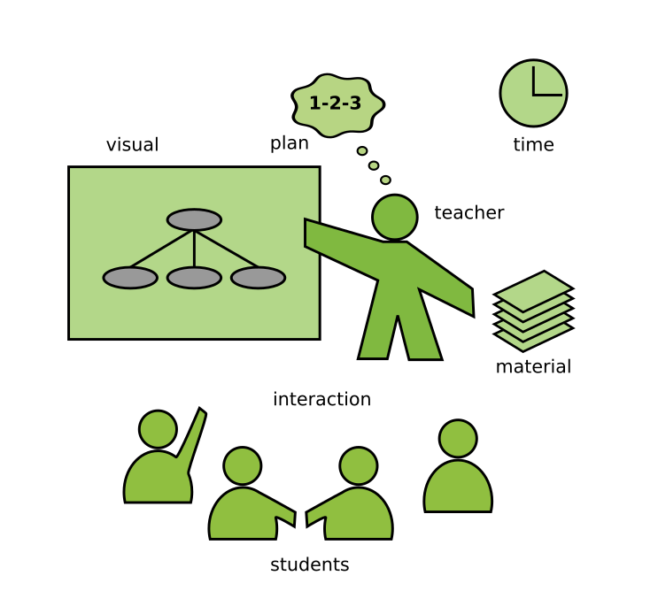

# Teaching Programming

**by Dr. Kristian Rother**

# Contents

## Fundamentals

* [Teaching is a Craft](fundamentals/teaching_craft.md)
* [The Students](fundamentals/students.md)
* [The Teacher](fundamentals/teacher.md)

## Planning

* [The Teaching Process](planning/teaching_process.md)
* [Preparing Lessons](planning/preparing_lessons.md)
* [Learning Goals](planning/goals.md)
* [Concept Maps](planning/concept_maps.md)
* [Lesson Plans](planning/lesson_plans.md)

## Getting Started

* [The first minute](getting_started/the_first_minute.md)
* [Priming](getting_started/priming.md)
* [Getting to know each other](getting_started/getting_to_know.md)
* [Managing expectations](getting_started/expectations.md)
* [Warming up](getting_started/warmup.md)
* [Warming up an onsite class](getting_started/warmup_onsite.md)

## Introducing new Content

* [Structuring concepts](lectures/lectures.md)
* [Facilitating your group](planning/facilitation.md)
* [Presenting information](lectures/presenting.md)
* [Questions](lectures/questions.md)
* [Online Teaching](lectures/online_teaching.md)

## Coding Exercises

* [Live coding](coding_exercises/live_coding.md)
* [Facilitating exercises](coding_exercises/reduced_examples.md)
* [Debugging](coding_exercises/debugging.md)
* [Coding Kata](coding_exercises/coding_kata.md)

## Wrapping up

* [Practical transfer](wrapping_up/transfer.md)
* [Repeating](wrapping_up/repeat.md)
* [Collecting feedback](wrapping_up/feedback.md)

## Troubleshooting

* [How to teach with little time to prepare?](troubleshooting/no_prep.md)
* [How to be a less nervous teacher?](troubleshooting/nervousness.md)
* [How to teach when your plan doesn't work?](troubleshooting/plan_b.md)
* [How to deal with technology failures?](troubleshooting/tech_failures.md)
* [How to handle heterogeneous skill levels?](troubleshooting/heterogeneous.md)
* [How to handle passive participants?](troubleshooting/passive.md)
* [How to handle participants under pressure?](troubleshooting/under_pressure.md)
* [How to wake up your class after lunch?](troubleshooting/energizers.md)
* [How to handle aggressive participants?](troubleshooting/aggression.md)
* [How to teach in an unfamiliar environment?](troubleshooting/paradrop.md)
* [How to teach a subject you know little about?](troubleshooting/jungle.md)

## Appendix

* [A recipe for designing courses](appendix/training_course_design.md)
* [Checklists](appendix/checklists.md)
* [Quotes on Teaching](appendix/quotes_teaching.md)
* [Links](appendix/links.md)

## Acknowledgements

I dedicate this document to Bettina Ritter-Mamczek and Cornelius Frömmel, to whom i owe my skills and passion to teaching. Greg Wilson has been a constant source of inspiration, and his fantastic Teach Tech Together helped me to decide what not to write. The actual contect was influenced a lot by discussions with Pedro Fernandes, Allegra Via and the members of GOBLET. I would like to thank Janick Mathy, Jasmin Touati and NobleProg for providing training opportunities and feedback that allowed me to fine-tune my teaching methods. Finally, I would like to thank the following teachers at the Spiced Academy for fruitful exchange: David Friedman, Matt, Ivana Matijevic, Paul Wlodkowski, Tom Gadsby, Stefan Roth, Pete Anderson, Merle Fischer, Alistair, Ugur Ural, Malte Bonart, Paula Gonzalez, Gesa Johannsen, Sam McGuire, Sara Maras, Carmine Somma, Dina Deifallah and Kiran Challa.

## License

(c) 2015 Dr. Kristian Rother

Distributed under the conditions of the Creative Commons Attribution Share-Alike License 4.0
