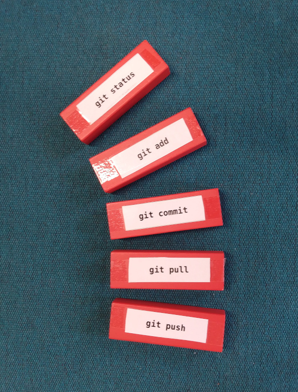

# 10 Tricks with Bricks

Some time ago, I wanted to support my classes on `git`, `bash` and `pandas` with interactive, haptic activities.
I bought a box of colored Jenga bricks and labeled them with programming instructions:

The outcome is a tool that can be used for many activities with little preparation.
Here are a few ways how they can be used:

## 1. Explain one

Place N + 5 bricks on the table. Each student picks and explains one.
This is a nice recap activity that can be done at the beginning of the next class.

If your group is up to 8 people, place the bricks on a table in the middle.
If your group is up to 15, place the bricks on a table in front of the classroom so that students can pick one as they come in.

----

## 2. Explain one, Upside-down

Place the bricks upside-down. Still every student draws and explains one.

The bricks crank up the difficulty by a notch.

----

## 3. Write a code example

Students pick a brick and write a code example using the command.
Give them some time to develop the code and ask them to share it.

This activity goes more into depth and is very likely to generate questions.
Because writing and discussing a code example takes more time, this works best in teams of 2-3.

----

## 4. Marketplace

Everybody (including yourself) takes 3 bricks.
Walk through the room, approach a random person, explain one of your bricks to them, give them the brick, get one from them, repeat.

This is a recap activity that scales up to very large groups (50+ given enough bricks)

----

## 5. Domino

Take turns placing bricks next to each other, explaining how the commands are connected.

This is a light warmup activity that helps students to integrate their knowledge.

----

## 6. Cluster

Have the students cluster the bricks into groups and label each group with a post-it.
This is an alternative method for *affinity grouping* - creating structure collaboratively.

This is a good activity to close a topic.

----

## 7. Solve a Task

Describe and visualize a problem (e.g. a programming task).
Ask students which commands they would need to use in which order to solve the problem.
Let them sit and puzzle for a while.

This is a good acitivity to train problem-solving, because it leaves program syntax aside for a while.

----

## 8. Troubleshooting

Ask students to pick a brick they find difficult / don't understand / have questions about.
Go through the bricks together and resolve whatever questions you can clarify.
You may come up with a few code examples on the fly.

This requires many more bricks than there are students.

----

## 9. Sort

Ask the students to sort the bricks into three piles: **easy, medium, hard**.
Give them time to discuss in case they disagree.

This is a quick feedback method that tells you how confident the group feels. 
You can use the result to recap the medium ones or dive deeper into 1-2 of the hard ones.

----

## 10. Jenga

Build a tower from the Jenga bricks.
Students take turns drawing and piling up bricks, briefly explaining the commands on them.

This activity is good for energizing / relaxing a group. The only disadvantage is that it works only with smaller groups (up to 8).
