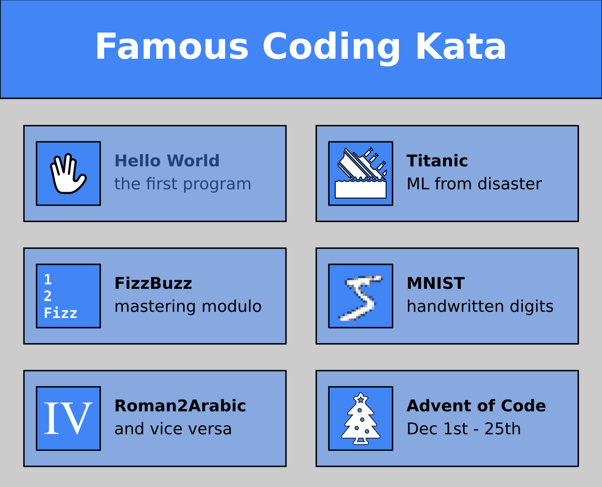

# Coding Kata

A **Coding Kata** is a well-defined coding challenge to rehearse skills.
Like in martial arts, the purpose of a coding Kata is to aim for perfect execution.
A student can solve the same Kata many times, improving their own programming every time or trying new programming techniques.

A **Coding Kata** could be: 

* write a *"Hello, World"* program
* calculate numbers from the *Fibonacci series*
* find the exit from a maze

For instance, you could implement the Hello World program in Python, C++, Java, bash, Postgres, Docker or brainf*** .
Likewise, you could use the MNIST digits dataset to exercise RandomForest models, neural networks, CNNs, PCA and so on.

In contrast to step-by-step guides, Coding Kata are much easier to write.
All you need to do is to come up with a clear description of the problem.
The typical Kata can be finished in 10-60 minutes.

----

## How to run a Kata?

1. Pick a challenge
2. Set a time limit
3. Start working in pairs
4. Review results together

### 1. Pick a Challenge

* Check the list below and pick a challenge
* Read through the challenge and make sure you understand the task
* Announce the task to the group
* Send them a link to the challenge

### 2. Set a time limit

* A good time limit is between 10 minutes (for a warmup exercise) and 45 minutes (a medium challenge)
* Announce the time limit
* Make sure the timer is clearly visible

### 3. Start working in pairs

* Randomly assign participants to pairs (use memory cards or similar)
* Give a strong, audible *"Lets GO!"* signal.
* Start the timer
* Towards the end, announce the time left

### 4. Review results together

* Ask every group to share their code on a public channel (git, Slack)
* Project the code on a screen
* Ask them to explain their code and/or give a live demo

----

## Variations

There are several ways to run a Coding Kata:

### Classroom Challenge

* Present the task.
* Give them time (5-15 minutes) to think about it.
* Wait for suggestions from participants.
* Type in what they tell you to type.
* Guide them towards the answer, take over when they get stuck.

*this is safer to run but less satisfying for the group*

### Hotseat Kata

* Place two chairs in the front at a computer connected to a screen
* Present the task
* Explain what is going to happen
* Ask two volunteers to take seats at the chairs
* One is the pilot (typing), the other is the copilot (assisting)
* After 5 minutes, the pilot is released, the copilot is promoted, and a new person fills in the empty seat.
* Repeat for the entire time box

----

## Online Kata

There are many places where you can find online coding Katas for self-study:

* [Graphics with Numpy](https://www.academis.eu/numpy_graphics)
* [Material on Academis](http://www.academis.eu/)
* [Advent of Code](https://adventofcode.com/)
* [CheckIO](https://checkio.org/)
* [Codingbat](http://codingbat.com/)
* [Codewars](http://www.codewars.com)
* [Cryptopals](https://cryptopals.com/)
* [Coding Dojo](http://codingdojo.org/cgi-bin/index.pl?KataCatalogue) – group Kata
* [Rosalind](http://rosalind.info) – bioinformatics
* [projecteuler.net](http://projecteuler.net) – Mathematical problems that require programming to solve.
* [regexone.com/](http://regexone.com/) – Learning regular expressions in 16+ lessons.

----

## Where does the word "Kata" come from?

A **Kata** is a well-defined ritualized exercise. In martial arts, the student is expected to perform an exact sequence of movements. Programmers have borrowed the concept for coding exercises.

Unfortunately we don't have an established system where you get colored belts (or hoodies or base caps) after completing a certain Kata. We should work on that.

----

## Further Reading

* [RandoriKata](http://codingdojo.org/RandoriKata/) – writeup of the kata method
* [Remote Mob Programming](https://www.remotemobprogramming.org/) – detailed description of a team kata method
* [pydantic data-kat](https://github.com/tmylk/data-kata/tree/main/validation/pydantic) – coding exercises for an ensemble programming session on pydantic
* [Mob Timer](https://mobti.me/mobrpg)
