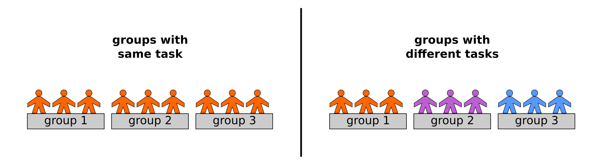

# Group Assignments

Many programming tasks work well in teams.
Group assignments do a lot to mitigate the heterogeneity of a class.
Besides solving the actual task, your students also train other essential programming skills like *planning* and *talking about code*.
But you should not expect that teamwork will happen by itself.
It usually requires decisive facilitation from the teacher.
In most cases, group assignments are a *planned, purposeful activity*.
In this chapter, you will find an overview of different **social forms** that you could use in a lesson:

----

## Individual assignments

Some students prefer that, because they can organize themselves freely.
However, students working on their own get stuck more easily.
For you this creates the problem how to find the time to help everybody.
Therefore, individual assignments are easier to get started with, but they create a lot of support downstream (the teaching equivalent of *tech debt*).
A few ideas to overcome this problem:

* before answering questions, brainstorm problems and collect them on a board
* display a students (buggy) code, and debug them together
* ask students do discuss code with their neighbour for 10 minutes

There is nothing wrong with individual assignments, but it should not be the only social form you are using.

----

## Work in pairs

This is probably the easiest to organize.
Give a task to pairs. Make sure the task is *very clear*.

Quite often, the chemistry within some pairs will be much better than in others.
Some people live on opposite ends of planet programming.
It is OK if they keep up appearances for some time while working on their own.
Strictly limit the time for pair assignments.
This allows you to manage the risk.

----

## Group assignments

Create small groups (2-4 people). Hand out a text or other material.
Explaing them the assignment, but have it written in the text as well.
There are two important variations of group assignments:

* all groups get the **same task**
* each group gets a **different task**

Different tasks give participants more responsibility and potentially superior results.
The former is less work to organize and generally safer.
Give the same task to each group if you haven't used this social form a lot.

----

## How to assign pairs / groups

Try any of the following:

* use an obvious criterion (location in the classroom)
* randomize (drawing colored blips from a bag, using the Zoom Breakout functionality, ``random.choice()`` etc.)
* Let students self-organize (risky if there are outsiders or tensions in the group; less risky with groups of 4+)

Do not fidget around and try to predict good groups by yourself.
You'll probably get it wrong anyway.

----

## Explain the task first

In any group assignments, it is essential that you stick to the following procedure:

1. Explain the task
2. Answer question to the task
3. Assign groups
4. Share material (handouts etc.)

As soon as you assign groups, the students will start to focus on each other.
As soon as you share material, they will want to examine it right away.
Both draws attention away from you – which is exactly what you want.
But they won't listen to you any more, so make sure to tell them the group what they are expected to do.
Otherwise the result will be a big mess.

----

## Group Puzzle

This is a more advanced social form that allows you to cover **a lot** of content.
Here is how it works:

#### Preparations

You need:

* a moderately complex task that requires combining multiple topics (e.g. "modify the colors in a photograph")
* 3-4 topics (e.g. *"RGB colors", "modifying Numpy arrays", "reading and writing images", "image formats")
* some reading material for each topic (1-2 pages, an example script etc.)

Ideally, the task is open-ended and tolerates some creative tinkering.

#### Part 1: Task Teams

* Assign people to teams of (3-4) people
* All teams get the same task (a more complex one)
* Let them chat for 5' to clarify the task
* Do a short Q & A
* Announce the topics and ask each group to assign at least one person to each topic.

#### Part 2: Topic Teams

Now comes the puzzle aspect. The teams regroup:

* the people for each topic get together
* they work on the material and work on a **simple** task (e.g. "read the text and create RGB colors for the rainbow")
* let them work on the task for a while (30' at least)
* be ready to troubleshoot

The trick is that every student now carries a lot of responsibility for their own team.
At the same time, they are never alone!

#### Part 3: Coming back

Finally, everybody goes back to their original team:

* everybody summarizes what they learned to their teammates
* start solving the task
* give them plenty of time for that

Following the idea 'the best teacher is someone who just learned himself.' Course trainers orchestrated the process.
