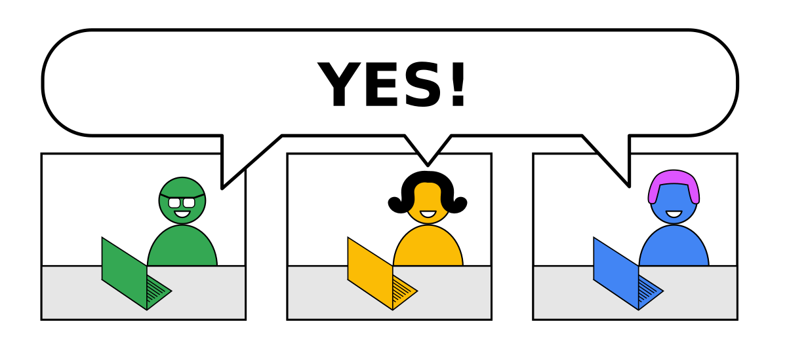
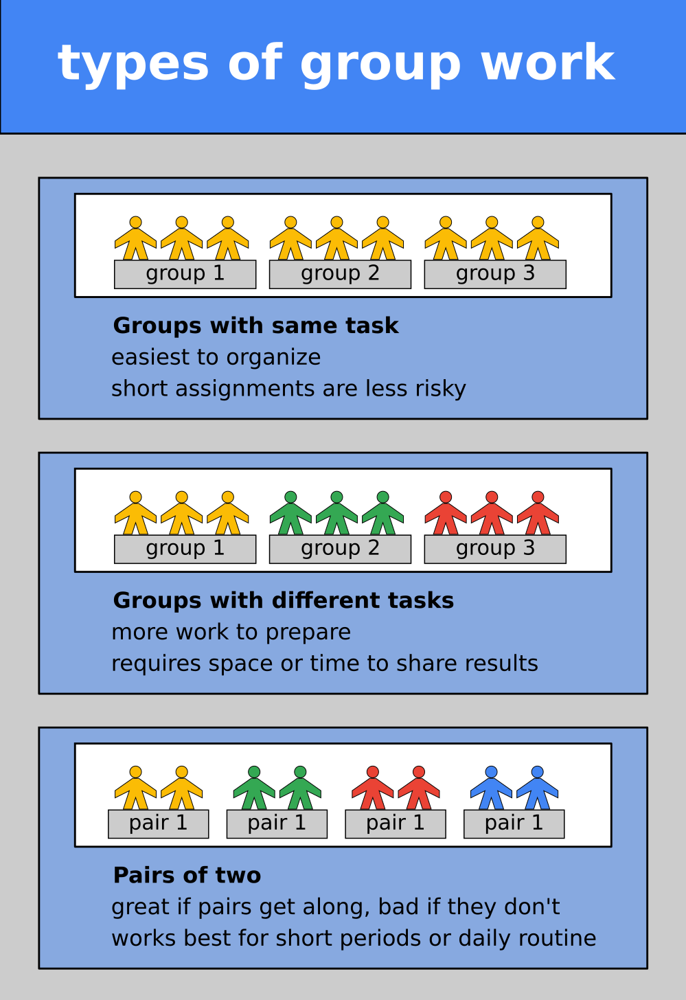
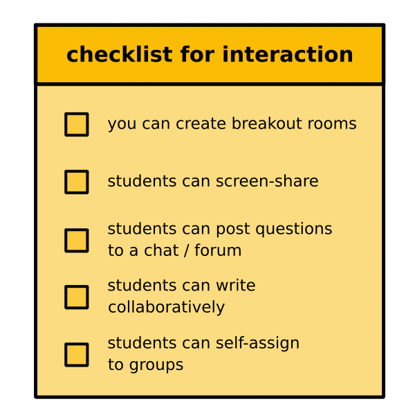
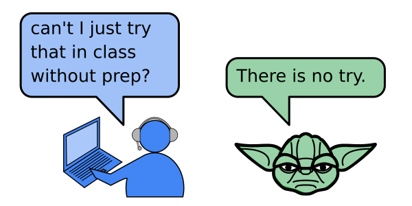
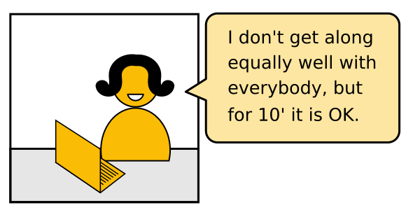

Group Assignments
=================

Many complex problems are easier to solve in a team.
Group assignments help to mitigate the heterogeneity of a class.
Besides solving the actual task, your students also train other essential programming skills like
*planning* and *talking about code*.
If they bring different skills, they also learn a lot from each other.
Essentially, you want to convert disconnected students:

.. figure:: images/students_nocoop.png
   :alt: three students having the same bug

into a group:

.. figure:: images/students_coop.png
   :alt: three students working together

so that:

However, unless your students know and trust each other, teamwork rarely happens by itself.
It usually requires decisive facilitation from the teacher. 
Students feel *psychologically safe* on their own. This creates a
barrier that is hard to overcome.

What can you do to encourage students to work together and *still* feel
safe?
In most cases, group assignments are a *planned, purposeful activity*.
In this chapter, you will find an overview of different **social forms** that you could use in a lesson:

Individual assignments
----------------------

Some students prefer that, because they can organize themselves freely.
However, students working on their own get stuck more easily. For you
this creates the problem how to find the time to help everybody.
Therefore, individual assignments are easier to get started with, but
they create a lot of support downstream (the teaching equivalent of
*tech debt*). A few ideas to overcome this problem:

-  before answering questions, brainstorm problems and collect them on a
   board
-  display a students (buggy) code, and debug them together
-  ask students do discuss code with their neighbour for 10 minutes

There is nothing wrong with individual assignments, but it should not be
the only social form you are using.

Work in pairs
-------------

This is probably the easiest to organize. Give a task to pairs. Make
sure the task is *very clear*.

Quite often, the chemistry within some pairs will be much better than in
others. Some people live on opposite ends of planet programming. It is
OK if they keep up appearances for some time while working on their own.
Strictly limit the time for pair assignments. This allows you to manage
the risk.

.. _group-assignments-1:

Group assignments
-----------------

There are 3 basic forms to organize group work. Of those, small teams of
3-4 people is the least risky and easiest to organize:

Groups with different tasks are great if you want to cover a lot of
ground quickly. Each group could research a different function or
library and show something at the end nobody else has seen yet.

Create small groups (2-4 people). Hand out a text or other material.
Explain them the assignment, but have it written in the text as well.
There are two important variations of group assignments:

-  all groups get the **same task**
-  each group gets a **different task**

Different tasks give participants more responsibility and potentially
superior results. The former is less work to organize and generally
safer. Give the same task to each group if you haven’t used this social
form a lot.

How to assign pairs / groups
----------------------------

Try any of the following:

-  use an obvious criterion (location in the classroom)
-  randomize (drawing colored blips from a bag, using the Zoom Breakout
   functionality, ``random.choice()`` etc.)
-  Let students self-organize (risky if there are outsiders or tensions
   in the group; less risky with groups of 4+)

Do not fidget around and try to predict good groups by yourself. You’ll
probably get it wrong anyway.

Explain the task first
----------------------

In any group assignments, it is essential that you stick to the
following procedure:

1. Explain the task
2. Answer question to the task
3. Assign groups
4. Share material (handouts etc.)

As soon as you assign groups, the students will start to focus on each
other. As soon as you share material, they will want to examine it right
away. Both draws attention away from you – which is exactly what you
want. But they won’t listen to you any more, so make sure to tell them
the group what they are expected to do. Otherwise the result will be a
big mess.

Check the technical setup
-------------------------

   checklist

An class is very sensitive to little bumps.
If something does not work out it takes the momentum from group activities.
In an online class, this is even worse.
So you want to make sure that technological setup does not get in the way.

Establish rules
---------------

When I started to teach online, I realized that rules for tasks and
activities need to be more clear than in a classroom. The last thing you
want is that you have 3 students in a breakout, each with a different
opinion on what they are expected to do. To be clear, put the following
information in the **eyes AND ears** of your students.

.. figure:: images/breakout_facilitation.png
   :alt: facilitation rules

A good example of a group task that you could post to a chat would be:

::

   Hyperparameter Optimization of a Classification Model
   -----------------------------------------------------
   During the next 25 minutes, your team should:

   1. Open the notebook `titanic.ipynb` that contains a Logistic Regression model
   2. Add the GridSearch example from the lecture notes
   3. Train the GridSearch to find the best hyperparameter value for `C`
   4. Post the training and test score to Slack

Example Tasks
-------------

Here are typical tasks that are not too difficult to prepare:

.. figure:: images/example_group_tasks.png
   :alt: example tasks for group work

Notes on the timing:

-  discuss an open question: 2-5 minutes, good for warming up
-  debug a piece of code: 5-10 minutes
-  read and summarize: 15 minutes (blog post) to 90 minutes (research
   paper)
-  answer an interview question: 5-10 minutes
-  implement a program with a step-by-step guide: 20-60 minutes

During the longer tasks you can go around and see if anyone wants help
or take turns reaching out to the groups via a chat.

Easy wins
---------

When you prepare tasks for group activities, **make the task a bit too
easy**. First, tasks are usually more difficult for the student than one
would think. Second, you want to lead your groups to success. It is
utterly frustrating if none of the groups makes it to the finishing line
or if your group is the only one that fails. Third, you maximize the
benefit from working in a group. If the core task is easy, your advanced
students will have time to try and discuss alternative implementations.
This is exactly where you want them to be.

If you do not have much experience with group tasks or need to get to
know a group of students, start with a shorter task (up to 10 minutes).
Shorter tasks are psychologically much safer:

Caveats
-------

These tips make student cooperation *more likely*. It still strongly
depends on the group chemistry at a given moment. Some groups take up
your encouragement very eagerly, others won’t react at all.

If it does not work it is not your fault. Imagine they have 2 kids or 7
cats around while being in your course. Such situations do occur, and
sometimes you won’t notice.

But celebrate if it does work!

