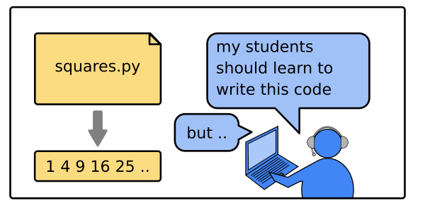
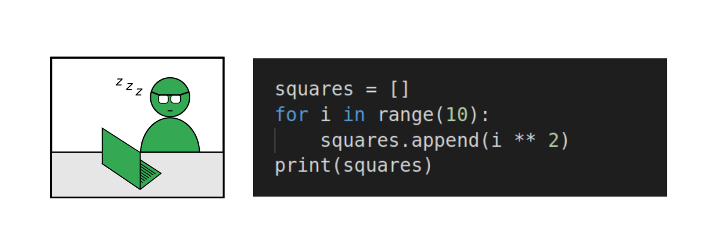
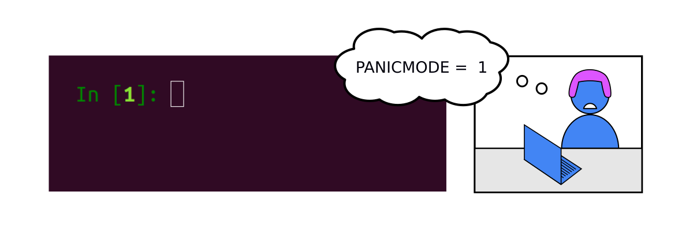
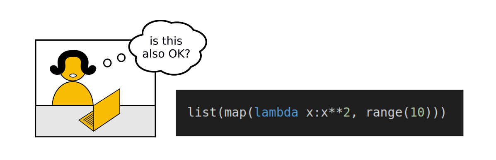

Coding Exercises
----------------

   teacher preparing lesson

Suppose your students are to write a program that calculates a series of
square numbers:

::

   1  4  9  16  25  36  49  ...

For you, the solution is easy to implement. But if you show them the
solution directly, it goes into their brain and out again:

   student fell asleep

However, asking them to write the program from scratch themselves is too
difficult:

   student in panic mode

Ideally, you want to develop exercises that are:

-  clear enough that they can focus on new concepts or commands
-  difficult enough that the students need to think
-  easy enough that they can find the solution themselves

You also want more advanced students to try alternative implementations:

   squares with functional pattern
