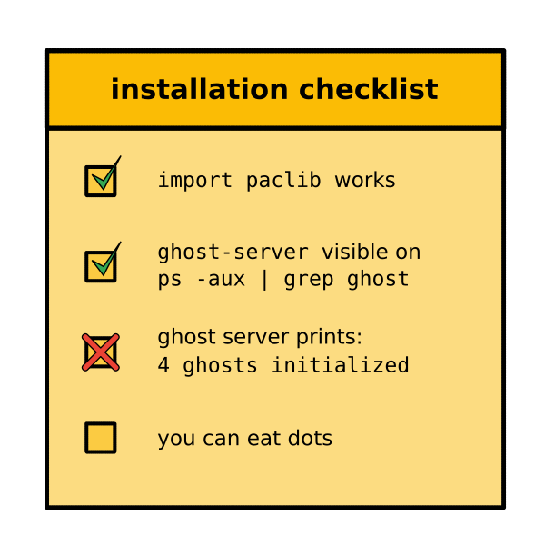

# How to prevent Installation Problems?

## The Problem

You prepared a nice, easy and fun example program.
Everything works fine, but then your lesson starts:

If you fix everything in class, half the day will be over.

What can you do to make installation issues go away?

----

## The Solution

Some courses are more prone to installation issues than others.
Installations are an annoying thing, because it is harder to help, especially if students need to reboot their system.
The riskier courses are the ones where students need to install programs in the first place, are not used to installing programs, and come with a mix of operating systems.
Apart from finding out what you are getting yourself into, here are a couple of steps you can take: 

### 1. Control the flow of events

You cannot make installation problems go away.
Instead, anticipate that some installations **will** fail and build a safety net.
The flow of events in an installation-risky training might look like this:

* **ask students to install software:** ideally, let them know a week in advance
* **send a reminder:** ask them to install again a few days before you start
* **offer an installation helpdesk:** one hour a few days before might solve a few issues already. Also, you might get good information where the students are standing.
* **check who has a working installation:** ask very early in your course to estimate the size of the problem.
* **reserve a timeslot for debugging installation issues:** after some time spent on introduction or theory, spend some time debugging. You need to timebox this activity and also provide some self-paced material for the ones who have a working installation.

You want to decrease the number of failing student computers.
If you get 90% working in a short time, it is good already.

### 2. Create a checklist

The last thing you want to do is check every installation yourself.
Write a simple checklist that students can use themselves to verify that their installation works:

Make sure that your students can check the points without you.
This should make most of the questions *"does it work already on my machine?"* go away.

### 3. Have a Plan B

Whatever you do, not all installations will work.
Reserve one or two backup options:

#### Cloud-based solutions

Quite a few programs can be run completely in the cloud.
Think of Google Colab notebooks, AWS EC2 servers, databases and many more.
The main disadvantage of this approach is that many services are not for free.
But having a server ready that you could start on demand takes a lot of the risk away.

#### Team Up

One of the simpler solutions is to pair up students for exercises.
This strategy gets the installation issues off your desk as soon as 50% of the students have the program installed.
Because this is quite safe, you might plan to do exercises in pairs from the very beginning.

Forming teams works generally better if the students know each other and have worked in pairs before.
You might want to let them self-assign to pairs – they can sort out the team chemistry better than you.

Of course, not having anything working on their own computers will be disappointing for the respective students.
But you could actually go around during a pair exercise and catch as many of them as possible.

#### Docker

Docker is a great tool that ends many installation issues for good.
If you are planning to use server-like programs for a longer time, this might be your backup plan of choice, or even the main plan.

However, Docker has a few disadvantages:
First, it does not work for GUI applications.
Second, it has a steep learning curve. If a student figures out how to use docker, they are probably able to install whatever you need anyway. Docker just makes it simpler.
Third, it does not help with installing Docker itself.
