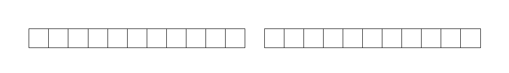

# Facilitating Coding Exercises

If your participants need to do something, they need instructions that are clear and that they have a good chance of completing themselves.
An example that does not work well with beginners:

    Implement the quicksort algorithm.

There is a big problem with this type of task.
It does not contain a clear problem-solving strategy.
When learning a new concept (the sorting algorithm), it is very difficult to develop a problem-solving strategy simultaneously (see [Greg Wilsons book](http://teachtogether.tech/en/index.html#s:architecture-load) for a detailed explanation).
The result is **cognitive overload**.

An example that might work better is providing a working path:

    1. Complete the quicksort code using given code sniplets.
    2. Execute the code on the datasets A and B.
    3. Measure how long the program takes to complete.
    4. Compare the performance to Pythons built-in `sort()` function.

In this exercise, the students have a chance to *execute, analyze and understand* the quicksort algorithm before having to implement the whole thing.

In this chapter, you will learn several strategies to design coding exercises that reduce the cognitive load.

----

## Step-by-Step tutorials

Probably the easiest way to facilitate a practical exercise is to take the participants by the hand and bring them home safely. Write down every single step necessary to complete a task. Most of the time that the tutorial is telling the participants exactly what to do, which lines of code to write etc. If they manage to follow the instructions by the letter, they will probably succeed.

If you want to see a highly developed step-by-step guide, take a look at the **[Django Girls Tutorial](https://tutorial.djangogirls.org/en/)**. This piece has been tested by more than 10000 people. Yet, Django Girls keep a high number of coaches around at their events, because most of the participants are total beginners and the tutorial covers a wide range of technologies.

On the positive side, step-by-step exercises keep the class busy and allow you to focus on matters where your full attention is required. Also, they lead to success for most participants quickly.
On the other hand, following a step-by-step guide is not very challenging for advanced students.
As a participant, you are aware that you are following a *"safe path for tourists"*. This could limiting the learning experience. Also, it takes a while to create a step-by-step instruction that works under most circumstances. Python installations, environments, missing libraries or a simple typo could still require your help.

Concluding, step-by-step tutorials are a useful method for a first confrontation with a new technology.

----

## Reduced examples

Writing a program from scratch is difficult. It works better to provide a **reduced example**, where a clear problem-solving strategy is made available:

* code with gaps		
* sort code lines		
* sort code blocks
* fix unindented code
* empty function headers
* sequence of small tasks
* pseudocode
* fix buggy code

Reduced examples are a powerful technique that spice up a lesson and trigger interesting questions.

----

## Programming from a model

Instead of giving a prose description, you can describe the problem using a formalized description or model. This is more difficult than a reduced example, but less difficult than starting with a prose description alone. Ways to describe your model include:

* Flowcharts
* ER-models
* UML Class diagrams
* UML sequence diagrams
* State diagrams
* Parnas tables
* graphical descriptions of an algorithm

----

## Self-checking exercises

A very valuable type of exercise is where participants can assess their progress themselves.
Sometimes it is sufficient to get the code to execute.
This works well if the program draws an image:

    :::text
    Write a program that draws the flag of Italy.

or when the students are writing a game:

    :::text
    Implement a rock-paper-scissors game.

But getting the code to run is insufficient or outright dangerous, when miscalculations or other semantic defects is go undetected easily (e.g. in data analysis or machine learning).

In these cases, your participants need a way to validate the program or to assess intermediate steps.
There are a few good options:

* provide sample output at each step (*"The output should look like this"*)
* use a test dataset or introduce the concept of validation data early on (in machine learning)
* provide `assert` statements or Unit Tests that participants can follow along
* have each step result in a character, the characters form a word at the end
* create a whole framework for self-checking code (probably a lot of work). The [Python Koans by Greg Malcolm](https://github.com/gregmalcolm/python_koans) are a good example of this approach.

Such exercises are valuable but more costly to create. Not only do you need to think of the problem itself, you also need to create a mechanism (or multiple ones) by which participants can assess their progress.

### Example:

In my [bash tutorial](https://github.com/krother/bash_tutorial), every exercise results in one or a few characters that form a word:

Once a student discovers that word, it will be self-evident that this is the correct solution.

*Exercises with self-assessment are inspired by the Montessori school of teaching.*

----

## Knowledge transfer

Show a sample solution for a related problem first.

When reading a language coursebook, you will find at the beginning of
each chapter a short text that contains examples of all topics treated
in that chapter. Lessons usually start with reading this text, and then
elaborating different aspects of this topic (grammar, vocabulary,
content etc.).

You can borrow this idea, and apply it to teaching other subjects, too.
First, you show a sample solution, and let the trainees repeat and
understand it. Then, you give a task where trainees have to modify the
approach a little to apply it to a different problem. Provide some
reference material (data, facts, formulae, computer commands etc) that
trainees can work with independently.

What is very nice about this method is that you can fit complicated
subjects into a shorter time box, because the trainees don't have to
start from zero.

----

## Optional hints

*Build a fail-safe system into tutorials or other complex tasks.*

Create an incremental set of hints that guide students through an
exercise. The hints can be on paper cards or on a wiki webpage. The
hints do not replace giving a theoretical background or providing an
overview of the topic. They rather help trainees regulate their learning
speed autonomously, thereby taking the burden off the trainer to
intervene when small problems occur or getting interrupted.

This method is described in more detail in:

*Rother K, Musielak M, Pleus A, Upmeier zu Belzen A, Multi-Stage Learning
Aids applied to hands-on software training. Brief Bioinform 2010; doi:
10.1093/bib/bbq024.*

----

## Early Victory Strategy

Let your participants know a goal that they can achieve easily.

When working on course projects and longer programming assignments, set the threshold low.
Communicate a **main goal** that the average student completes in 25% of the time allocated for it.
Add a few **optional goals**:

    :::text
    Main goal:
    * implement the Fizz-Buzz-Test

    Optional goals:
    * let the user input the maximum number
    * implement the code as a function
    * do not use any variables

The purpose of this approach is to let your students build their own self-confidence.
Feeling more comfortable, they will find it easier to cooperate as a group.
Also, they will find the room to find unexpected solutions.

I have used this strategy with great success in 10 consecutive course projects in a full-time course.
The main assignment was:

    :::text
    Give a 5' lightning talk about a topic of your choice on Friday.

The result was that students found very diverse topics *while* working on their course projects.
A side effect was that the lightning talk sessions became a lot more enjoyable than hearing a dozen similar project presentations.

*Source: The early victory strategy is based on the teaching of Sun Tzu.*
