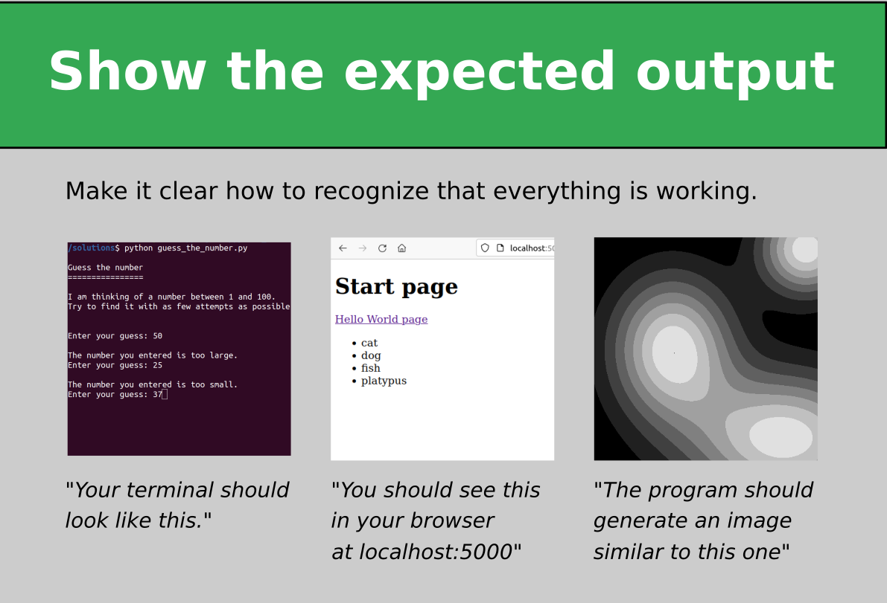

# How to select material for self-study?

## The Problem

You want your students to become good at a technical skill.

In teaching, time is always too short to reach mastery.

**So how can you help them to become better themselves?**

----

## Solution

Maria Montessori redefined the teacher as a *learning facilitator*:

### 1. Show a learning path

One of the main reasons why students are looking for a teacher nowadays is that there is simply too much material.
A simple search for a topic like **Data Science course** will open up an entire jungle of possibilities, and it is very hard to decide where to start.
The bolder students start anyway but get stuck after a while.

As a teacher, you can help a lot by **showing a linear path** that helps them to orient themselves:

This is the strategy used by many self-paced online courses.
Almost all of them have a very clear, linear outline.

The main point of a learning path is that it gives your student a **direction**.
It does not mean that they have to walk that same path to the very end - in fact very few do, as proven by the churn rates of online courses.

But if the student follows your path until they know the jungle well enough to choose their own direction – or the next guide, you have succeeded.

### 2. Reading Material

With self-study material, students usually have the same problem as with choosing a subject: there is simply too much material.
It does not help if you assemble a reading list consisting of 10 web pages, 5 research papers and 1 book.
Very few people have the time to read through all of these.

Select reading material that is concise and super focused.
Provide 2-4 well selected links instead of building a library.
You may include a mix of blogs, videos, code examples or books.
Each of these are great, but some students have their own preferred media.

If you are looking for good examples of self-study material, start with:

* [ML Fundamentals by Daniel Godoy](https://github.com/dvgodoy/ML_Fundamentals)
* [Code Sniplets by Chris Albon](https://chrisalbon.com/)
* [Linear Algebra Videos by 3Blue1Brown](https://www.youtube.com/playlist?list=PLZHQObOWTQDPD3MizzM2xVFitgF8hE_ab)

### 3. Write Exercises

If you have more time to spare you may want to write exercises on your own.
To be suitable for self-study (or online group work), you need a complete step-by-step guide.
In a step-by-step guide, you need to cover not only the necessary steps, but also anticipate a few things that might go wrong.

It does not have to be a literary masterpiece.
What counts more is that the instructions are clear and the guide is well-structured with sections and subheadings.

A key component is that students can verify their own progress after every step (this is BTW also a key component in the Montessori approach to teaching):

Writing and debugging a step-by-step guide is a lot of work and requires multiple iterations.
You may want to be available to help in the first iteration.

Here you find some very mature and detailed step-by-step guides:

* [DjangoGirls Tutorial](https://tutorial.djangogirls.org/en/)
* [Full Stack Open](https://fullstackopen.com/en/)
* [Software Carpentry](https://software-carpentry.org/lessons/)
