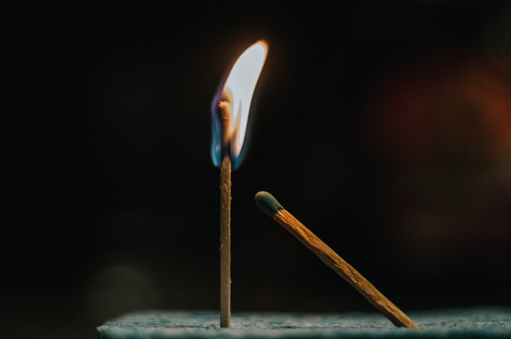

# Start a Fire

*Photo by [Devin Avery](https://unsplash.com/@devintavery?utm_source=unsplash&utm_medium=referral&utm_content=creditCopyText) on [Unsplash](https://unsplash.com/s/photos/matches?utm_source=unsplash&utm_medium=referral&utm_content=creditCopyText)*
  
| summary     | play with matches |
|-------------|-------------------|
| time        | 10' |
| preparation | 5' |
| group size  | 5 - 15 |
| material    | matches, water cup |

----

### How it is done

1. Ask *“What will you remember about the course?”*.
2. Pass around the cup and the matches.
3. Everybody may comment whatever they want, as long as the match is burning
4. There is one match per person, including yourself.

----

### Comments

**IT IS A BAD IDEA TO USE THIS METHOD IN A ROOM FULL OF LAPTOPS.**
This is best executed in a more open meeting space.

* Do not use this in rooms with a carpet.
* Check the location of smoke detectors, explosives, chemicals etc.
* Another person should hold the water cup in order to dispose the match quickly.
* Extend the time you speak by holding the match upwards.
