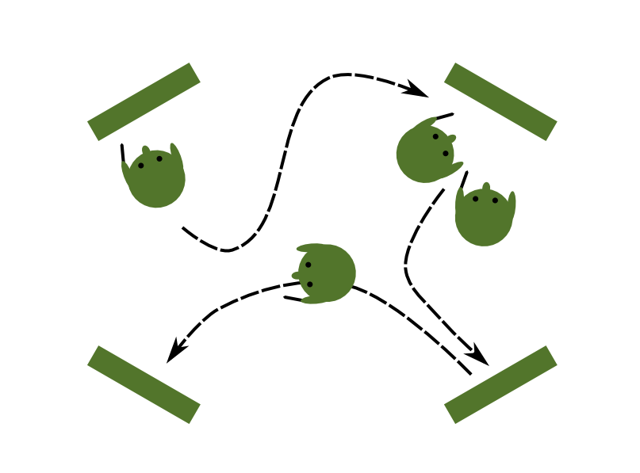

# Four-Corner Feedback

**collect feedback on 4 questions**

### Time in class

### Preparation time
5'

### Group size
5-20

### What you need

* 4 sheets of flipchart paper (half size)
* four spots to attach the paper
* marker pens

### How it is done

Hang 4 sheets of flipchart paper on different spots of the room. Write a question on each, e.g.:

* What did you like about the course?
* What should be improved?
* What would you like to learn more about?
* What will you use in practice?

Give markers to course participants and let them roam around and write for about 10 minutes. As a result, you obtain feedback on your course and your group has the opportunity to express things that may have been left unsaid.

### Comments

The four-corner method can be used for a number of purposes: Collecting information on a new topic, facilitating the transfer to everyday practice, or collectively looking for solutions to a problem. Here, I focused on the feedback aspect because I found standing up and moving gives students the energy to focus one last time after a long day.

