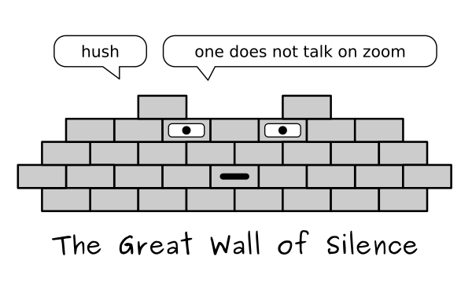

Collecting Feedback
===================

.. figure:: images/pingu.png
   :alt: pingu asking for feedback

The Problem
-----------

You have **no idea** what is going on in your class.

or worse, you **know** something is going on:

.. figure:: images/are_you_mad_at_me.png
   :alt: teacher trying to talk to student

or everything is great and you would like to take a moment to
**reflect** with your students:

.. figure:: images/feedback_reflect.png
   :alt: students reflect

Normative and Formative Feedback
--------------------------------

There are two main types of feedback.
**Normative Feedback** helps you to fine-tune a course while it is running:

* find out what to prepare for the next lesson
* find out what your participants have learned
* improve a future edition of your course
* make your participants aware of what they have learned
* make concerns of your participants heard
* help participants to close the course mentally

In contrast, **Formative Feedback** collects more objective information.
Formative feedback is useful to benchmark different courses against each other.
I do not focus on formative feedback here, although I have seen it as an excellent
tool to improve as a teacher if handled by skilled course organizers.

Most students do not share feedback by themselves.
In the following chapters, you find a couple of strategies to elicit useful information.

.. seealso::

   `Formative Assessment methods <https://www.edutopia.org/groups/assessment/250941>`__

A: Single/Multiple Choice Quiz
~~~~~~~~~~~~~~~~~~~~~~~~~~~~~~

Ask three questions about subjects from the last lesson so that each
student can have a guess:

There are many tools that allow you to create single-choice or
multiple-choice quizzes. Most **Learning Management Systems (LMS)** have
a quiz app built in, Zoom has a **Poll app**, and on Slack you have the
`Polly
app <https://scikitcilantro.slack.com/apps/A04E6JX41-polly?tab=more_info>`__.

A low-tech version that works on most chat programs is to use Emoji
responses. Here are True/False questions:

.. figure:: images/slack_yesno.png
   :alt: yes no question on Slack

Quizzes like these are low-risk. They focus on the content and let you
know how far the class is overall. Students can also assess their own
progress. In any case, they will want to hear the answer afterwards and
may have follow-up questions.

Their main disadvantage is that you need to prepare the questions in
advance.

B: Collect ideas
~~~~~~~~~~~~~~~~

A more spontaneous feedback is to collect ideas in an online app. It
usually makes sense that students can see the results – this builds
mutual trust. Here are three questions that are easy to start with:

.. figure:: images/feedback_temp_check.png
   :alt: three questions

Collecting ideas on multiple questions allows you to mix information on
technical aspects (*“which topic is difficult”*) or do an emotional
**temperature check** (*“what do you like”*, *“what frustrates you”*).
You can use the temperature check question to release a bit of pressure
in a controlled way.

.. figure:: images/thermo.png
   :alt: penguin with thermometer

Like with the quizzes, you can post your questions in a chat program and
collect results there. If you need a bit more freedom, a shared **Google
Spreadsheet** is easy to set up. A fancier (and free) tool is `the 3L
activity on
Funretrospectives.com <https://app.funretrospectives.com/?activity=3Ls>`__.

C: Prioritize ideas
~~~~~~~~~~~~~~~~~~~

If you want to gauge interests quickly or make a joint decision, you can
let the group vote. This is a great start for a wrap-up or recap
session.

Technically, this works the same way as a quiz. But the purpose is
different – the voting empowers the students and makes it more likely
they will talk.

D: Lean Coffee
~~~~~~~~~~~~~~

If you want to spend some time reflecting more deeply, you may want to
try the Lean Coffee method. It does not produce any tangible output, but
allows you to cover many topics in a short time. It works as follows:

The method needs some time (2 minutes for explaining, 5 minutes for
collecting topics and voting plus 20-30 minutes for discussions). It
works with small to medium groups (up to 10 people).

The Lean Coffee method requires that people are in a constructive mode.
If you have conflicts boiling in the group, discussing them may make
them worse. The Lean coffee is a good way to run a retrospective at the
end of a course unit or project.

Warning: Feedback is confidential
~~~~~~~~~~~~~~~~~~~~~~~~~~~~~~~~~

Most feedback should be kept confidential unless everybody is
comfortable sharing it. It may be a good idea to destroy evidence after
the course.

.. seealso::

   You find a lot of online facilitation tools on
   `www.funretrospectives.com <https://www.funretrospectives.com>`__.

.. toctree::
   :maxdepth: 1

   dot_voting.md
   props.md
   fire.md
   fist_or_five.md
   four_corners.md
   round_robin.md
   supermarket.md
   voting_box.md
   feedback.md
