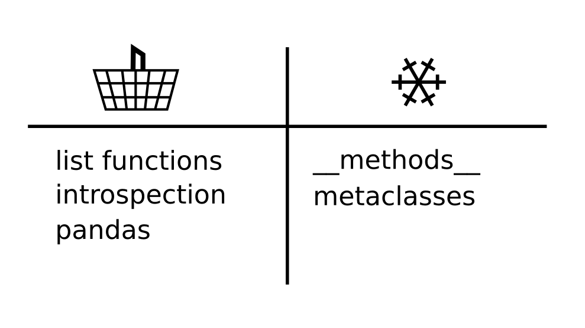

# Supermarket

| summary     | quick feedback on the course contents |
|-------------|---------------------------------------|
| time        | 5-10' |
| preparation | 2' |
| group size  | 3 - 30 |
| material    | whiteboard or flipchart|

----

### How it is done

At the end of a course or day:

1. Draw a shopping basket and a freezer on the board
2. Place the board near the exit
3. Ask participants to write on the board what they find useful (basket) and what they don't need right now (freezer)

----

### Comments

If you are closing after this activity, you could ask participants to explain why they placed something in the basket or the freezer (small groups only).

Alternatively, participants might write their feedback on the way out.

The feedback you get is focused on the actual contents **and** its practical applicability. I find it a great way to filter out background noise, e.g. the atmosphere was nice etc.
