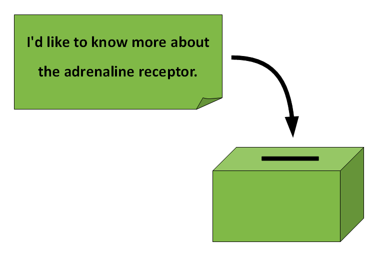

# Voting Box

| summary     | collect cards with feedback in a box |
|-------------|--------------------------------------|
| time        | 10' |
| preparation | - |
| group size  | <30 |
| material    | paper cards, a mailbox, hat or box |

----

### How it is done

Write 1-3 open question on the board, e.g.:

* *“What would you like to learn tomorrow?”*
* *"Where do you get stuck?"*
* *"What do you like about the course?"*

Share small pieces of paper among the students. Give them some time to write down something and collect the paper pieces in the box. Evaluate the answers. If you are collecting feedback, start reading the answers only **after all students are out of sight**.

You can use this feedback technique to collect ideas and suggestions from a passive group. For instance, when your lessons start very late, when students have a lot of respect towards you, or when there is a language barrier. The method also helps if your group is heterogeneous or dominated by a few active trainees.

I have used the voting box for getting feedback after the first few days of a course, and prepare the rest of the course to the answers. It is a foolproof method that you can apply spontaneously.

In a longer course, you could keep the box around near the exit and check it regularly.
