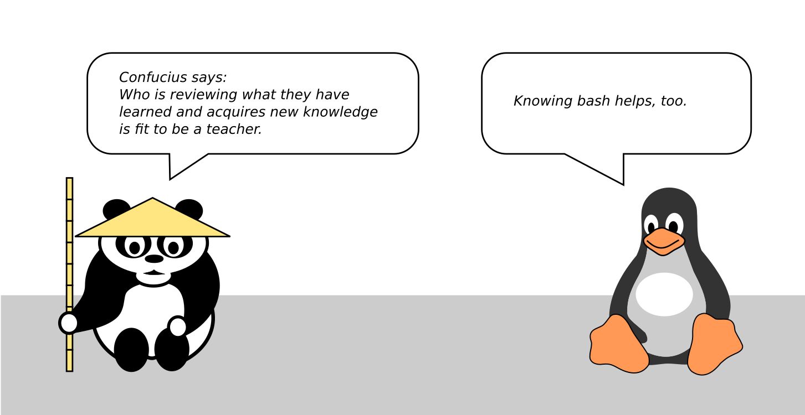

Programming is difficult to teach
=================================

|image0|

Teaching is a very old profession. A lot has been written about theory
and practice of teaching. Reading a book on education is a good idea.
However, teaching programming is special. There are specific challenges
that many programming teachers face. In this chapter I would like to
point out four of them.

Programming is difficult to learn
---------------------------------

Consider you are teaching an introductory Python course. As a classroom
project, your students are going to analyze a tabular file with penguin
data. You would like them to write a small program like this one:

.. code:: python3

   # count all Adelie penguins
   ade = 0
   for line in open('penguins.csv'):
       if 'Adelie' in line:
           ade += 1

   print(f'There are {ade} Adelie penguins in the file.')

What difficulties do students face when writing such a program?
Here are a few things many beginner programmers struggle with:

-  set up their Python environment
-  decompose the problem into elementary steps
-  understand the abstraction behind the `for` loop
-  combine the `for` loop with a conditional statement (two abstractions)
-  type in the instructions correctly
-  write a correct path to the CSV file

In all these steps, details matter. Getting one tiny detail wrong usually ruins everything.
In this aspect, learning to program is fundamentally different from e.g. learning a spoken language.
The following variations of the penguin counter program contains several bugs that will get many first-time programmers stuck:

.. code:: python3

   # count all Adelie penguins
   ade == 0
   for line in 'penguins.csv':
       if line in 'Adelie':
           ade + 1
           print('There are {ade} Adelie penguins in the file.')

Each line contains a bug that breaks the program in one way or another.
Understanding why a particular line is correct or wrong requires a lot of context
(syntax, other lines of code, input data, function signatures etc.).
A student of programming needs the entire context to make a program work.
This is what makes programming difficult to learn.

Programming requires multiple skills
------------------------------------

To count the penguins in Python, you could also use `pandas`, a popular Python library for data analysis.
Essentially, `pandas` allows you to process tabular data without control flow statements:

.. code:: python3

   # count all Adelie penguins
   import pandas as pd

   df = pd.read_csv('penguins.csv')
   adelie = df[df['species'] == 'Adelie']
   print(adelie.shape[0])

This program still counts penguins.
But which of the two penguin counter programs is better?
The first program with the `for` loop uses only basic language features and will work in any Python environment. 
It is easy to understand for anyone who used a different imperative programming language before.
The second program using `pandas`, gives your students a powerful data analysis tool.
On the other hand, an extra library needs to be installed, `pandas` code is not always easy to read, and the students will learn nothing about control flow.

Professional programmers face decisions between alternative approaches very frequently.
So, in addition to **writing code**, they also **make design decisions**.
Making design decisions is an important skill that is orthogonal to writing code.

.. note::

   A senior programmer might comment that both implementations are bad,
   because there are no tests, bad documentation and the scope of the program is not defined.
   **testing**, **documenting** and **requirements engineering** are more skills a programmer needs.

In the table below you find examples of skills (*competencies* in educational jargon) that programmers typically use:

+---------------------------------+------------------------------------+
| skill                           | description                        |
+=================================+====================================+
| write code                      | decompose a problem into           |
|                                 | programming instructions and type  |
|                                 | them in                            |
+---------------------------------+------------------------------------+
| program design                  | make decisions on structure,       |
|                                 | algorithms and technologies        |
+---------------------------------+------------------------------------+
| reading code                    | understand other peoples code,     |
|                                 | including your former self         |
+---------------------------------+------------------------------------+
| debugging                       | diagnose errors and fix them       |
+---------------------------------+------------------------------------+
| refactoring                     | improve the structure of your code |
+---------------------------------+------------------------------------+
| development tools               | use an environment to work with    |
|                                 | code efficiently                   |
+---------------------------------+------------------------------------+
| testing                         | check whether a program is doing   |
|                                 | what its inventors had in mind     |
+---------------------------------+------------------------------------+
| validation                      | check whether the program          |
|                                 | contributes to its purpose         |
+---------------------------------+------------------------------------+
| version control                 | keep track of changes over time    |
+---------------------------------+------------------------------------+
| algorithms                      | know problem-solving strategies    |
+---------------------------------+------------------------------------+
| communication                   | explain code and software projects |
|                                 | to other people, including         |
|                                 | non-programmers                    |
+---------------------------------+------------------------------------+

If you don't know these skills exist, it is very difficult to learn about them on your own.
Yet, most introductory programming books and courses focus entirely on the skill of *writing code*.
What about the other skills? Can they be taught?
Yes, of course, all of them can be taught.
But it is difficult to find the right balance of skills and to communicate it clearly.
But in my opinion, **teaching programming is all about finding that balance**.

The content is unstable
-----------------------

I once had the pleasure to attend a meeting of math teachers at a primary school.
The teachers discussed strategies to work with students who struggle with arithmetics of integers up to 20.
One of the teachers pulled out a box full of cards with exercises.
Each card was tailored at a specific sub-problem (e.g. adding `9`)
that the teacher could briefly explain to the student and then help the rest of the class.
I was genuinely impressed. The material addressed a teaching situation that all of the math teachers had experienced.
The cards had been purchased from a publisher that specializes on that kind of material.
I realized that it has advantages when millions of students learn the same content each year.
Also, arithmetics between 1 and 20 are very stable. 
The content (syllabus) for primary school math is defined completely and in high detail (reference?).
Unfortunately, this is not the case for programming.

There is no universally accepted, generic content for programming languages.
Practically, every teaching institution uses their own.
You can expect that every teaching format has to be uniquely structured from scratch.
Crafting content covering the many skills of programming is not easy.
To make matters worse, the technologies we work with evolve rapidly.
Whatever you create, will have to be regularly reviewed, refined and updated.

Non-linear skill growth
-----------------------

*“Things that took me 2 days a year ago now take me 10 minutes”*

(anonymous former course participant)

.. figure:: ../images/expo.png
   :alt: non-linear skill growth

   non-linear skill growth

People learning to program often progress impressively. A few weeks of
experience makes them write similar code 10x faster than before or solve
problems that seemed insurmountable. My impression is that this steep
learning curve persists for a long time (see figure). Practically it
means that most programming classes will be highly heterogeneous in the
amount and quality of code that students write.

Students would benefit from locating themselves on the learning curve.
However, there is no straightforward metric for programming skill (such
as the time for running 5 km) or a benchmark system (like the A1, A2.. C
level system for learning languages). Most of the time, the learning
programmer is in the dark where they are on the path to mastery.

The heterogeneity and lack of a metric create a perception bias: one
student has the impression that another student is much more advanced,
when they really are only a couple of days apart on the same learning
path. This perception bias promotes all kinds of side effects like
*impostor syndrome* and can generate a lot of stress.

If the goal of your programming course is to reach a certain level,
you need to define it very carefully first.
And there is a good chance that your estimate what your students can learn will be wrong.
This is a tough call to make.

In my opinion, the better alternative is to embrace the diverse
experience of your participants: The goal of a course is that the
students program better after the course than before.
If this is your goal, you create education where everybody wins.

Be prepared to deal with the non-linear nature of
the learning curve and the resulting side effects. 
Be prepared to deal with the non-linear nature of
the learning curve and the resulting side effects. 

Summary
-------

From these considerations, it should be clear that programming is
difficult to teach. Which means that the job of a programming teacher is
interesting. Let's take up the challenge and see how we can approach
these challenges systematically.

