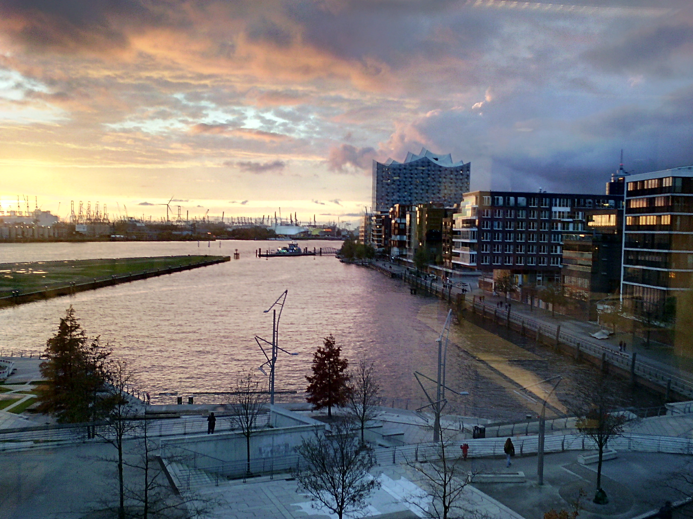
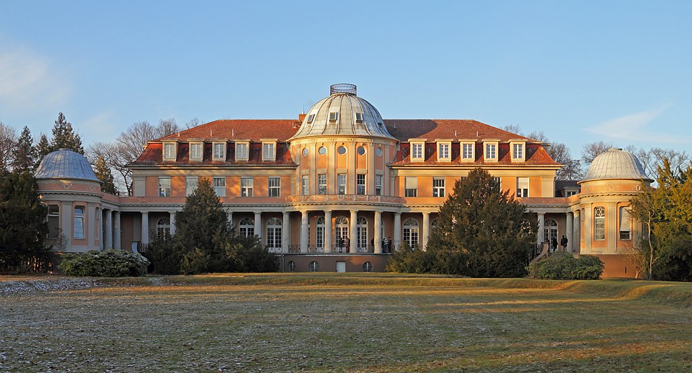
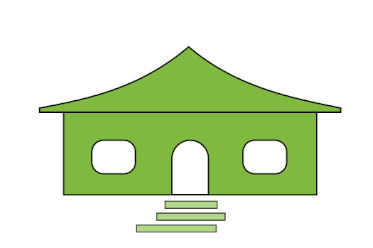

# The Classroom

I once had the pleasure to teach in Hamburg at the waterside. There was an amazing harbor skyline right outside the window.
It was a university seated in the thriving heart of the city.
The students were on time, eager to learn and were focused throughout the entire day.
Soon, the lesson was running under full sail.

*Siemens Villa: A.Savin (WikiCommons), CC BY-SA 3.0 <https://creativecommons.org/licenses/by-sa/3.0>, via Wikimedia Commons*

Another time, I was to deliver the exactly same content in Berlin. In a university hosted in an actual castle. 
The castle was located outside the city center in a quiet area.
It was a marvellous place with a huge garden. 
However, there was not much else apart from a vending machine.
While the students came in, one of them approached me and asked:

    Could we have five more minutes to set up our coffee machine?

I got their point as soon as I tried the coffee from the vending machine.
Getting everyone supplied with coffee took a while, so we had time to chat.
It took us longer to start than with the first group, but had in-depth conversations that went beyond the curriculum.
Plus we had a continuous supply of coffee right in the classroom.

The point of the story is that whatever your lesson is about, the place where you teach influences your teaching a lot.
In the best case, the room puts everybody in a good mood. In the worst case, it produces serious impediments.

## Checklist: The Room

Here you find a checklist you can use to assess the pros and cons of a room in which you will teach for the first time:

* What presentation equipment is there? *(whiteboard, projector/screen, flipchart, pin boards)*
* What is the room layout? *(does it support communication?)*
* How is the atmosphere? *(cozy, empty, friendly, neutral, ...)*
* How are the acoustics? Do you have to talk very loudly? Is there an echo?
* Are there any visual obstacles? *(huge screens, pillars)*
* Where is the door? *(will stragglers pop right into your stage?)*
* Can you move around freely to help the partipants?
* Do the pens work? *(default is `no`, bring a spare pen)*
* Where is the light coming from? Are there blinds in case of sun glare?
* How to open the windows / turn on the air condition?
* Can you move the tables?
* Is it possible to quickly arrange chairs in a circle or semi-circle?
* Is there space for a group conversation? (*often, a garden or courtyard will do*)
* Is there space for breakout sessions?
* Are participants allowed to eat/drink in the room?
* Are drinks/food in the room already?
* Where is the bathroom?
* Where is the first-aid kit?
* Where are the emergency exits?
* Who can you call if something does not work?

---- 
## Checklist: Hardware

For a programming course, you usually want to have at least one computer.
There are many things that can go wrong, so you may want to check a few things about computers and hardware:

* **What is the Wifi password?**
* What adapter does the projector have? *(ask twice, this one can be a showstopper)*
* Do you need a microphone?
* Do you have a teachers PC or do you bring your own?
* Can you plug in a USB drive with spare material?
* Do the participants have computers in the room or do they bring their own?
* How many computers per participant are there?
* Are there enough power sockets/extension cables?
* If there are computers in the room, are they identical?
* Is it easy to put the computers away for a group discussion?
* Are there loudspeakers? *(for yourself or for playing audio)*
* Is there a risk of power outages?
* Is there an admin you can call for tech support?
