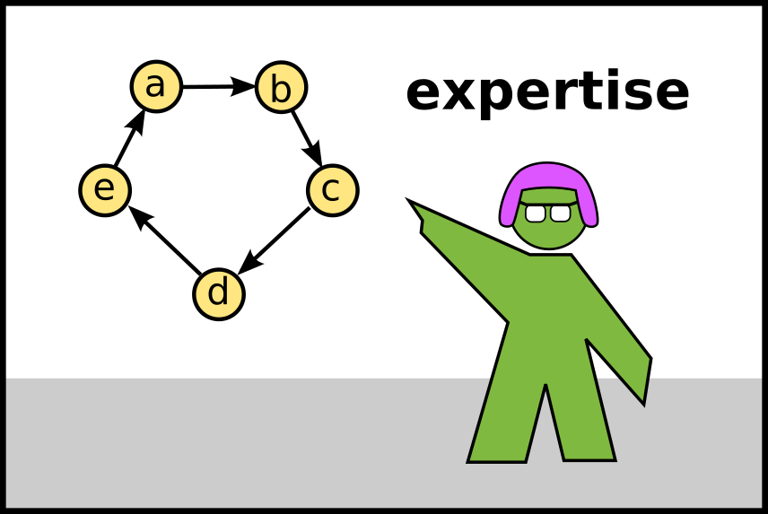
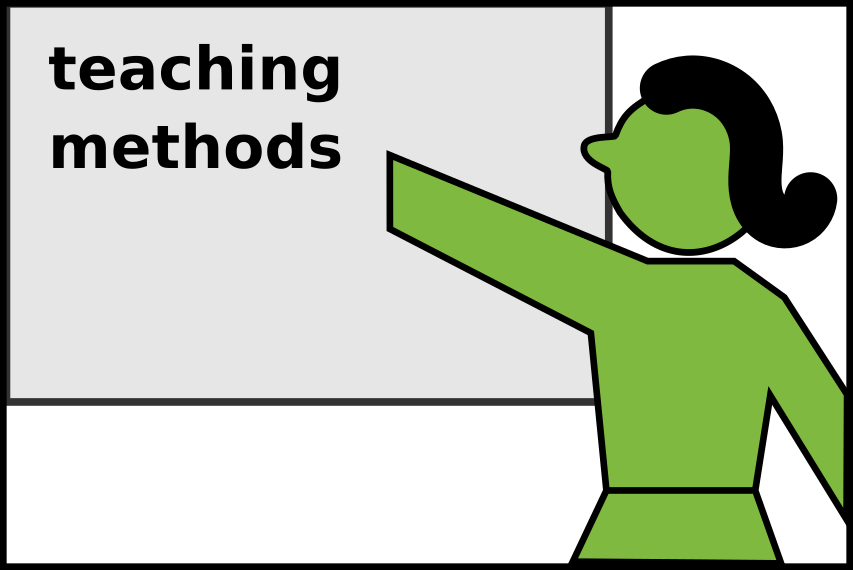
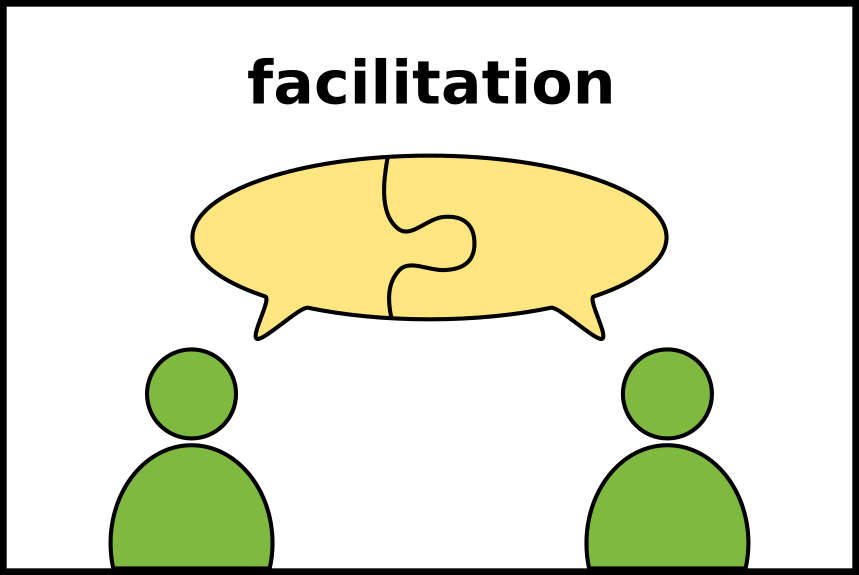
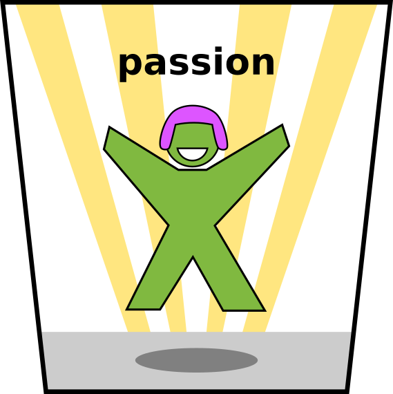
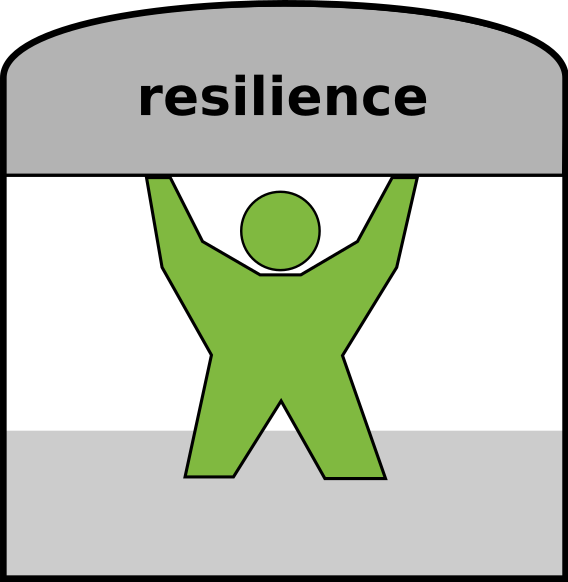
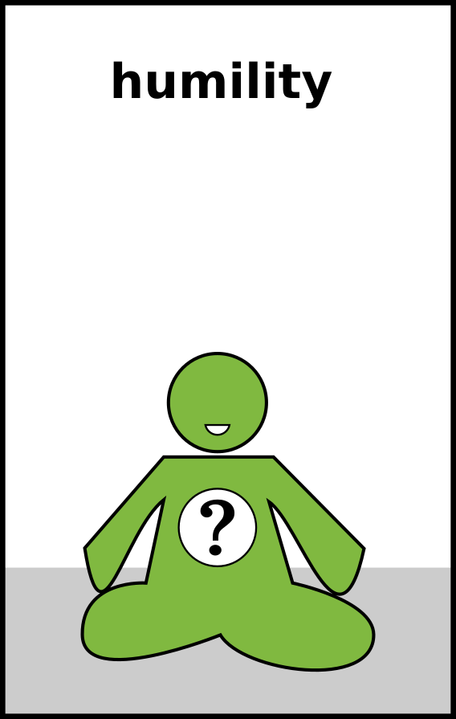

# The Teacher

Let's take a look at the person of the teacher.
You are a central element of the teaching machinery, both compiler and runtime environment of a lesson.
In this chapter, you can find out what skills help being a teacher.

When interviewing teacher candidates, I am looking for six different areas.
Half of them are technical skills, the other half are personality traits.
Each section contains a few questions you can use to gauge your own skills in that area.
Let's start with the technical part:

----

## 1. Subject Matter Expertise

A programming teacher needs to know programming.
This is usually the first thing prospective teachers think of.
For a junior programming teacher, knowing the subject well is really important to feel comfortable in class.
But in my opinion, experienced programmers tend to overrate their expertise a bit.
Being an expert is not **the most important** thing:

* First of all, a teacher is rather a generalist. In a generic programming or data analysis course, you need to know the basics well. 
* Second, the field of IT evolves quickly and you will find yourself learning along with your students.
* Third, it is OK for a programmer not to know everything right away. That is a valuable message in itself.

An experienced practitioner is an excellent fit for short lectures and tutorials on their topic (up to 1-2 days).
This is where very deep knowledge is useful, e.g. when you talk as an expert on *"two-factor authentication"* to other experienced programmers. A typical question the participants have is *"How is this used in practice?"*. Similarly, in an academic lecture you may be expected to connect to the latest research. But you may find yourself in a tradeoff between detail and being understandable, and I believe a teacher should always prefer the latter.

### Questions:

* How experienced do you consider yourself in your main programming language?
* Which other topics would you feel comfortable teaching?
* What tools do you find useful to use your programming language professionally?
* What diagrams or formal languages help to describe your programming language or the programs written in it?
* What problem-solving strategies do you find essential when programming?
* What area would you like to know more about?

----

## 2. Teaching methods

A programming teacher needs to know how to teach.
This is a tricky one. Most programming teachers I have worked with, including myself, do not have a formal background in education.
A software developer who becomes teacher most likely has misconceptions what *"know how to teach"* means.
Such misconceptions are *"teaching is a talent you are born with"* or *"teaching is something you just do"* or *"teaching is easier than programming"*. Delivering a frontal lecture every now and then is doable without going deep into didactics. But you need more of the teaching craft when designing a longer course or dealing with challenging situations.

To me, *"knowing how to teach"* means knowing **teaching methods**.
A teaching method is a tool that you can use during a lesson or preparation.
For instance, a **slide presentation** is a teaching method, a **multiple choice question** is another.
An exerienced teacher knows hundreds of methods. They excel in running longer courses and keep the motivation of participants up even if the audience is very heterogeneous.
A beginner teacher should have a few that they are comfortable with.

A programming teacher needs teaching methods for:

* preparing lessons
* engaging classroom activities
* presenting content
* designing exercises
* backup procedures when unexpected things happen

Most of this book build your repertoire of teaching methods.

### Questions:

* What teaching methods do you know?
* What public speaking tricks do you know to make a presentation more interesting?
* What visualization media/visualization tools have you used?
* Do you prefer to interact with your audience of like
* Do you prefer an online or offline setting?
* Do you prefer teaching a small or big audience?
* Do you enjoy drawing?

----

## 3. Facilitation skills

As a teacher you often have a facilitator role.
There are many *"people skills"* that have nothing to do with the actual content or its delivery.
If you are teaching a class for more than a day, you need to form a team, grow, encourage and support your participants.
You need to let them make mistakes and console them when they feel overwhelmed.
You need to promote fairness and equality and protect participants from major roadblocks.
You may need to act as a referee when conflicts occur.

All of these are classical facilitation skills you may also find in a management role.
The stakes in teaching are maybe not as high as in a project worth millions.
But teaching a group over a longer time has a lasting impact on their life and career.
As a teacher you might receive a great deal of support with the facilitation part from course organizers and other support staff. They can take a lot of work off your plate and help mitigate difficult situations.

### Questions:

* Have you facilitated groups before (e.g. a retrospective)?
* Have you done mentoring (e.g. code reviews, 1on1s or giving direct feedback)?
* Could you imagine running a class where all students are more experienced than yourself?
* Do you have a procedure for conflict resolution?
* What can you do to make members of underrepresented or underpriviledged groups more welcome?

----

## 4. Passion

Let's continue with the first personality trait. A teacher needs *passion for their subject*.
You need it to ignite and inspire your students that what you do is actually interesting.
Finding something you find fun doing, even if it is not your favourite topic is a useful ability.

A teacher also needs *passion for teaching*.
I am a bit critical of the phrase, because I read it in applications a lot where it appeared
as a replacement for the lack of methodical teaching knowledge.
But they got something fundamental right: you need to care about teaching.

I have seen junior teachers become the most passionate teachers when they were teaching a course they attended not long ago themselves. Their passion helped them to build a close connection with participants quickly.
In my opinion the passion for teaching means that you have genuine love for human beings, to help and enable people, even if you don't like them a lot, or won't ever see them again.
This love for human beings goes a long way to build a respectful teacher-student relationship.

### Questions:

* What do you remember about how you learned programming in the first place?
* Do you have a favourite "programming story"?
* What did you learn yourself recently?

----

## 5. Resilience

Teaching is a demanding profession. Your person is in the center of attention all the time.
You are responsible for everything, and on top of it you are on your own. There is often not much room to interact with other teachers, because they, too, are gone teaching. Consider yourself lucky if you have the opportunity to teach together with someone else. But most of the time, the job is a bit lonely.

You need to have self-defence mechanisms that prevent you from exhausting yourself.
Especially as a beginner, it is hard to not over-prepare (and to overwork), because nobody tells you when a lesson is *"good enough"*. Watching your working hours is generally difficult.
Take care to maintain a healthy life outside teaching.

When you teach people over a longer time, the challenge is to find the right distance to your students. On one hand you care about them, and want to establish a good relationship. On the other hand they will be gone, so you don't want to get emotionally too attached to them. Also, you may have to make hard decisions (e.g. failing exams), so don't treat them as your *"friends"* because you are not theirs.

### Questions:

* How comfortable are you improvising?
* Have you experienced impostor syndrome?
* Who can you reach out for support in difficult teaching situations?

----

## 6. Humility

As a teacher, you are the least important person in the room.
It is all about the student. As long as it works for them, you can forget everything else.
You want to grow your students to become better than you thought possible.
To allow them to surpass your expectations, you must allow yourself to be imperfect. If you convey, or even *think* your skills are out of their reach, you are denying them the chance to become better.
After all, you are looking up stuff on StackOverflow, are you?

Do not judge what your participants should or should not do. You cannot read their minds. Give them encouraging exercises and helpful feedback and earn their trust. You cannot force them to learn either. It is the student who decides whether to learn or not. The only thing you can do is to decide what is on the menu, propose something and make it interesting. And to try again and again if it didn't work.

Do not judge whether your students are fit to be programmers either. I have written useful programs with 10000 lines and with 10 lines. Who knows what programming skills we will need in the future? Is it enough to have computational literacy? Is everybody going to be a programmer? Or nobody? Prepare your students as good as you can and let them find out as the future unfolds.

If you are a great, inspiring teacher, it will take years for your students to fully blossom. You will not see the fruit of your work (or even be rewarded for it). Knowing that you weave a legacy is what makes teaching so rewarding. But don't take yourself too serious. It takes all the fun away.

### Questions:

* what does success as a teacher mean to you?
* assume one of your students ends up becoming a great programmer. Will you know about it?
* what would you think if the technology you are teaching becomes completely obsolete next year?
* Who are the greatest teachers you know?
