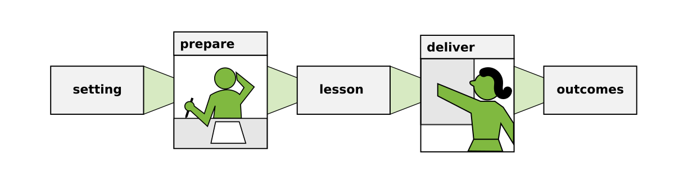

# The Teaching Process

How can we approach teaching systematically?
In the following chapters, you will find instructions for intentional practice.
Here, you find the toplevel view.

So how does teaching work? Let's borrow an analogy: **teaching is like programming:**

* First, you have a setting in which you are going to teach – the requirements of your program
* Second, you prepare a lesson – you write the source code
* Third, you deliver the lesson – you execute the program
* Finally, there is some outcome (learning progress) – the output
 

I have been using this model to prepare lessons for many years.
Of course, the programming analogy does not hold in all aspects.
Don't start looking for the equivalent of compilation or continuous integration in teaching.
**The purpose of this model is to help you see teaching as an engineered process.**
An engineered process that can be analyzed, debugged and improved.

Let's look at the parts in more detail:

----

## The Setting

The setting involves **the particiants**, **the teacher** and several **external factors** that you need to work with. 
What is the lesson/course about? Who are the participants? Have you delivered the same topic before? 
Where is the lesson going to take place? Are there enough power sockets? 
Like the requirements of a program, the setting usually is determined by your clients.
There is often some room for negotiating the setting, but you will have to accept most of it.
Your job is mainly to find out what the setting is and make a lesson that matches it.

You find more about the setting in the chapter [External Factors](external_factors.md)

----

## Preparing Lessons

Preparing lessons is indispensible.
With *preparing*, I refer to anything you do before the lesson starts.
It may involve:

* research about the subject
* designing learning goals
* planning classroom activities
* writing exercises
* preparing visual material

The outcome of preparation is a bunch of artifacts (e.g. presentations, exercises for the students and planning documents for yourself). I will call these simply *the lesson*, as you would call a collection of source, data and configuration files *the source code*.

What makes a good lesson? Like with source code, the ideal lesson is easy to read, clear and well-structured.
It does not break with unexpected input – e.g. when your setting turns out to be slightly different.
A good lesson is also reusable; it can be adopted by other teachers, and you can generate new lessons from the same material.

Occasionally, I have planned my lessons within 5 minutes on the back of a napkin. 
These were lessons I had done 3+ times and knew the students well.
But most of the time, preparing lessons is quite a bit of work.
With a new topic or group, the preparation time will easily exceed the time spent in the classroom.

You find all aspects of preparation detailed in the second part of this book.

----

## Delivering Lessons

You **deliver** the lesson when you are in contact with students.
Typically, you will apply **teaching methods** that you planned: 

* give a presentation
* run a quiz
* do a coding exercise
* debug code together

Sometimes everything goes exactly as you planned it. However, I choose the programming analogy for a reason: when executing a program for the first time, unexpected things happen.
It is the same with lessons: students may find one aspect very difficult, or become very curious about another.
Luckily, teachers are not computers and can adapt their lessons while executing it. They improvise.

----

## Outcomes

The outcomes are the output of your lesson.
Of course, the main output of teaching is that your students learn something.
Learning is surprisingly hard to measure. 
Even if you run a quiz or exam after every lesson, the information it provides is rather limited.

But there are a few good proxies that tell you whether a lesson was good:

* the teacher keeps their job. I put this first, because you need to protect yourself a little (more from burnout than from getting fired)
* there are no unwanted side effects (in particular Code of Conduct incidents)
* your plan works: the lesson finishes on time
* the lesson goal is reached (see [Learning Goals](../planning/goals.md) )
* students give good informal feedback, they confirm they learned a lot
* the goal of the organization gets done (students graduate, find jobs etc.)
* students write their own programs
* you are happy

----

## Debug and repeat

Approaching teaching as an **engineered process** has a couple of advantages.

First of all, you can analyze the lesson in retrospect: Did you stick to the plan? Did it work? 
Did anything unexpected happen in the classroom?
Second, you have a chance to debug the lesson and improve the next time.
Third, viewing teaching as an engineering process makes it easier to not take every mistake personal – and you will inevitably make lots of them when teaching. Detaching a bit helps you to maintain your sanity.

In a longer course, the preparation-delivery-model is iterative.
The outcome of one lesson feeds into the preparation of your next lesson.
Your students have learned something, your materials evolve.
If things go well, you have learne something as well.
Because of that, the setting of the next lesson will be slightly different every time.
