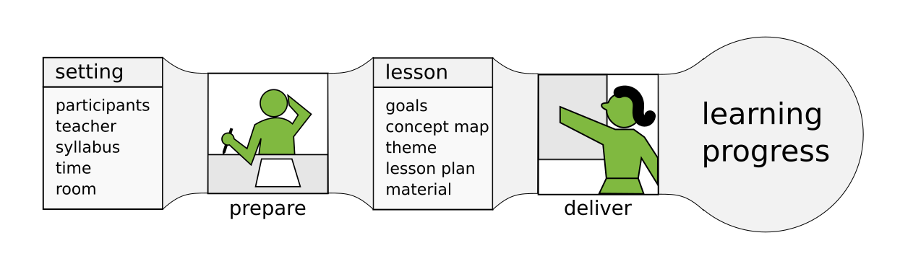

# The Teaching Process

In this chapter, we will look at teaching as a two-step process:

* First, you prepare a lesson – you write the source code.
* Second, you deliver it in the classroom – you execute it

## Step 1: Lesson Preparation

During **lesson preparation**, you consider the **setting** in which your lesson takes place.
These roughly resemble the requirements of a program.
The setting involves **the particiants**, **the teacher** and several **external factors** that you need to work with but cannot influence. I have dedicated one chapter on each part of the setting.

During lesson preparation you develop a **lesson** – the source code of teaching.
A lesson consists of multiple artifacts that we will discuss in detail in the next part of the book.

----

## Step 2: Delivery

Then you **deliver** the lesson.
You go in front of your class and execute the lesson.
You apply a series of **teaching methods** (whether you planned them explicitly or not) and react on the students' response.
Sometimes everything goes as planned, sometimes you need to change the plan on the fly and improvise.

The output of a lesson is – hopefully – **learning progress**.

----

## What is learning progress?

**Learning progress**, the main output of your lesson, may appear in several forms:

* knowledge your participants gained
* knowledge you gained
* artifacts: programs, diagrams, tables, posters
* exercise submissions
* feedback
* exams, grades and certifications

Of these, *"knowledge your participants gained"* is what you really want, but it is very hard to measure.
Because the knowledge gained is difficult to measure, it makes sense to produce **artifacts**.
These artifacts allow you to start the next lesson on common ground.
*Exams and grades* are the easiest to measure, but they are the least useful.
The rest is somewhere in between.

----

## Teaching is a cyclic process

During a course, the two step-process become a cycle: You prepare, you deliver and repeat.
The learning progress of one lesson feeds into the preparation of your next lesson.
What you learn during one course feeds into the preparation of your next course.

In the next course, you will have new participants with different needs, or simply more of them.
You will have gained experience, and your materials evolve.
You may work together with different teacher colleagues.
Finally, the external factors may change gently (moving to a different room) or abruptly (moving everything online over the weekend).

From these considerations it should be obvious that no two lessons are the same.
We are unable to prepare a course once and leave it unchanged, because the setting is subject to constant change.
So while we can hope to recycle parts from earlier lessons, we have to create a new, unique composition every time.
A good teacher is never done.
