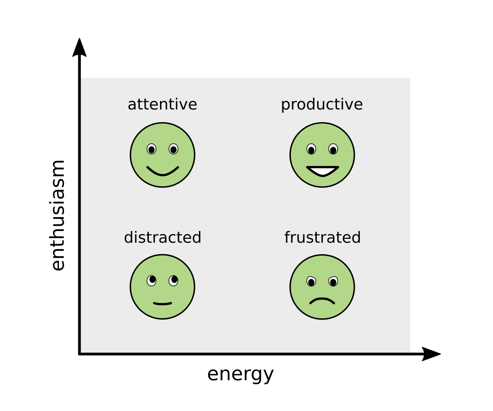

# Types of Students

In this chapter we will focus on the most important person in a classroom: the student. 
To build a successful student-teacher relationship, you need to build trust first.
To build trust, it helps to recognize and meet the needs of your students.

Not all students are the same. Actually, they are quite different. 
Some students are very active, they bring a lot of *energy* to the classroom. Others observe more passively.
Some students are very enthusiastic about the lesson. Others are more sceptical.

We can put these two coordinates into a matrix, resulting in four archetypes: *attentive, distracted, frustrated and productive students*:

Let's take a closer look at all four of them.

----

## The attentive student

The attentive student is genuinely interested in learning. 
They generally acknowledge your authority, even if the programming topics you teach them are difficult at first.
While they could get similar information from the web, the attentive student believes they can learn faster with your help.

A typical statement I hear from attentive students is:

    :::text
    "I want to get the basics right 
    so that I can continue learning on my own."

To get the basics right, they need to know what the basics are first.
What the attentive student needs most is **structure**. 
Your role as a teacher for attentive students is to identify structures and to make them clearly visible.
Focus on structure helps your students to understanding the basics, so that they can learn as quickly as possible.

One big risk for the attentive student too much information.
If they get more input than they can process, they experience **Cognitive overload**.
They switch off or become frustrated. It is your job to protect your attentive students from cognitive overload.

The attentive student is a careful listener. They also evaluate critically what they hear.
Sometimes they do not say much, and you need to apply some tricks to build a conversation.
They often come up with well-thought questions that move the classroom forward.
From my perspective, this makes attentive students generally easy and fun to work with.

Luckily, the attentive student was the most prevalent type in the courses I have been teaching.

----

## The distracted student

I recall a lesson where I came with an ambitious plan.
We started and the class was buzzing with activity.
After a few minutes I realized that the excitement was probably not because the students were excited about programming.
Finally one of them said:

    :::text
    "I'm sorry if we seem a bit nervous,
    but we have exams right after your lesson."

The entire class was distracted.

The distracted student is focusing on your lesson with only a part of their brain.
What are they doing with the rest of their brain then?

Some students are distracted by **important events**: the exam in the afternoon, their job application, an argument with their partner, the babysitter who canceled 10 minutes ago and many other things.
Being vocal what is bothering them may help the student to get the distraction out of their head temporarily.
But many times, you have to accept that the student is somewhere else.

Some students are distracted because they are **low on energy**.
Their brain is simply not running on full capacity.
They might be tired or have not woken up yet. 
You find low-energy students after every lunch break, because blood leaves the brain to do housekeeping.
The good news is that you can *energize* and *activate* low-energy students intentionally.

Some students detach themselves because the **lesson is not working** for them.
The lesson might be too difficult, too easy, or they do not see its relevance. 
To bring them back, you will need to carefully *re-sell* the lesson to them.
This is not that easy to do, but possible.
This type of distraction is easier to prevent than to fix.

All distractions have in common that they reduce the mental capacity of your students.
Distracted students may require you to adjust your lesson: You might need to explain things again, slow down and drop content,or speed up and go into more serious examples.

Nevertheless, you can't expect that your students will be fully focused all the time. 
In a bigger group, there will always be a few students who are on different planets.
Fortunately, distracted students do not create much disruption (because whispering under the bench has largely been replaced by typing on mobile phones).

----

## The frustrated student

A **frustrated** student is unhappy during the course, and displays that openly.
Things that could frustrate a student are:

* being constantly stuck while programming
* lack of learning progress
* expectations they had are not being met
* being exposed before the group
* not being listened to
* experiencing harrassment or discrimination
* fear of exams, unemployment or failure in general

Having frustrated students in your class is a **big problem**. 
They might behave verbally aggressive towards their teacher (or worse) towards their fellow students.
More commonly, they create a bad mood and drag down the learning experience for the entire class.
Your job as a teacher is to protect the students from frustration as much as possible - to everyones benefit.

Protecting students from frustration has little to do with coding. It requires leadership skills.
Here are a few leadership techniques that help:

* Create a harrassment-free environment. Have a **Code of Conduct** and enforce it. In my opinion, this point is more important than anything else in this chapter.
* Let your students share their expectations early. It helps you to adjust early.
* Create easy wins first: Code that runs out of the box, tasks that everybody can solve quickly etc.
* Make room for students to share when they are stuck. Discuss strategies to deal with it. This is one of the most important learnings about programming. After all, what do *you* do when you have a coding problem you cannot solve?
* Avoid propagating stereotypes what a programmer should be able to do (e.g. *"you need to be able to write quicksort from scratch"*). We know little where our field is developing and how our work will look like in a couple of years. Propagating a stereotype is not helpful, and toxic for underpriviledged groups and people who you are training to discover uncharted lands.
* Also see [Motivation and Demotivation](https://teachtogether.tech/en/index.html#s:motivation) by Greg Wilson.

Taken together, dealing with frustrated students is work.
If you observe that one or two students absorb half of your energy, they most likely are in the frustration zone.

----

## The productive student

The productive student is in the flow. They are focused, energized and happy about what they do.
Typically, the productive student is good at writing code and is working independently.
Productive students are great students to have.

The productive student does not need you to explain basics. They need you to pour oil into the fire.
Throw interesting problems or code sniplets at them and let them run with them. 
They also benefit from some guidance, especially focusing their attention on one technology at a time, e.g.:

    :::text
    To build your own web server, tr this Django tutorial.
    
instead of

    :::text
    You could try Flask, Web2Py, Django or maybe Binder.

Often, it is enough to drop the name of a library or function and they will figure out the rest.

There are two risks with productive students: First, too much hand-holding. If you try to restrain them, they will become frustrated. Don't do that. Second, an active student may try to get lots of your attention, dragging it away from people who need your help more. You may need to facilitate the situation. If the student enjoys teaming up, there is a chance that they infect the rest of the class with their enthusiasm. If they prefer to work on their own, they are still be valuable source of expertise (e.g. by reviewing their code).

In any case, having students in the productive zone is a great asset.

----

## Conclusion

Teaching would be a lot easier if you could look into the students' heads and see whether they are *attentive, distracted, frustrated* or *productive*. In practice, this is more complicated. With 5 students, you will know where they are. With 10 students, you can adjust your lesson with little effort. With a group of 20, finding out their needs is hard work, and with 50+ it is a matter of statistics.

You will find your students are in different zones of the above matrix.
Sometimes they all group in the same area, sometimes they are all over the place.
The art of teaching has a lot to do with finding out where your students are, and crafting lessons that are flexible enough to adjust them to the needs of your audience.
