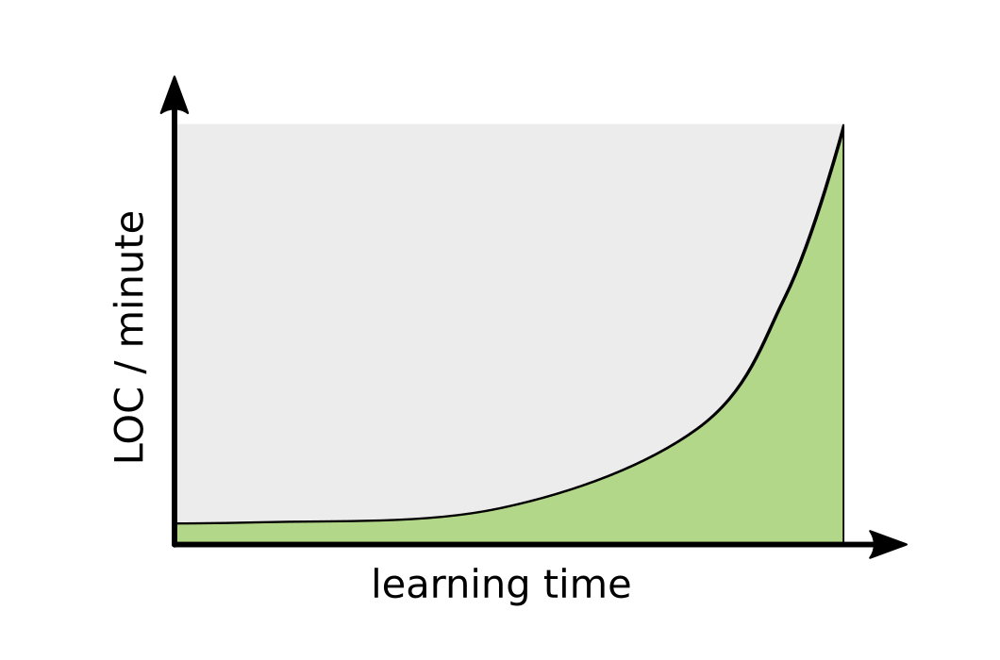

# Why Programming is difficult to teach

Teaching is a very old profession but teaching programming is special.
There are a few specific challenges that many programming teachers face.
In this chapter I would like to cover four of them.

----

## Challenge #1: Programming is difficult to learn

Consider an introductory Python course. 
As a classroom project, students are analyzing a table with penguins.
You would like them to write programs like this:

    :::python3
    # count all Adelie penguins
    ade = 0
    for line in open('penguins.csv'):
        if 'Adelie' in line:
            ade += 1
    
    print(f'There are {ade} Adelie penguins in the file.')

What difficulties might a student face learning to write a Python program like this?
As you well know, there are many things that are not easy when you do them for the first time:

* set up their Python environment properly
* decompose the problem into elementary steps
* grasp the abstraction behind the for loop
* combine the for loop with a conditional statement (another abstraction)
* type in the instructions correctly

In all these steps, tiny details matter. Getting one tiny detail wrong can ruin everything.
In this aspect, learning to program is fundamentally different from e.g. learning a spoken language.
The following variations of the above code lines are non-trivial mistakes for many beginners:

    :::python3
    ade = 1

    ade + 1

    if line in 'Adelie':

    print(f'There are {ade} Adelie penguins in the file.')

Each of these lines breaks the program in one way or another.
Understanding why a particular line is correct requires a lot of context (syntax, other lines of code, input data, function signatures etc.). All of that context is necessary to make a program work. 
This is what makes programming difficult to learn.

----
## Challenge #2: Programming requires many Competencies

To count the penguins in Python, you could also use the `pandas` library.
`pandas` is a popular analysis tool in the Python world. It gets the control flow statements (`for` and `if`) out of the way:

    import pandas as pd

    df = pd.read_csv('penguins.csv', sep=',')
    adelie = df.loc[df['species'] == 'Adelie']
    print(len(adelie))

This is doable and solves the problem at hand. The code counts penguins.
But which of the two penguin counter programs is better?

* The first program with the `for` loop, uses only basic language features. It will work on any Python machine including browser-based implementations and tiny computers like the MicroBit. The first program is easy to read for anyone who used a different imperative programing language before.
* The second program using `pandas`, gives your student a powerful data analysis tool. There exists an entire ecosystem around `pandas` that makes common analytics tasks easy. There are many examples one can copy-paste. On the other hand, `pandas` code is not always easy to read. And does it guide students towards generic programming skills?

Both implementations have their pros and cons. 
A programmer needs to be able to recognize these pros and cons. 
So in addition to writing code, programming requires **reading and evaluating code**, an additional, orthogonal skill.

A senior programmer might state that both implementations are bad, because there are no Unit Tests. A senior programmer might also say that if the program is running in a proper test infrastructure, the implementation does not matter much.
If you think about programming from that angle, you discover **testing code**, another skill orthogonal to programming.

There are more of these orthogonal skills that I will for now refer to as **Competencies**.

In the table below you find a few competencies that programmers typically use:

| competency | description |
|------------|-------------|
| writing code | decompose a problem into programming instructions and type them in |
| reading code | work with other peoples code, including your former self |
| debugging | diagnose errors and fix them |
| refactoring | improve the structure of your code |
| development tools | use an environment to work with code efficiently |
| testing | check whether a program is doing what its inventors had in mind |
| validation | check whether the program contributes to its purpose |
| version control | keep track of changes over time |
| algorithms | known problem-solving strategies |
| software engineering | decompose a big problem (e.g. by data modeling, requirements analysis, architecture) |
| communication | explain code and software projects to other people, including non-programmers |

All of these competencies have in common that they are very difficult to figure out if you do not know they exist. 
So as a teacher your job is to make your students aware of these hidden orthogonal dimensions to writing code.
Are competencies teachable? Yes, of course they are. All of these things can be learned and taught.

Yet, many introductory programming books and courses mainly focus on the competency of *writing code*, trying to cover as many language features as possible.
Why? Because it is hard to find a balanced mix between the competencies is difficult.
But in my opinion, teaching programming is **all about finding that balance**.

----

## Challenge #3: There is no universal syllabus

I once had the pleasure to attend a meeting of math teachers at a German primary school.
There were 13 math teachers and two interested parents, both of which happend to be Python programmers (coincidence?).
The teachers discussed strategies to work with students who lag behind in arithmetics (adding/subtracting integers up to 20).
One of the teachers pulled out a box full of postcards. Each postcard contained an exercise tailored at a specific sub-problem that students typically face (e.g. adding `9`) and short instruction for the teachers, so they could show the student what to do and then help the rest of the class.

I was impressed. The material addressed a teaching situation that all of the 13 math teachers had experienced.
The solution came from a publisher that specialized on that kind of material.
I realized that it has advantages when 1 million students (roughly 100 million worldwide) learn the same content each year, and the content is very stable.

**There is a complete, detailed syllabus for primary school math.**
It is regularly updated, books refer to it, teachers use it. Parents can download (and understand) it.
Unfortunately, this is not true about programming.

There is no universally accepted, generic syllabus for programming languages (or language-agnostic programing).
This is a problem for programming teachers, because a syllabus helps with structuring lessons a lot.
Think of the syllabus as a flat version of the competencies from the last section.
The syllabus simplifies the many orthogonal competencies into a list-like structure.
A good syllabus is a great starting point for teachers.

Creating a good syllabus from scratch is not easy.
Programming comes with a lot of terminology.
This terminology contains many words that students have heard in a different context.
Here is what someone who never coded might see when they read a raw syllabus:

    :::text
    Introduction to Programming in Zebra
    ====================================

    - installing Zebra
    - Hi Planet
    - the Zebra Hull
    - integer changeables
    - yarns
    - per circles
    - functions
    - the never..do..this statement
    - truncator expressions
    - file trumpets
    - rivers and sinks
    - instagators for scratching the net
    - citation counting and the trash service

While this syllabus might make perfect sense to you, it requires an effort to translate it to students.
Here is a shorter version:

    :::text
    Getting Started with Zebra
    ==========================

    - installing Zebra on your computer
    - writing your first program
    - counting to one billion
    - cleaning up your code
    - searching for errors in your program
    - downloading Wikipedia

Many programming teachers have to write their own syllabus.
To write a syllabus, you need to:

* identify the competencies you need to teach
* add sub-points for each of them
* flatten the syllabus, prioritizing some competencies
* rewrite the syllabus in words your students understand

Projecting the multi-dimensional competencies of programming into a flat structure is not that easy.
Unlike primary school math or spoken languages, learning to program is not standardized. The students interests, course formats and programming languages vary a lot. Unlike math, the technologies are also evolving quite rapidly. 
So we will have to write and regularly review our syllabi ourselves.

----

## Challenge #4: Non-linear skill growth

*"things that took me 2 days a year ago now take me 10 minutes"*

People learning to program often progress impressively. A few weeks of experience makes them write similar code 10x faster than before or solve problems that seemed insurmountable. My impression is that this steep learning curve persists for a long time (see figure). Practically it means that most programming classes will be highly heterogeneous in the amount of code that students write. 

Students would benefit from locating themselves on the learning curve. However, there is no straightforward metric for programming skill (such as the time for running 5 km) or a benchmark system (like the A1, A2.. C level system for learning languages).
Most of the time, an emerging programmer is in the dark how far they are on the path to mastery.

The heterogeneity and lack of a metric create a perception bias: one student has the impression that another student is much more advanced, when they really are only a couple of days apart on the same learning path. This perception bias promotes all kinds of side effects like *impostor syndrome* and can generate a lot of stress.

If the goal of your programming course is to reach a certain level, define it first. But be prepared to deal with the non-linear nature of the learning curve and the resulting side effects. This is a tough call to make.

In my opinion, the better alternative is to embrace the diverse experience of your participants: The goal of a course is that the students program better after the course than before. If this is your goal, you create education where everybody wins.

----

## Summary

From these considerations, it should be clear that programming is difficult to teach.
Which means that the job of a programming teacher is interesting.
Let's take up the challenge and see how we can approach these challenges systematically.
