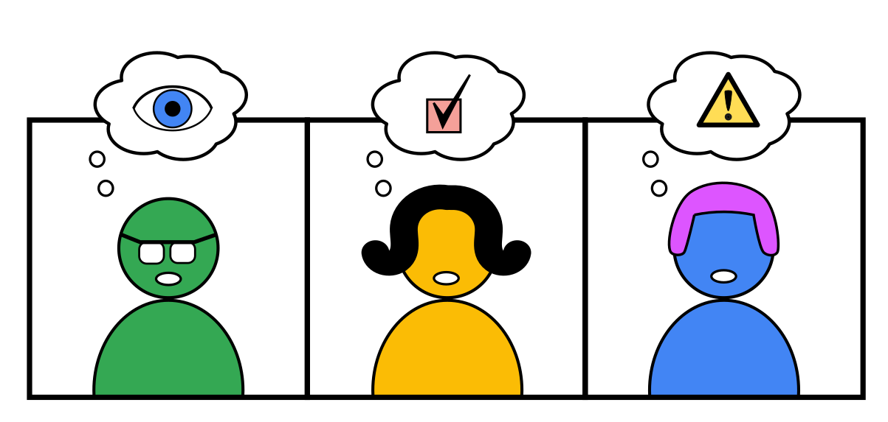

Warming Up
==========

Suppose you want to deliver a lesson on **time series forecasting**.
You have the lesson fully worked out with theory and exercises.
As an example you want to use bicycle rental data (check out `Bike Sharing
Demand on Kaggle <https://www.kaggle.com/c/bike-sharing-demand>`__ ).

.. figure:: images/bike_time_series.png
   :alt: bike driving along a time series

At the beginning of a lesson you want to achieve multiple things:

Get the full attention of your students
---------------------------------------

Build authority and rapport
---------------------------

.. figure:: images/warmup_rapport.png
   :alt: impressed students

Make them talk about the subject
--------------------------------

.. figure:: images/warmup_talk.png
   :alt: talkative students

… on top of that, you don’t want to spend too much time warming up your
class. After the first 10 minutes you want to get to more serious stuff.

.. figure:: images/all_in_ten_minutes.png
   :alt: all of that in 10 minutes

In the following chapters we will look at a few things you could do in the beginning.

.. toctree::
   :maxdepth: 1

   priming.rst
   one_liners.rst
   buggy_code.rst
   upside_down.rst
   brainstorming.rst
   storytelling.rst
   theater.rst
   tricks_with_bricks.rst
