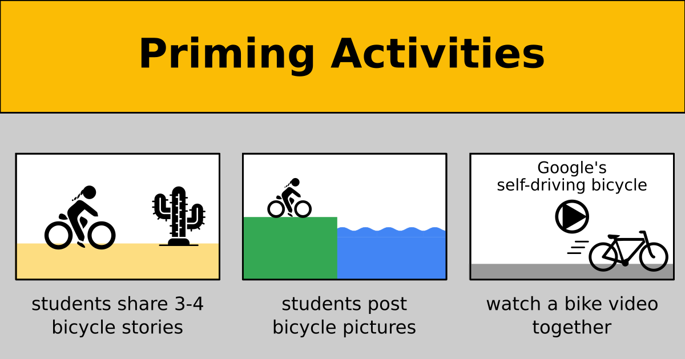

Priming
=======

**Priming** is a central aspect of all warm-up techniques. 
It is a neuropsychological concept where a stimulus influences the response to a subsequent stimulus (see `Priming on Wikipedia <https://en.wikipedia.org/wiki/Priming_(psychology)>`__).
Priming can be expressed as: *“directing the attention of people to a particular field.”* 
Priming helps your participants understand a concept or complete a task
because the area of their brain responsible for that kind of problem is already active.

For instance, if you see a picture of a bicycle, and two minutes later someone asks you to name a vehicle,
the response "bicycle" is a lot more likely.
Your brain has already heated up its *"bicycle"* area.

What does that mean for teaching?
Instead of using the first warm-up method that you come across, 
you can deliberately prime your participants towards the *concept* that you want to get across.
Priming can be achieved by a rich variety of activities: questions,
quizzes, practical examples, stories, videos and many more.

Priming Activities
------------------

Here are a few easy and fun activities that work for priming:

-  share short stories
-  show a brief video in the beginning of your lesson
-  show a cartoon, ask students to explain it. See
   `xkcd.com <https://xkcd.com/>`__ or `phdcomics.com <http://phdcomics.com>`__
-  hand out a short program that does something impressive and ask people to run it
-  ask an open question and let participants chat with each other before collecting answers

In general, you can prime both on the **theme** (e.g. *"bicycles"*) and the **topic** (e.g. *"time series forecasting"*) of a lesson.
I recommend priming the theme when introducing a longer project, and prime for the topic for a shorter lesson.
The activities remain the same.
