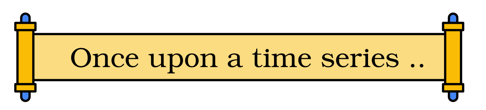
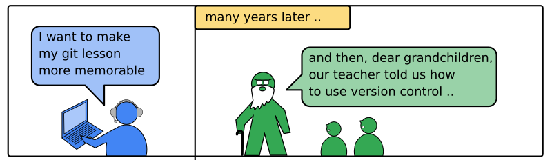
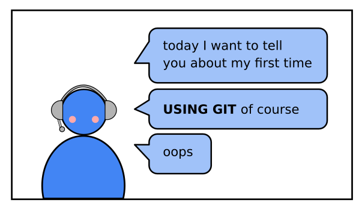
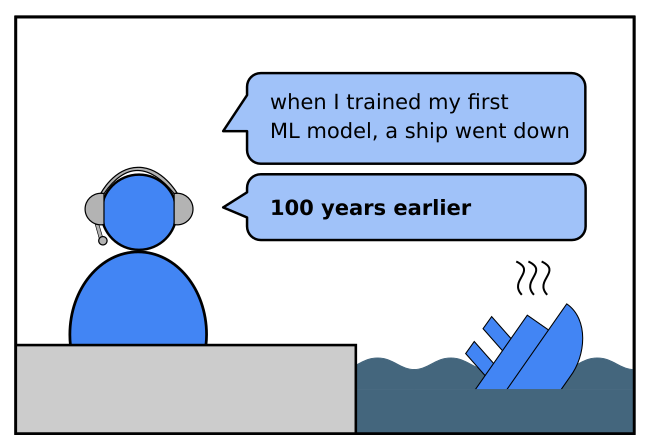
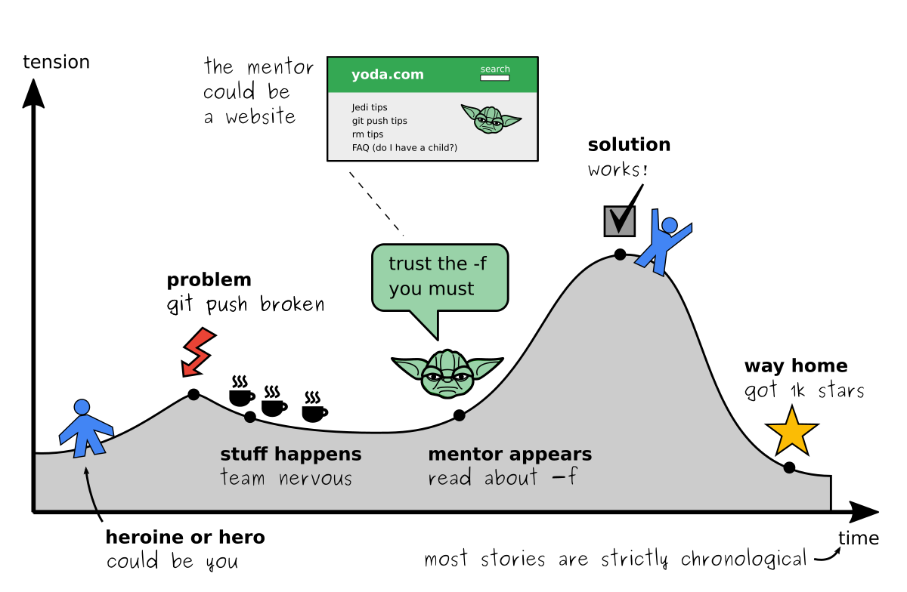
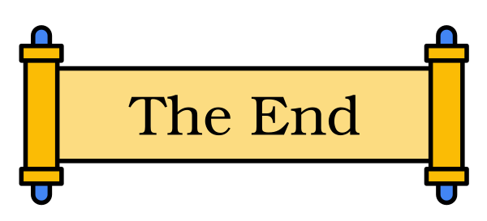

How to use storytelling?
========================

   Once upon a time series …

The Problem
-----------

Stories are great! For some reason, good stories stick to our memories.
They also help people to stick together.
Wouldn’t it be great to start your lesson with a story?

   grandpa tells about his git lesson

The beginning of your lesson is a good spot for **storytelling**, where you tell a short story
about real or fictional events. 
I prefer real events, because our business is tech and not literature.
Fortunately, storytelling is a technique that doesn’t suffer much from the online format. 
In the following, let’s look at where to find stories and how to tell them well.

.. note::

   It is worth noting that *storytelling* and *data
   storytelling* are different things:
   
   .. figure:: images/story_vs_data.png
      :alt: storytelling vs data storytelling
   
      storytelling vs data storytelling

Draw from your experience
-------------------------

You are the expert. You have been in situations that your students have
no idea about. This makes it easy to find stories. It does not even have
to be a particularly good story. All you have to find is a situation
where you were in touch with the topics your students are interested in:
Think about:

-  the first time you used a technology
-  a project that you worked in
-  spectacular failures
-  bugs you struggled with

   another first time story

Here is a short story about a bug that happened to me:

::

   A few weeks ago, I wrote a snake game for my software engineering course.
   I used the 'curses' library to draw on the terminal.
   I thought: 'curses' is in the Python standard library.
   What could possibly go wrong?

   Five minutes after the course started, things did go wrong.
   The students tried to run my snake program.
   The program worked on Linux.
   The program worked on MacOS.
   The program crashed on all Windows systems.
   There is no 'curses' installed with Python on Windows.

   Preventing such failures is what Software Engineering is all about.
   It made a good practical example at the start for the course.

Although the problem was solved by a single line
(``pip install windows-curses``), the story makes a point: *bugs like
this happen even to experienced people*.

Tell what happened. That is enough. Keeping the language plain and
simple is fine. If you want, add a few rhetoric devices:

-  repeat key phrases: *“curses”*, *“go wrong”*
-  apply the rule of three to build suspense: *“Linuxes, MacOS,
   Windows”*
-  use anaphers (starting sentences similarly): *“program”*

It is fine to tell about super common experiences like `the Titanic
challenge on Kaggle <https://www.kaggle.com/c/titanic>`__ as long as you
find something that is new for the students.

   another first time story

The “Hero Journey” Structure
----------------------------

Usually, stories are strictly chronological. If you want to craft a
story that is a bit more sophisticated, you can employ the structure of
a classical drama and package that into 2-5 minutes. This is called the
**“Hero Journey”**:

   hero journey

Notes on the parts:

-  **The hero:** is a person that suffers and grows. It could be you or
   a colleague. I am yet to hear a story where the hero was an AI.
-  **The problem:** for the hero to suffer, there must be some sort of
   challenge. It appears early on to drive the rest of the story.
-  **Stuff happens:** a continuation of events to build suspense. Pick a
   few representative detials and/or characters and leave away the rest.
-  **Mentor appears:** at the major turning point, someone or something
   helps the hero grow. It is crucial that the hero does not conceive
   the key idea by themselves (it looks really wonky if you talk about
   yourself). When you use storytelling in teaching, the mentor usually
   contributes a tool or programming concept.
-  **Solution:** at the climax of the story, the problems gets solved.
   Revel in the moment.
-  **Way home:** the *“and they lived happily ever after”* part. Keep it
   short.

Example Story
-------------

Here is a real story that taught me the value of version control:

::

   During my PhD I was web scraping a dozen websites
   and collected the data in a database.
   There even was a web front-end.

   The database server was running and everything worked fine.

   One day the admin called and told me the disk of the server had crashed.
   I tried to rebuild the database using the scripts I had,
   but I could not figure out which of the different copies I had
   would fit together.
   The project was dead.

   A year later I was working in a differet place.
   Once again, scraping websites and collecting data in a database.
   I took over code from the previous maintainer.
   When I asked whether they would email me the code, they said:

       "No, everything is in our version control system."

   I learned what that was and started commiting code myself.

   One day, the admin called and told me the disk of the server had crashed.
   But this time, we were prepared.
   We knew exactly what the latest working version was.
   We had to reinstall the server, and test everything manually,
   but after a week the server was up and running.

   Version control had saved the day.

You may want to rehearse your story one or twice or write it down.

.. seealso::

   Check out the teachings of `Master
Foo <http://catb.org/esr/writings/unix-koans/ten-thousand.html>`__
although they are a bit ancient.

   If you are interested in techniques used by experienced public speakers
   and on big stages, check out

   -  `John Zimmers Blog <https://mannerofspeaking.org/blog/>`__
   -  `Florian Muecks Blog <https://www.florianmueck.com/blog/>`__

   The End
