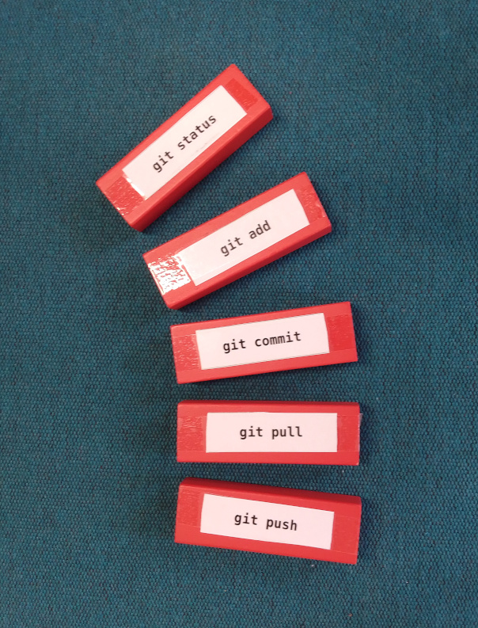

Eight Tricks with Bricks
========================

Some time ago, I wanted to support my classes on ``git``, ``bash`` and
``pandas`` with interactive, haptic activities. I bought a box of
colored Jenga bricks and labeled them with programming instructions:

The outcome is a tool that can be used for many activities with little
preparation. Here are eight ways how they can be used:

.. hint::

   most of the activities work with index cards instead of bricks,
   but the bricks are of course a lot nicer.

Explain one
-----------

Place N + 5 bricks on the table *(N=number of students)*.
Each student picks and explains one.
This is a nice recap activity that can be done at the beginning of the
next class.

If your group is up to 8 people, place the bricks on a table in the
middle. If your group is up to 15, place the bricks on a table in front
of the classroom so that students can pick one as they come in.

.. hint::

   To crank up the difficulty, place the bricks upside-down.

Write a code example
--------------------

Students pick a brick and write a code example using the command.
Give them some time to develop the code and ask them to share it.

This activity goes more into depth and is very likely to generate
questions. Because writing and discussing a code example takes more
time, this works best in teams of 2-3.

Marketplace
-----------

Everybody (including yourself) takes 3 bricks. Walk through the room,
approach a random person, explain one of your bricks to them, give them
the brick, get one from them, repeat.

.. note::

   This is a recap activity that scales up to very large groups (50+ given
   enough bricks)

Domino
------

For this activity, you need a few more bricks than there are participants.
Every student gets two bricks.

* place the first brick on the table
* take turns placing bricks next to another brick
* anyone who places a brick needs to explain how the adjacent concepts are related to each other
* continue until all bricks are placed

The quality of the explanation does not matter that much. The main point is to get everyone talking.

.. note:: 

   This is a light warmup activity that helps students to integrate their
   knowledge.
   This activity has a self-balancing mechanism: The more cards are already there, the easier it will be to come up with an explanation. If someone gets really stuck, allow them to swap theirs for a spare card
   
Cluster
-------

Have the students cluster the bricks into groups and label each group
with a post-it. This is an alternative method for *affinity grouping* -
creating structure collaboratively.

.. note::
   
   This is a good activity to close a topic.

Solve a Task
------------

Describe and visualize a problem (e.g. a programming task). Ask students
which commands they would need to use in which order to solve the
problem. Let them sit and puzzle for a while.

.. note::

   This is a good acitivity to train problem-solving, because it leaves
   program syntax aside for a while.

Troubleshooting
---------------

Ask students to pick a brick they find difficult / don’t understand /
have questions about. Go through the bricks together and resolve
whatever questions you can clarify. You may come up with a few code
examples on the fly.

This activity requires many more bricks than there are students.

Jenga
-----

Build a tower from the Jenga bricks. Students take turns drawing and
piling up bricks, briefly explaining the commands on them.

This activity is good for energizing / relaxing a group. The only
disadvantage is that it works only with smaller groups (up to 8).
