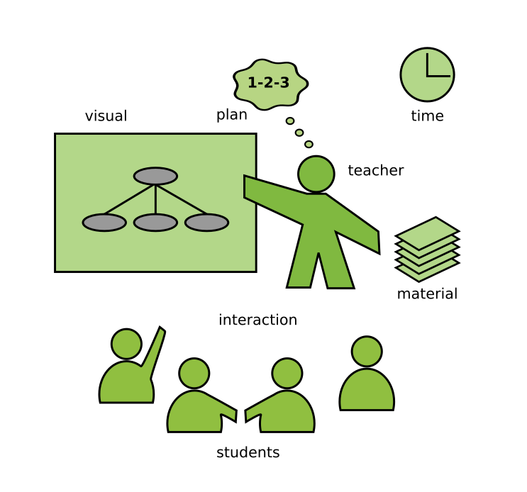

Teaching Programming
====================

**by Dr. Kristian Rother**

|image0|

Fundamentals
------------

.. toctree::
   :maxdepth: 1

   fundamentals/teaching_craft.md
   fundamentals/programming_is_difficult_to_teach.rst
   fundamentals/teaching_process.md
   fundamentals/students.md
   fundamentals/types_of_students.rst
   fundamentals/teacher.md
   fundamentals/room.md

----

Preparing Lessons
-----------------

.. toctree::
   :maxdepth: 1

   planning/preparing_lessons.md
   planning/decide_what_to_teach.md
   planning/goals.md
   planning/concept_maps.md
   planning/lesson_structure.md
   planning/lesson_plans.md
   penguin_lesson/README.rst

----

Connecting with your Students
-----------------------------

.. toctree::
   :maxdepth: 1

   connecting/expectations.md
   connecting/the_first_minute.md
   connecting/selling.md
   connecting/mood_cards.md
   connecting/four_questions.md
   connecting/scale.md
   connecting/getting_to_know.md
   
----

Warming Up
----------

.. toctree::
   :maxdepth: 1

   getting_started/priming.md
   getting_started/one_liners.md
   getting_started/buggy_code.md
   getting_started/upside_down.md
   getting_started/brainstorming.md
   getting_started/puzzles.md
   getting_started/storytelling.md
   getting_started/theater.md
   getting_started/tricks_with_bricks.md

----

Introducing new Content
-----------------------

.. toctree::
   :maxdepth: 1

   lectures/lectures.md
   lectures/alternatives_to_frontal_teaching.md
   lectures/live_coding.md
   lectures/presenting.md
   lectures/questions.md
   lectures/knowledge_board.rst
   lectures/paper_and_scissors.md
   lectures/algorithmic_games.md

----

Coding Exercises
----------------

.. toctree::
   :maxdepth: 1

   coding_exercises/reduced_examples.md
   coding_exercises/prevent_install_failure.md
   coding_exercises/group_assignments.md
   coding_exercises/debugging.md
   coding_exercises/coding_kata.md
   coding_exercises/group_puzzle.md
   
----

Wrapping up
-----------

.. toctree::
   :maxdepth: 1

   wrapping_up/mc_questions.md
   wrapping_up/twenty_questions.md
   wrapping_up/check_cross.md
   wrapping_up/memory.md
   wrapping_up/scrabble.md
   wrapping_up/domino.md
   wrapping_up/telepathy.md
   wrapping_up/quiz.md
   wrapping_up/lightning_talks.md
   wrapping_up/facilitated_discussion.md
   wrapping_up/caroussel.md
   wrapping_up/marketplace.md
   wrapping_up/fishbowl.md
   wrapping_up/repeat.md

----

Collecting Feedback
-------------------

.. toctree::
   :maxdepth: 1

   feedback/dot_voting.md
   feedback/props.md
   feedback/fire.md
   feedback/fist_or_five.md
   feedback/four_corners.md
   feedback/round_robin.md
   feedback/supermarket.md
   feedback/voting_box.md
   feedback/feedback.md

----

Online Teaching
---------------

.. toctree::
   :maxdepth: 1

   lectures/online_teaching.md
   online_teaching/save_preparation_time.md
   online_teaching/start_class.md
   online_teaching/engaging_coding_exercises.md
   online_teaching/self_study_material.md
   online_teaching/students_work_together.md
   online_teaching/instant_feedback.md
   
----

Troubleshooting
---------------

.. toctree::
   :maxdepth: 1

   troubleshooting/no_prep.md
   troubleshooting/nervousness.md
   troubleshooting/plan_b.md
   troubleshooting/tech_failures.md
   troubleshooting/heterogeneous.md
   troubleshooting/disruptive_behavior.md
   troubleshooting/passive.md
   troubleshooting/under_pressure.md
   troubleshooting/energizers.md
   troubleshooting/aggression.md
   troubleshooting/paradrop.md
   troubleshooting/jungle.md
   
----

Appendix
--------

.. toctree::
   :maxdepth: 1

   appendix/training_course_design.md
   appendix/quotes_teaching.md
   appendix/links.md
   
----

.. topic:: Acknowledgements

   I dedicate this document to Bettina Ritter-Mamczek and Cornelius
   Frömmel, to whom i owe my skills and passion to teaching. Greg Wilson
   has been a constant source of inspiration, and his fantastic book Teach
   Tech Together helped me to decide what not to write. The actual contect
   was influenced a lot by discussions with Pedro Fernandes, Allegra Via
   and the members of GOBLET. I would like to thank Janick Mathys, Jasmin
   Touati and NobleProg for providing training opportunities and feedback
   that allowed me to fine-tune my teaching methods. Finally, I would like
   to thank the following teachers at the Spiced Academy for fruitful
   exchange: David Friedman, Matt Fowler, Ivana Matijevic, Paul Wlodkowski,
   Tom Gadsby, Stefan Roth, Pete Anderson, Merle Fischer, Alistair Quinn,
   Ugur Ural, Malte Bonart, Paula Gonzalez, Gesa Johannsen, Sam McGuire,
   Sara Maras, Marija Vlajic, Carmine Somma, Dina Deifallah and Kiran
   Challa.

.. topic:: License

   © 2021 Dr. Kristian Rother

   Usable under the conditions of the Creative Commons Attribution Share-alike License 4.0 (CC-BY-SA 4.0).
   See `creativecommons.org <https://creativecommons.org/licenses/by-sa/4.0/>`__ for details

