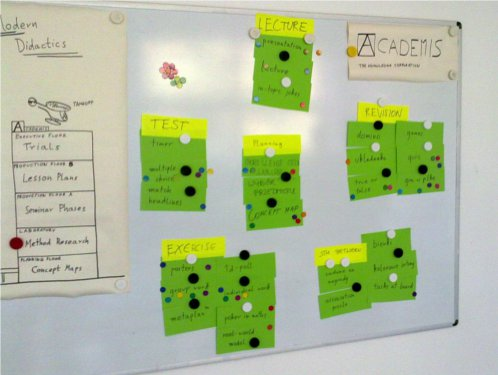

# Alternatives to Frontal Teaching

Many teachers observe that frontal, *deductive*, instruction alone is not satisfactory.
After lecturing for a while you may be looking for alternatives to make your lessons more engaging for the students and for yourself as well.
Also, you may think that a more diverse repertoire of teaching methods improves the learning.
To my knowledge and experience, you are absolutely right.

In this chapter, we will look at **inductive instruction**, the opposite of deductive instruction.

## What is inductive instruction?

In inductive instruction, your students get exposed to training examples and problems without explaining the underlying concept first.
They will – hopefully – *discover* – common patterns that map to the concepts.
The role of the teacher shifts from being the main provider of information to that of a facilitator that helps with the discovery.
Think of your role as that of a tour guide through a swamp – it is your responsibility that your group walks in the right direction so that they get to see the crocodiles, but at the same time prevent them from getting eaten by one.

One key advantage of inductive instruction is that your students are much more active and in control of their learning process.
They get a chance to use knowledge they already have.
You also receive more immediate feedback of how the learning is proceeding simply by observing.
Inductive instruction has a high potential to train deep understanding and real-world problem-solving skills.

The disadvantage of inductive instruction is that it is more difficult to do.
First, you cannot prepare a deck of slides. You need to think about what you want to achieve.
Second, the next step of induction – what your students – see always has to be in their reach. It can be very frustrating if they don't see anything or the problems are too hard to solve.
Third, you give away a lot of control over where the teaching ends up. You might prepare a concept map, but your students might come up with a different one. To keep the class together, you might need some extra facilitation techniques.

Despite these difficulties, inductive teaching is worth doing.
Let's look at a few recipes how you can get started.

----

## Code examples

A straightforward recipe is to let students experiment with code:

1. prepare a code example
2. formulate a specific task
3. let students work on the tasks
4. discuss the questions with the entire class, providing additional explanation
5. summarize the outcome on the board

The task should be deep enough to be interesting and shallow enough to make sure they succeed.
This is the most difficult part.
For instance, in a lesson on algorithms, you might prepare a piece of code sorting random numbers with the following task:

    1. execute the code that sorts numbers
    2. measure the time it takes to sort 10, 100 .. 100000 random numbers using `%timeit`
    3. plot the results
    4. what mathematical function could describe the time dependency?

If things go well, students will understand that it is useful to measure the calculation time of programs, how to measure it and at least one relationship.
After they finish, you can provide the terminology to what they have found (*"Big-O-Notation"*, *"log-linear"* etc.).
The summary of the outcomes might be a list of bullet points or a concept map.
But your students might also find other things: How do the chosen algorithm, the programming language or the processor cache affect the measurement. 
This is a desired effect and strength of inductive instruction!

----

## Code Comparison

In this variation of the recipe, your students compare multiple code examples to find key differences:

1. prepare two or more code examples
2. formulate a specific task
3. let students work on the tasks
4. compare the results with the entire class
5. summarize the outcome on the board

With the sorting example from above, a corresponding task would be:

    Measure the performance of algorithms A and B for 10 - 100000 random numbers.
    Which algorithm is faster?

Of course, in an interesting setup A and B have different time complexity, so that A is faster with smaller data sets and B for bigger ones.

This recipe works well if students work on the assignment in pairs or small groups.
You can even hand out one algorithm to each group and compare the results afterwards.
In that case your class gets done more, but you will need to reserve more time for the discussion.
The summary of the outcomes might be a list of bullet points or a concept map.

----

## Research

The origin of the lecture as a teaching form is medieval: There was only one book, so the professor was reading it to the class.
Fortunately, this is no longer the case.
Your students have abundant information at their fingertips.
Thus, you can have your students do finding information, and focus on other aspects of teaching.
Here is a straightforward recipe for student research:

    1. select material for each concept
    2. formulate 1-3 research questions
    3. divide the class into groups, each working on one concept
    4. each group works on the material and questions
    5. each group briefly presents their outcomes
    6. summarize the outcome on the board

The key ingredient for successful research is that you select *high-quality, focused material* that directs the students towards the concepts you want to get across.
If you are very short on preparation time, a minimal research task would be:

    Research sorting algorithms. Use Google.

In that case your students will find all kinds of things, but the results will not be very focused.
They might also start questioning what you are actually doing undless you do something meaningful in the meantime.
A better research task would be:

    :::text
    Watch the Insertion Sort video by a Hungarian Dance Company 
    (https://www.youtube.com/watch?v=EdIKIf9mHk0&list=PLOmdoKois7_FK-ySGwHBkltzB11snW7KQ)

    Read about Insertion Sort on Wikipedia.
    Answer the following questions:

    1. what is the best possible time dependency on N?
    2. what is the worst possible time dependency on N?
    3. does the algorithm need additional memory? 

A research lesson can involve many different things: functions, programming libraries, running code examples and reading research papers.

----

### Poster gallery

In this recipe, your students create a visualization of a concept:

1. give the students a clear taks, e.g. *"draw sorting algorithm X"*
2. divide them into small groups
3. hand them big sheets of paper and pens (or ask them to use PowerPoint)
4. give them time to work on the task
5. let each group present their outcomes within a 2'-5'
6. hang up the posters posters in the classroom

Topics for which drawing works well are: mind maps organizing a list of concepts, workflows, timelines, tabular information.
If the topic is new, you need to provide some guidance in the form of hints, material for research, pictographs that participants can glue together etc. This variant will require a lot of active work and thinking. It will take at least one hour.

If the participants already have knowledge on the subject, the poster serves as a summary (and first repetition). This should take less time (30-40 minutes).

----

## Affinity grouping

| summary     | structure information with the group |
|-------------|-------------------|
| time        | 45' |
| preparation | 15' |
| group size  | 2-20 |
| material    | board, cards, pens, pins |

* start with concepts on 20-30 cards (provided by you or from prior brainstorming)
* attach all cards to the board
* ask participants to suggest groups of cards
* wait for suggestions and move the cards accordingly
* moderate the discussion, but don't interfere with the suggestions
* ask participants to name the clusters
* attach the cluster names as well

In this activity, you ask your class to structure information they have heard or worked with before.
Creating structure is an important part of inductive teaching.
Think of it as students creating their own concept map.
The process of finding clusters exposes interesting parts: When your students disagree or discuss multiple alternatives, this might indicate areas worth investigating further.
While reaching a consensus is important in affinity grouping, the exact outcome is not.
There is no single correct clustering.

Affinity grouping is a basic facilitation method. Structuring concepts is a very powerful way to reinforce learning. Observe closely whether you would have grouped the cards the same way. Note that there is no single correct grouping, but it tells you something about the learning process of your participants.
