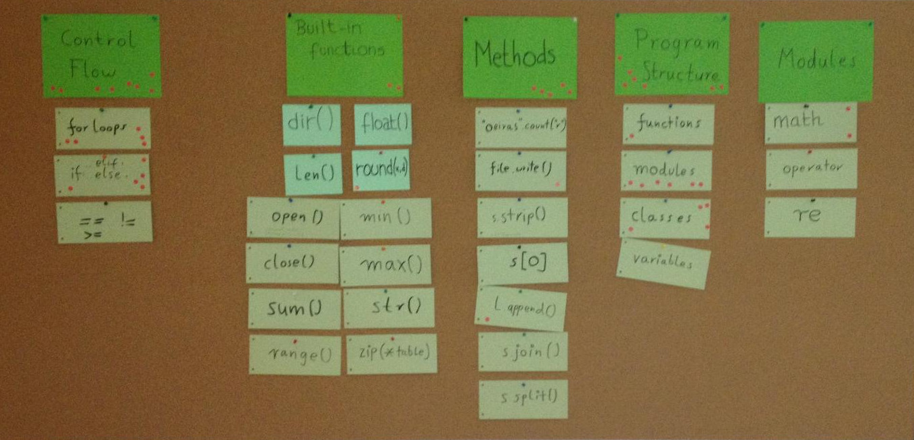
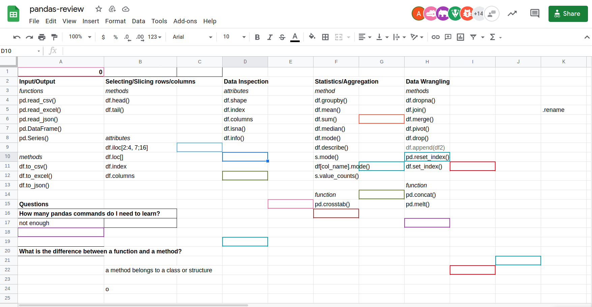

Knowledge Board
===============

============ =============================================
summary      visualize progress and structured concepts
============ =============================================
time         10'
preparation  5'
group size   5-25
material     pin board, cards, pins
============ =============================================

How it is done
--------------

1. define 5-6 categories (e.g. your top-level concepts)
2. use the categories as headings on the pin wall.
3. create cards for new concepts
4. add the new cards to the capacitor
5. leave the cards there
6. repeat from 3. in the next lesson

----

Comments
--------

A knowledge board helps your students see what they have already learned about.
Seeing more and more cards being added over a couple of days gives a good feeling of progress.
If you add new cards at the end of every lesson, it makes a good wrap-up ritual.

Ideally, the knowledge board is visible throughout a course.
Simply seeing the cards supports student retention.
The cards can be used for different kinds of recap activities (*"explain one"*).

A knowledge board can also be built as a collaborative activity.
In that case, you can use the **affinity grouping** method.

----

Using an online knowlege board
------------------------------

A knowledge board is one of the easier methods to use in an online setting.
You might want to move the knowledge board online when you don't have a pin wall, other people use the room in between,
or you are teaching an online course in the first place.

You can use a **spreadsheet**, a **Miro board** or any other technology for the board.
Generally, the knowledge board makes collaboration a little easier.
On the other hand, it won't be in front of your students all the time like the classroom board.
I have frequently used an online board to initiate a recap session:

1. create a board and share it with students
2. ask students to add concepts they encountered during the course (5')
3. group the concepts together (requires strong moderation)
4. identify problematic areas (ask students to vote or mark concepts as *difficult*)
