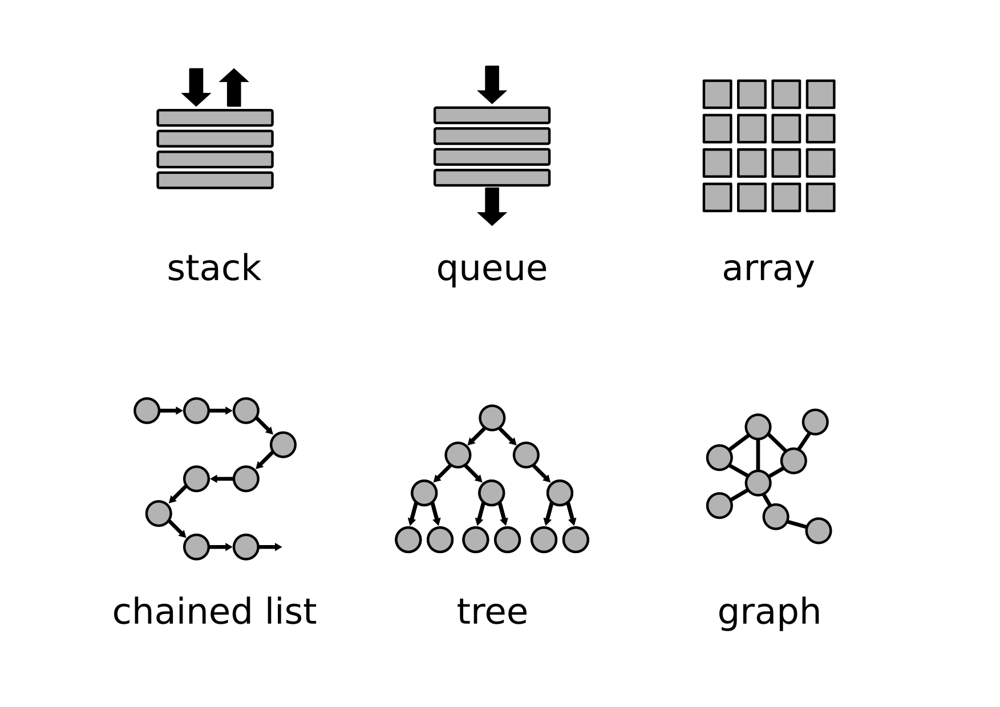
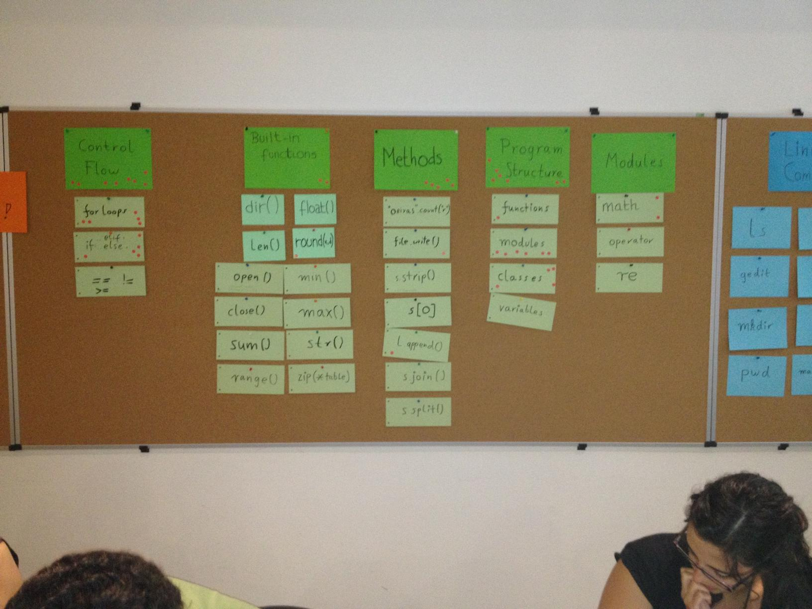

# Structuring Concepts in Frontal Teaching

Your lesson is well prepared. You have set goals, structured your topic and created a Concept Map.
Now, how do you get your nicely structured concepts into the participants heads?

One common strategy is that the teacher introduces and explains new concepts.
This teacher-centric strategy is commonly known as **deductive instruction**.
In **deductive instruction** sets the pace of learning and the range of concepts is predefined.
These properties make deductive insruction very predictable and often an easier choice for beginners. 
Deductive instruction is often found in lectures, talks and similar.

In this chapter, you find several recipes to structure your concepts cleanly in a frontal lesson.

----

## Explain the learning process

Many learners like to know what is expecting them.
One effective strategy is to state your learning goals clearly at the start of a lesson.
You might enumerate your main concepts right away, to iterate over them during the lesson:

    :::text
    Today we will use 3 new data structures:

    - stacks
    - queues
    - arrays

In a longer course, you may want to show a high-level overview that shows where the new content fits in the bigger picture.
Students will see what is behind and ahead of them and will recognize their own progress more easily:

*overview of data structures, both covered and not covered in the current lesson*

It is generally a good idea to make your goals even more transparent by including them in shared material or making them permanently visible in the classroom.

----

## Top-Down Deduction

The following recipe is probably the simplest form to deductively introduce coding concepts:

1. show the concept map
2. explain one or more concepts
3. show a code example that uses the concepts
4. execute the code

This is a top-down, theory-based approach that is used by many academic lecturers.
It has the advantage that it is not very difficult to get started with.
You can implement this recipe even if your concept map is the table of contents of a text book.

If you are a more experienced teacher, this recipe works if you have to improvise: You create the code examples from scratch as you go. All you need is to make the code work and know which concepts you want to cover.

An example of steps 2.-4. is used by [Uncle Bob explaining TDD](https://www.youtube.com/watch?v=58jGpV2Cg50) (the TDD explanation starts around 20:00, the live coding at 45:00).

----

## Bottom-Up Deduction

An alternative is to reverse the steps:

1. show a code example that uses the concepts
2. execute the code
3. discuss the concepts used in the code
4. show your concept map

In this recipe, you put the coding practice into the spotlight.
This is very motivating, especially if your example code does something impressive.
It is still deductive instruction though.
When using this recipe, your participants may come up with questions that have nothing to do with your concepts, and you need to gently steer the discussion back to the main track. 
To guide the discussion you may want to prepare a list of questions that you ask students to think about.

----

## Introduce concepts iteratively

Yet another recipe is to develop your concept map step by step:

1. state a problem question
2. introduce a new concept that answers the question
3. show a code example
4. repeat 1.-3. until your concept map is complete

The advantage of this recipe is that students see the concepts emerge in a logical sequence.
It engages them more actively.
At the same time this recipe is more challenging to implement.
It requires a very good knowledge of the subject to pick the right problem questions and code examples that are not too trivial.
This type of deductive instruction makes it easy to establish a continuous dialogue with your students.

The iterative recipe works better if you can draw/reveal parts of your concept map as you introduce new concepts.
It is well apt to explain mathematical concepts on a whiteboard (where step 3 could also be a diagram, equation or proof).

----

## Knowledge capacitor

A knowledge capacitor helps your students to see what concepts they have learned about.
Ideally, it is visible throughout the course, e.g. as a pin wall in the classroom.
If you don't have a pin wall, an online spreadsheet or note app also work.

1. prepare predefined categories (your top-level concepts)
2. use the categories as headings on the pin wall.
3. create cards for new concepts
4. add the new cards to the capacitor (during the wrap-up of each lesson)
4. use the capacitor for warm-up and recap activities

Because the knowledge capacitor is visible all the time, it enhances retention.
Adding concepts over time to the capacitor also gives participants a feeling of achievement.

----

## Sweeping Up

One disadvantage of deductive instruction is that you may miss out some concepts that students care about.
This is not a big problem, but you may find over time an increasing number of questions asking for clarification.
For instance, in a course on data structures they might ask:

    "is a priority queue the same as a queue?"

    "what is the difference between a balanced tree and a binary tree?"

    "could you explain what a frozen set is?"

When you observe more questions reaching beyond the core concepts, this is a good sign.
It means your students feel already comfortable enough with the content of the lessons.
It may be also time to look what other concepts exist.
The following recipe recipe helps you to fill up gaps in participants' knowledge:

1. prepare a list of 7-25 concepts (data structures, functions)
2. write all of them to cards
3. ask participants to sort the cards into *easy*, *medium* and *difficult*
4. skip the *easy* concepts
5. find one explanation or code example for each *half-known* concept together
6. reserve the *difficult* concepts for a more thorough explanation

You might add the concepts to a knowledge capacitor to have them properly chunked.
