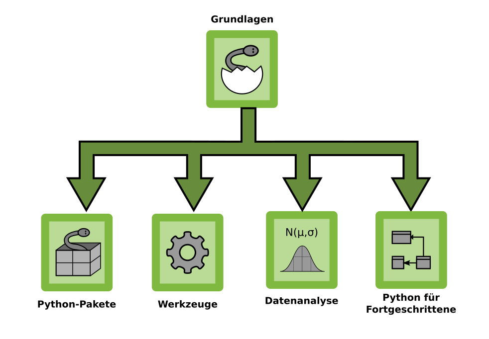

# Structuring concepts

Your lesson is well prepared. You have set goals, structured your topic and created a Concept Map. Now, how do you get your nicely structured concepts into the participants heads?

This chapter lists a few approaches you can choose from.

----

## Explain the learning process

Many learners like to know what is expecting them. One effective strategy is to state your learning goals clearly at the start of a lesson:

    :::text
    "Today we will use 4 different data structures."

Alternatively, you could make the goals transparent in your material or visualize them in the classroom.

In a longer course, a higher-level overview is helpful. You could show a table or roadmap that contains the building blocks of your course:

A top-level concept map also helps participants to locate the current lesson.

----

## Deductive instruction

In **deductive instruction**, the teacher introduces and explains new concepts. This is a teacher-centric approach where you set the pace of learning. The following sequence is an example of deductive instruction:

1. Show the concept map
2. Explain one or more concepts on it
3. Show a code example that uses the concept
4. Execute the code

This is a top-down, theory-based approach that is used by many academic lecturers. It has the advantage that it is not very difficult; you can pull it off even if your concept map is the table of contents of a text book. If you reverse the steps, you put the coding practice into the spotlight (but it is still deductive instruction):

1. Show a code example or do a live coding session
2. Execute the code step by step
3. Discuss the concepts used in the code
4. Unveil your concept map

In this pattern, your participants may come up with questions that have nothing to do with your concepts, and you need to gently steer the discussion back to the main track. It helps if your example program does something impressive. To guide the discussion it helps to have a prepared list of questions.

Yet another approach is to develop your concept step by step:

1. State a question
2. Introduce the concept that answers the question
3. Repeat until your concept map is complete

This is the most challenging sequence of the above. It requires a very good knowledge of the subject to pick the right questions. On the other hand, it engages the participants strongly; they witness the concepts emerge logically. This sequence calls for a medium where you can draw your concept map step by step. If it works well, you are almost streaming your concepts into the participants. Masters of their art run this kind of deductive instruction as a continuous dialogue with their participants.

----

## Inductive instruction

In inductive instruction, your participants get to see several training examples until they find common patterns – your concepts. In contrast to deductive instruction, the participants are much more active and in control of the learning process. This has the advantage that you get more immediate feedback of their progress. On the other hand, it is more difficult to prepare.

Some examples how an inductive teaching session could look in practice:

### Code examples I

Participants try out several code examples and discuss them in pairs.
They answer a couple of questions about the code. Afterwards you discuss the questions with the class and show your concept map as an explanation.

### Code examples II
Divide the class in groups. Each group examines a different programming package/library. After some time they present their package to the class.
The packages presented are the concepts.

### Comparison

Prepare two alternative implementations for the same problem.
Let participants find out the key differences. Discuss their pros and cons.

### Work sheets
Good for calculating, writing short definitions, drawing.
schriftliche Aufgaben	Arbeitsblätter mit klarem Arbeitsauftrag

### Text analysis
Participants read a piece of text on programming on their own and answer an open question, e.g.:

    :::text
    "How did the team in the described project make sure
    that they were writing quality code?"

Afterwards, you collect answers and group them as concepts around your central topic – the concept map is emerging directly from the students' own work.

### Simulation

Simlate an algorithm analogously before going into the code. The understanding of its inner workings will be much more immediate.

Algorithmic simulations can be done on the board, on paper or choreographed with the participants as live actors – a good occasion for a change of environment.

----

The main difficulty in inductive instruction is to motivate the task and come up with a clear task description. It is possible that it does not go . But the resulting learning effect usually outweighs the risk.

----

## Priming supports instruction

The use of **Priming** is helpful in both deductive and inductive instruction.
A well-conducted warm-up exercise does half the work for you: It introduces concepts, problems or makes the participants generally think in the right direction.

You can use all the puzzles, quizzes and games described in chapter **Warming Up** to prime your participants.

----

## Concept artifacts

Your participants will remember concepts that they apply or find useful easily. Others will need *spaced repetition*, recalling these concepts several times. You can enhance the retention of your content by creating *concept artifacts* during the lesson. Here are some examples how to do that.

----

### Explain functions

Fill up gaps in participants' knowledge

* prepare a list of 10-25 functions/modules/commands
* write all of them to cards
* ask participants to divide the cards into *known*, *half-known* and *unknown*
* skip the *known* concepts
* find one example for each *half-known* concept together
* reserve the *unknown* concepts for a more thorough explanation

Afterwards, you can group the cards or use them in a knowledge capacitor.

----

### Knowledge capacitor

Use a pin wall with cards where you collect important concepts. Ask your participants to structure concepts into categories that you prepare. Because the knowledge capacitor is visible all the time, it enhances retention.

Adding concepts over time to the capacitor also gives participants a feeling of achievement.

If you don't have the space to keep the wall in the classroom, an online spreadsheet is a (weaker) alternative.

----

### Poster gallery

Students prepare posters in small groups. Give them a clear task, e.g.:

* draw a mind map for a given topic
* create a workflow
* create a timeline
* fill a table

If the topic is rather new, you need to provide some guidance in the form of hints, material for research, pictographs that participants can glue together etc. This variant will require a lot of active work and thinking. It will take at least one hour.

If the participants already have knowledge on the subject, the poster serves as a summary (and first repetition). This should take less time (30-40 minutes).

Have the posters drawn on big sheets of paper. Hang the posters up in the classroom, so that they stay visible as a result.

----

### Affinity grouping

| summary     | structure information with the group |
|-------------|-------------------|
| time        | 45' |
| preparation | 15' |
| group size  | 2-20 |
| material    | board, cards, pens, magnets or pins |

* start with concepts on 20-30 cards (provided by you or from prior brainstorming)
* attach all cards to the board
* ask participants to suggest groups of cards
* wait for suggestions
* move the cards accordingly
* moderate the discussion, but don't interfere with the suggestions
* ask participants to name the clusters
* attach the cluster names as well

Affinity grouping is a basic moderation method. Structuring concepts is a very powerful way to reinforce learning. Observe closely whether you would have grouped the cards the same way. Note that there is no single correct grouping, but it tells you something about the learning process of your participants.

Apart from enhancing retention, you can use affinity grouping to plan projects together. You can have participants vote on concepts or ideas that they want to repeat, implement or learn more about (see *dot voting* in the *Feedback* chapter).
