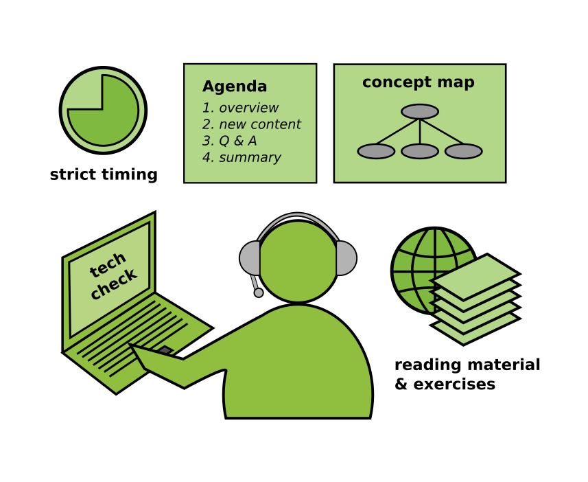

# Teaching Online

**Online teaching is difficult.** With any communication tool, the nonverbal feedback from your participants is less direct. It is much harder to create an engaging, high-quality experience. It requires more planning and certainly is more tiring.

So why should we bother at all? First, online teaching is much cheaper than booking a training room and having trainers or even participants travel around. Second, I am writing this post in quarantine during the Corona pandemic, and it is my only option to teach at all.

Here are some tips to make it work:

----

## 1. Have an Agenda

When teaching online, there is very little room for improvising. Chaos is detrimental. In a face to face class, it is sometimes useful to take a detour to a subtopic that students are interested in. In a remote class it can be tempting to follow up a question with a deep dive. Don't do that! It is very easy to miss out that half of your class is not interested in that at all. Instead, have an agenda and stick to it.

Create a fine-grained schedule with blocks of 20' max. Leave time for participants to arrive (and start on time). Leave time for a summary as well. Take a break after 45' and do something else after 2 hours. An agenda for a 45' lesson on databases might look like this:

| time | content |
|------|---------|
|  5'  | arrival and welcome |
|  5'  | starter question "why are DBs useful?" - students post ideas |
|  2'  | lesson overview |
| 15'  | SQL vs noSQL databases – presentation with concept map |
|  7'  | Q & A |
|  5'  | discuss assignment: install postgres |
|  5'  | summary |

Share this agenda with your participants before the lesson. It does a great deal to show that you know what you are doing (and have thought about it).

----

## 2. Check the Technology

Technology is still a brittle element of communication. Here are some things that you might want to check before:

* do you have a quiet place for teaching?
* does your microphone work?
* is there background noise?
* can you share your screen?
* can participants share their screen?
* is the transmitted screen resolution good enough to read code?
* do you have a place to share code, images, slides etc?
* is everybody invited to a chat channel?
* is the network strong enough for you to use a camera?
* is the network strong enough for participants to use a camera?
* ask your participants whether they can hear you

You will need to establish some discipline in communication: ask people to mute their microphones while not speaking and abstain from commenting on everything.

----

## 3. Reduce Content

You have to accept that you will cover less content online compared to a face-to-face class of equal length. The content you have needs to be more clear as well. Use a [Concept Map](http://www.academis.eu/posts/teaching/planning/concept_maps.md) that explains your topic in one picture. Stick to a maximum of 7 concepts rigorously. If you manage to get these 7 points across during a lesson, it is already an achievement.

A good strategy to present content within the confinements of online media is:

* say what you are going to say
* say it
* say what you have said

This presentation strategy is said to have been developed for military briefings, and it might help you as well to get your message across.

----

## 4. Talk Less

Speaking through a microphone is not a very efficient way to transmit information (even worse than the potentially multi-sensory lecture format).
Also, it is very hard to listen productively for more than 2 hours. Most importantly, it is very exhausting for you. Covering multiple full days constantly online is not a good idea.

**Consider some alternatives:**

* give out reading materials
* have clear assignments ready
* schedule 1-on-1 sessions with your participants
* use multiple choice questions for recap
* interrupt your lessons by interactive questions (try [Socrative](http://www.socrative.com) )
* try **Polly**, the Slack polling tool
* ask participants to brainstorm ideas in the chat forum
* ask participants to summarize their take home message in 3 sentences
* give them incomplete code examples to complete
* give them exercises that can be completed with one line of code

.. and use them.

----

## 5. Try Flipped Class

Instead of the classical frontal teaching + exercises, try the **Flipped Classroom** technique. A recipe in an online class could look like this:

1. Give them an assignment, e.g. *"Create a table in Postgres that meets the following criteria ..."*
2. Give them reading material
3. Give them time for self-study (1h at least)
4. Be available for questions during that time.
5. In an online session, review the results together, answer more questions
6. Follow up with a more theoretical session, where you structure the topic, fill in the gaps, give additional context etc.

The advantage of Flipped Class is that it ruthlessly empowers your students to get things done on their own.

### Also see:

* [Short Video with Eric Mazur on Flipped Class](https://www.youtube.com/watch?v=Z9orbxoRofI)
* [Long Video with Eric Mazur on Flipped Class](https://www.youtube.com/watch?v=WwslBPj8GgI)
