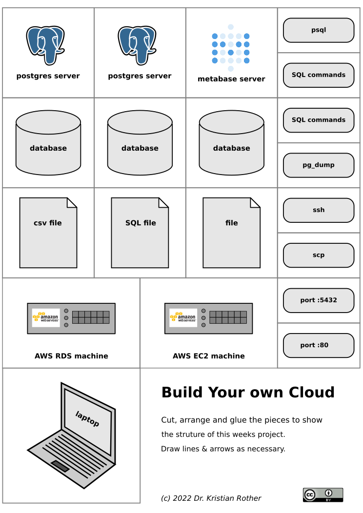
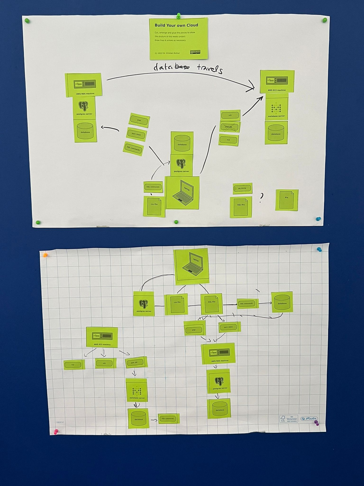

# Paper-and-Scissor Worksheets

This is an example of having students build a software architecture using paper and scissors.

### Goal

The students visualize the interactions between 3 computers in a classroom project.
They would receive a worksheet like this one (download the SVG file :::file pg_worksheet.svg ):

The students would cut, arrange and glue the elements to explain what they have done in a project.
This helps them to clarify, which computer or program communicates with which other.
The students basically create their own concept map in a inductive instruction setting.
The activity clarifies or at least exposes unclear points in the follow-up discussion.

There are two ways to use a worksheet like this one:

1. To introduce a new topic or project. In this case you need **reading material where students find what they should build.**
2. To recap a project students have been working on

### Preparations

you need:

* reading material (only if you go for option 1)
* print the PDF N+1 times (N = number of students // 3) on 120g paper in a bright colour
* large sheets of paper (A2, flipchart cut in half)
* scissors for each group
* glue sticks for each group
* some black pens

### How to do it

1. Announce the task: create an overview of the project using the paper parts
2. They don't have to use all the parts
3. Randomly assign the students to groups of 2-3 people
4. Give them 30-40 minutes to work on the material
5. Put up the results on pin walls as a sort of gallery
6. Let each group briefly(!) present their outcome, answer questions

This is how the result could look like:

