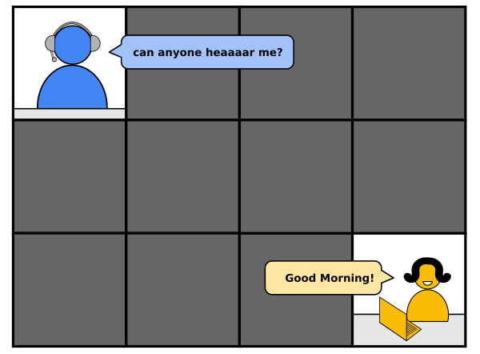

Arrive Early
~~~~~~~~~~~~

When the lesson starts, you don’t want the technical setup to get in the
way. Be there 10 minutes earlier at least. Conduct your tech-check with
the first person that pops up.

   soundcheck

Make use of the remaining time to chat a little and get a feeling for
the audience. A good starter question when you join a longer course for
a few days is:

::

   "What did you learn yesterday?"

