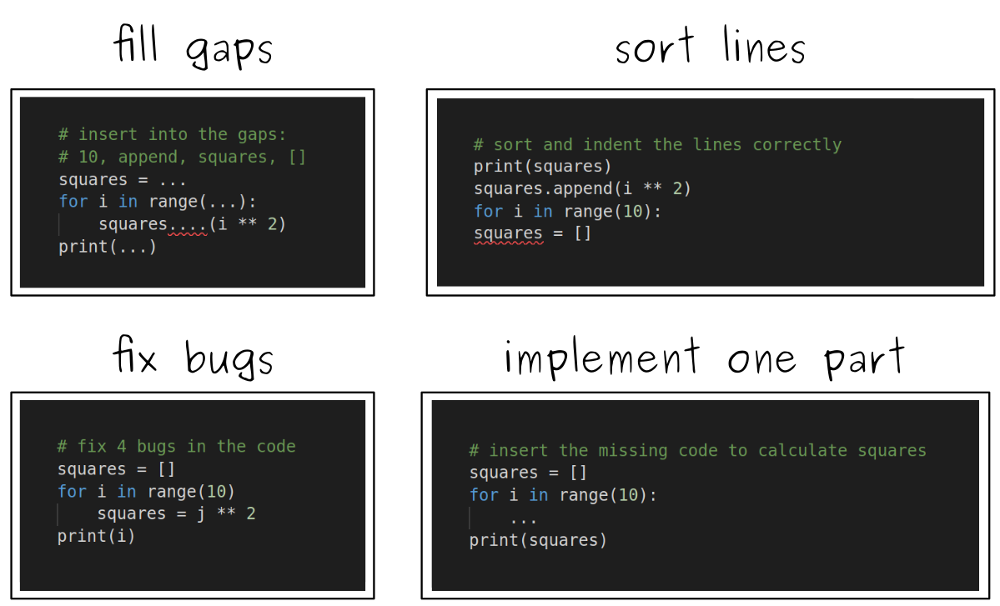

# How to create engaging coding exercises?

## The Problem

Suppose your students are to write a program
that calculates a series of square numbers:

    1  4  9  16  25  36  49  ...
  
For you, the solution is easy to implement.
But if you show them the solution directly, it goes into their brain and out again:

However, asking them to write the program from scratch themselves is too difficult:

Ideally, you want to develop exercises that are:

* clear enough that they can focus on new concepts or commands
* difficult enough that the students need to think
* easy enough that they can find the solution themselves

You also want more advanced students to try alternative implementations:

----

## Solution

There are a few ways how you can build a coding exercise in an online class:

### 1. Live Code

Live coding is a very versatile method to teach coding.
On one hand, it is already useful to present new concepts by implementing them.
But if you slow down, you can guide the students towards the solution and wait for their input.

Assuming that you know the solution well enough to write it off the cuff, live coding does not require a huge amount of preparation.
You can save time by preparing the "boring" parts and live coding the interesting ones.

It requires quite a bit of patience to slow down enough.
In an online setting, students may easily stop coding themselves.
It may happen that they lose track because the coding happens too quickly.
It could also be that they struggle managing their own editor and a screen-shared one (people with two screens have a big advantage here).
To make this less likely, stop after 20 minutes or take a break and share an intermediate result.

You could organize a live coding session like this:

| time | activity |
|------|----------|
| 30'  | theory: explain the new concept with live code |
| 20'  | exercise: students work on a slightly different taks |
| 20'  | wrap-up: code the solution together |

### 2. Reduced Examples

Reduced examples means that you prepare an incomplete solution.
The incomplete solutions put an otherwise difficult problem in arms reach of your students.
To create a reduced example, create a complete solution first and then omit or mix some parts:

Reduced examples can be used in many situations:

* a 5-minute puzzle that helps you to introduce a new concept
* a longer exercise where students need to apply something you explained earlier
* repeat something that you did the previous day

Reduced examples are great because you can fine-tune difficulty.
Also see: [Faded Examples](https://teachtogether.tech/en/index.html#s:architecture-load) by Greg Wilson.

Reduced examples allow you to recycle code examples from earlier lessons.
It saves a lot of time if you slightly modify an exercise you know well to adapt it to a specific audience.

### 3. Step-by-Step instructions

A more standard exercise is providing a step-by-step recipe that tells students exactly what to do.
This is generally good for longer exercises, because students need to read and implement each step carefully.
Step-by-step instructions let students proceed at their own pace, but need more time to prepare.
You find this method described in more detail in [How to create materials for self-study](self_study_material.md).
