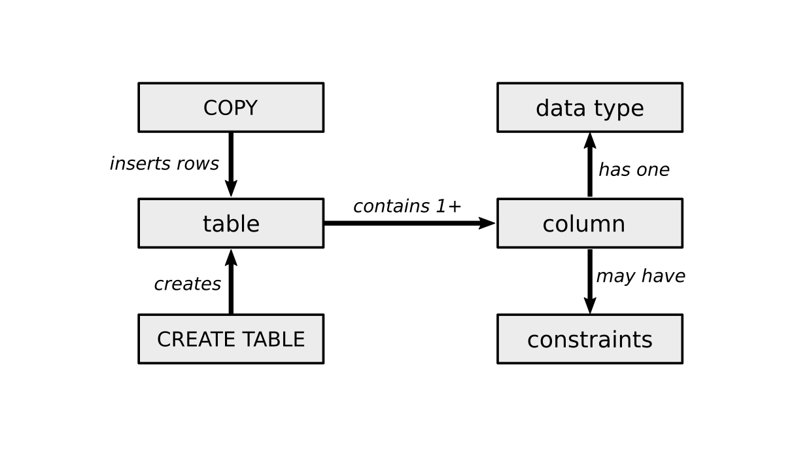

Every lesson starts with a **warm-up** part and ends with a **wrap-up**.
The next lesson connects to the previous one. 
This is why the diagram is a circle.

### 1. Start with a Problem

In the **warm-up** phase, you want to involve the students emotionally.
On of the easiest ways to achieve this is to present a problem.

Let's look at an example.
Suppose you want to teach a lesson on SQL `CREATE TABLE`.
What you want to achieve is:

    students understand CREATE TABLE.

Unfortunately, this is not very useful as a goal.
You cannot look into your students head and check whether they understood it.
Also, it is way too unspecific. It does not tell you what exactly to prepare.
An improvement would be:

    students implement a CREATE TABLE statement.

This second statement is better.
It is testable.
You could have an exercise where the students have to write a `CREATE TABLE`.
Still, it does not give students any reason why they would want to do this.
We can improve the goal further to:

    students load a CSV file into an SQL table.

Now, students are faced with a challenge, and the `CREATE TABLE` becomes a useful tool.
Also, students can self-test easily – the data is in the table or not.
Finally, let's add a theme:

    students load a CSV file with penguin data into an SQL table.

Using penguin data (or any other specific dataset) makes it easier for you to get the students on board.
Starting with a **themed probled like is a strong driver of an entire lesson.

Check out the [Start a Lesson](start_class.md) chapter to find more ideas for the warm-up phase.

### 2. Create a Visual Overview

As a next thing you may want to is to introduce some **theory**.
Now you could really spend a lot of time putting together a long deck of slides.
When teaching to code in the 21st century, this is not really necessary.
You don't need to transfer huge amounts of information.
All the students need to know is out in the internet anyway.

What is difficult for the students is to learn what to look for.
Therefore, your main job as a teacher is to **communicate structure**.
Find up to **7 key concepts** and create a visual overview from it.

You can spend plenty of in-class time on a diagram like this (called a concept map).
You could:

* explain each of the items in the concept map
* zoom into any of the items (e.g. enumerate several SQL data types)
* execute a piece of code and explain which parts of the concept map are where
* give students a piece of code and ask them to identify the pieces
* summarize your lesson
* run a recap activity

A concept map and some extra information (e.g. a table with data types, a code example) are enough to fill a 20' theory session.
You could supplement slides if you want but you won't need many of them.
If you want to live code an example (execute CREATE TABLE statements), you can add another 10'.
If you want your students to type in the same code right away, you may easily fill 45'.

Creating a visual overview is the backbone of a successful lesson.

### 6. Write a lesson plan

One main result of your preparation should be a **lesson plan** where you write down for yourself what you want to do during the lesson.
Here is an example for a 90' lesson on `CREATE TABLE`:

| section | activity | time |
|---------|----------|------|
| warm-up | say hello | 1'  |
|         | explain the problem: load CSV to SQL | 4' | 
|         | give students the penguin CSV file | 2' |
|         | ask for ideas | 5' |
| theory  | explain the concept map | 10' |
|         | go through example code | 10' |
| exercise | code with gaps exercise | 10' |
|          | step-by-step guide to load CSV | 30' |
| wrap-up  | review the solution | 8' |
|          | Q & A | 7' |
| backup   | 5 prepared questions | ? |

This plan assumes that students have Postgres installed.
For a group that has no experience with SQL, the timing is rather ambitious.
For first-time SQL users it might as well take 2-2.5 hours.
More experienced students, will get through the exercise faster, so that you will have more time to go deeper into some of the concepts (e.g. highlight some data types or constraints).

Having a lesson plan helps you a lot to allocate time.
It also helps reacting during the lesson as it unfolds.

When teaching online, many things take longer than you would think initially.
Realizing this and preparing just enough so that you can run the lesson at a comfortable pace will save you lots of preparation time.
