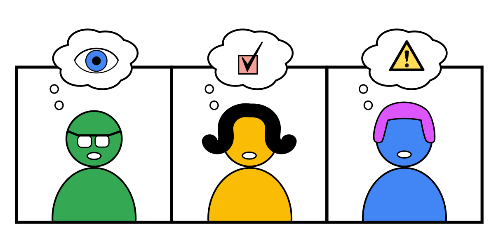
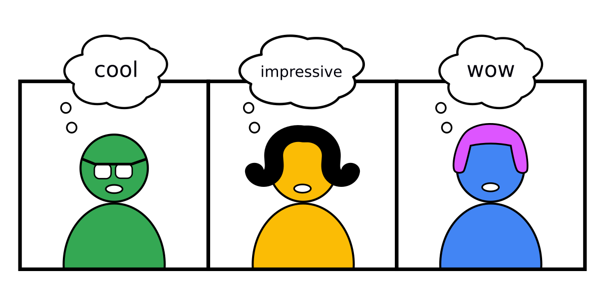
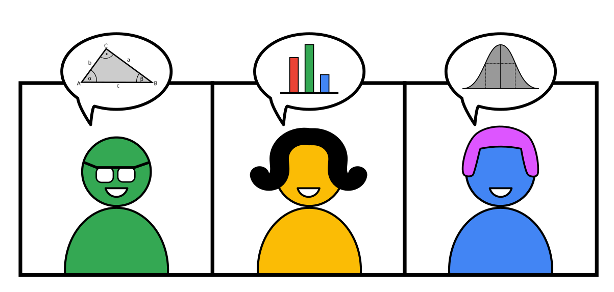
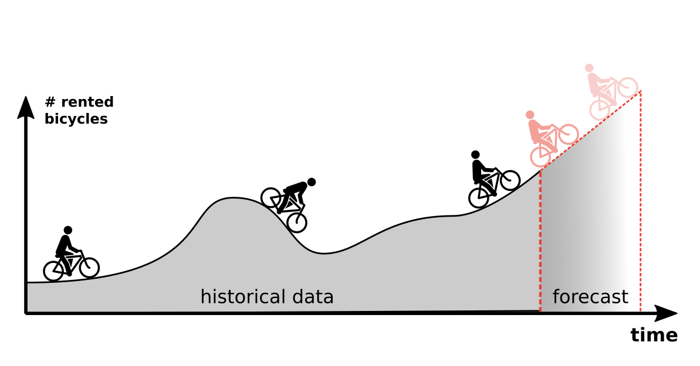
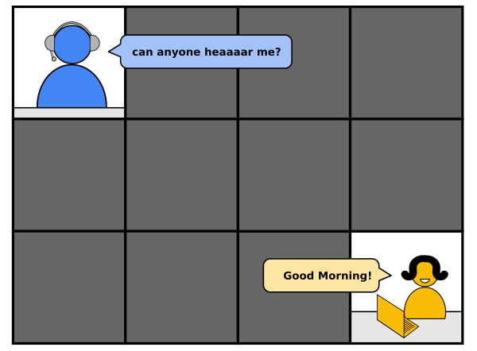
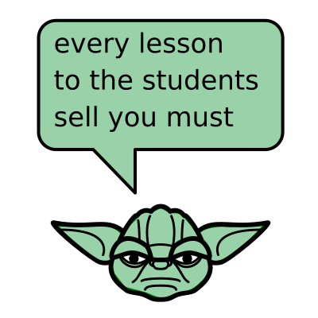
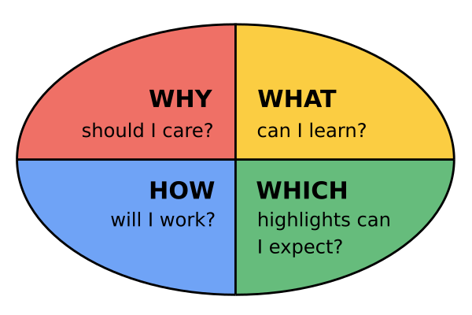
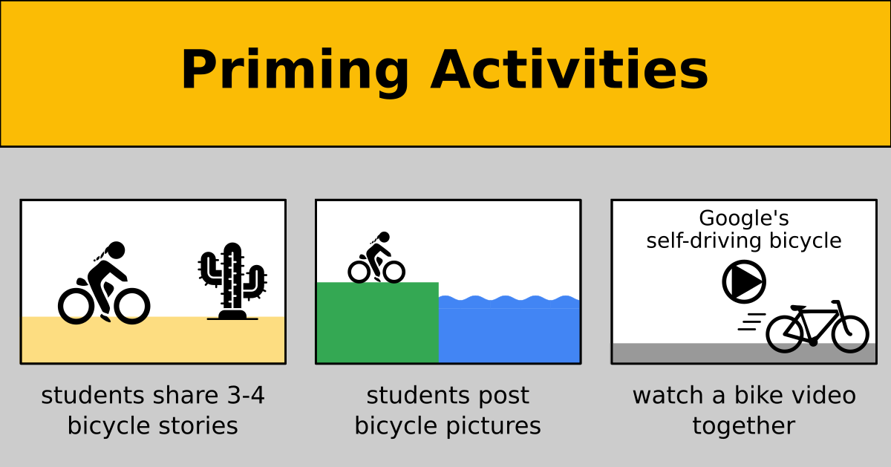

# How to start an online lesson?

## The Problem

At the beginning of a lesson you want to achieve multiple things:

### Get the full attention of your students

### Build authority and rapport

### Make them talk about the subject

... on top of that, you don't want to spend too much time warming up your class.
After the first 10 minutes you want to get to more serious stuff.

----

## Solution

Suppose you want to deliver a lesson on **time series forecasting**.
You have the lesson fully worked out with theory and exercises.
As an example you want to use bicycle rental data (check out [Bike Sharing Demand on Kaggle](https://www.kaggle.com/c/bike-sharing-demand) ).

Let's look at a few things you could do at the start:

### 1. Arrive Early

When the lesson starts, you don't want the technical setup to get in the way.
Be there 10 minutes earlier at least.
Conduct your tech-check with the first person that pops up.

Make use of the remaining time to chat a little and get a feeling for the audience.
A good starter question when you join a longer course for a few days is:

    :::text
    "What did you learn yesterday?"

When it is time to start, start with 1-2 of the following strategies:

### 2. Sell your lesson in one minute

To make adults learn, they need to have a reason to be there.
This is called *"selling the lesson"*.
You have to sell your lesson even if the students are not paying or have already paid.
In an IT course, lessons are not that hard to sell, because students usually really want to learn the stuff.
However, they still want to know **why they should be in your specific lesson.** 

An easy strategy is to answer four questions at the beginning:

For the bicycle lesson, your introduction could be:

    :::text
    Welcome to the lesson "Time Series Forecasting".
    I want you to forecast bicycle rentals <show the above image>.

    Time Series are super common. Every business has 
    time series data and wants to know what the future brings (WHY).

    In this lesson, you will learn to train a Poisson Regressor
    and take care of seasonality in the data (WHAT).

    In the first half I will go through a scikit code example. 
    In the second half you will work in teams to apply
    a few new pandas functions on the data. (HOW)

    We will use plotly to create diagrams,
    because this is my favourite library (HIGHLIGHT)

### 3. Show something impressive

If this is your first lesson with a new group, you may want to establish yourself as the go-to-expert first.
Summarizing your entire CV is usually a bit boring.
A better strategy is to focus on the parts that connect to the lesson.
You could pick one of:

* tell how you came to teach that lesson (your background + 1-2 career stops or how you met the organizers)
* tell about a project you did (see [storytelling](storytelling.md))
* show the outcome of a program (e.g. a diagram or image)

Whatever you show, keep it short (firmly below 5 minutes).

### 3. Priming

**Priming** is a psychological effect a stimulus influences the response to a subsequent stimulus (see [Priming on Wikipedia](https://en.wikipedia.org/wiki/Priming_(psychology)).
In plain English priming means:

    :::text
    You see a picture of a bicycle.
    If someone asks you 2 minutes later to name a vehicle,
    the response "bicycle" is a lot more likely.

    Your brain had already heated up its "bicycle" area.

In teaching, you can use priming to make your students immerse into the topic of the lesson.
Here are a few easy and fun activities that work for priming:

In general, you can prime both on the **theme** (the bicycles) and the **topic** (forecasting) of a lesson.
I would recommend going for the theme when introducing a project that lasts 1+ days, and prime for the topic for a shorter lesson.
The activities remain the same.

### 4. Recap

When you are with the same group for more than one day, starting becomes easier from day two.
You can start your lesson revisiting topics from the previous day.
A recap activity could consist of 1-3 interview questions, 3-5 quiz questions (see [instant feedback](instant_feedback.md)) or a reduced code example (see [coding exercises](engaging_coding_exercises.md)).

One of my favourite recap activities is to ask students to write **five easy lines of code**:

    :::python3
    # starter code:
    import seaborn as sns
    df = sns.load_dataset('flights')

    # 1. Check the number of rows and columns

    # 2. Show all data for 1950

    # 3. Calculate the average passenger number

    # 4. Plot the 'passenger' column

    # 5. Save the data to a new CSV file

Give students 5-10 minutes to work on the taks.
Then go through the results together.

This type of activity is a brain massage, not a test.
The trick is that the lines should be easy for everyone to write.

If you make everyone succeed in the first 10 minutes, they will make you succeed during the rest of the lesson.

### Further Reading

* check out [Googles self-driving bicycles](https://www.youtube.com/watch?v=LSZPNwZex9s).
