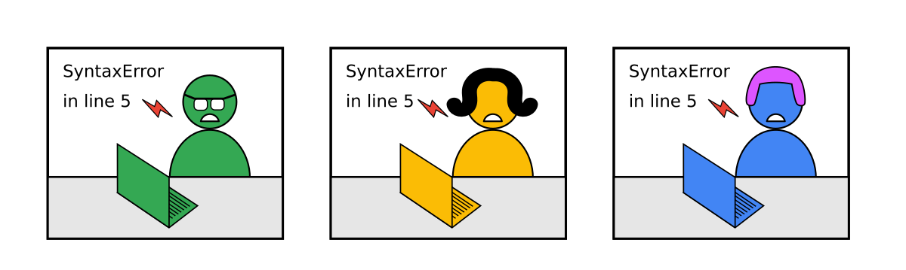
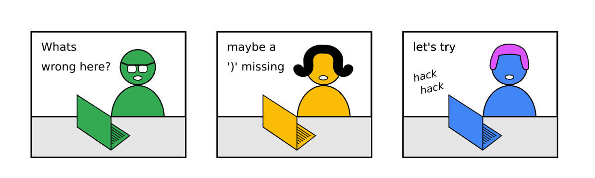
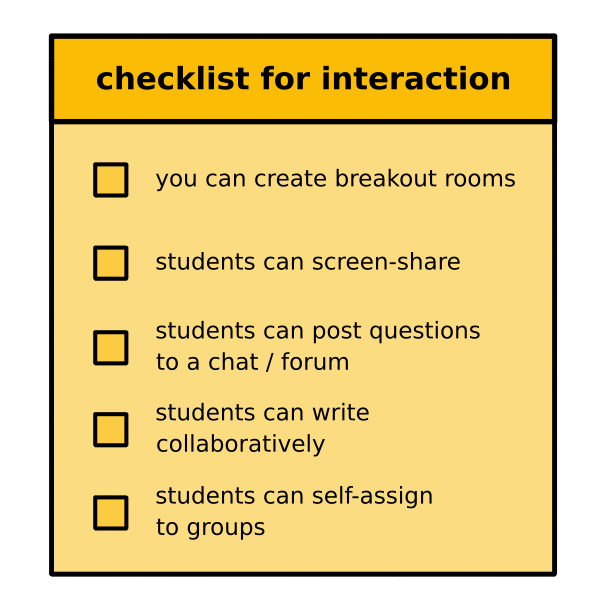
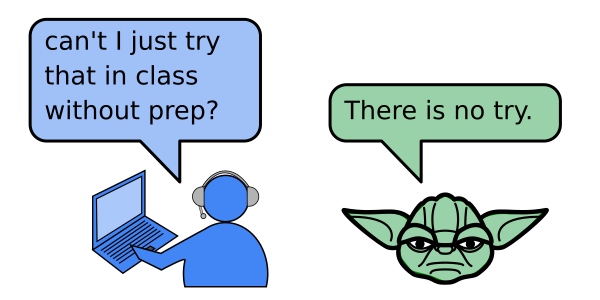
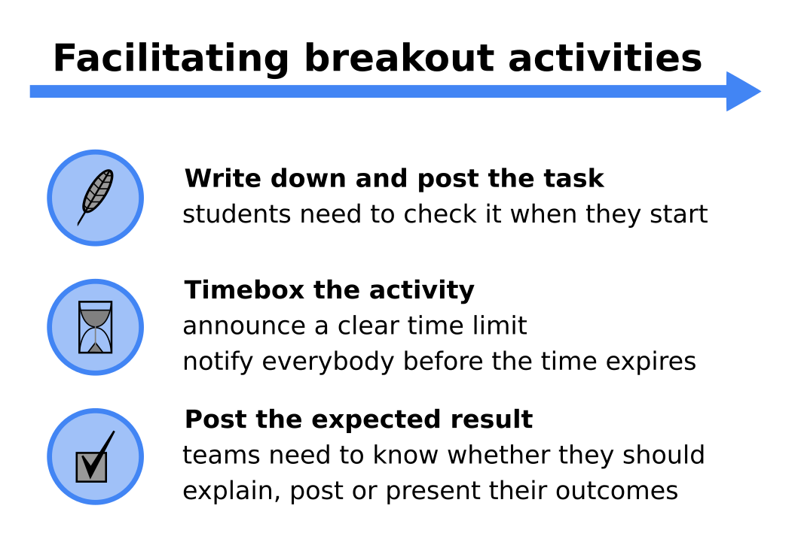
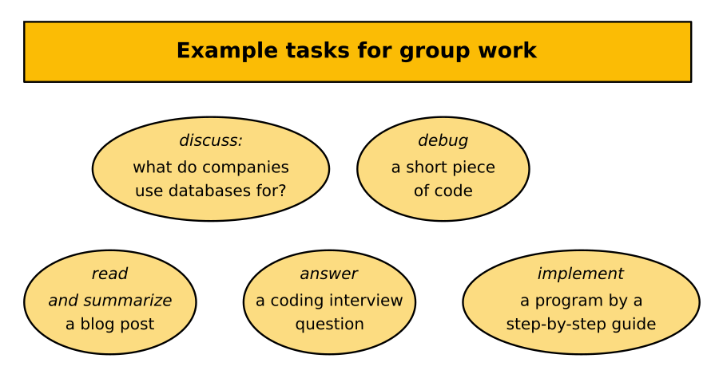
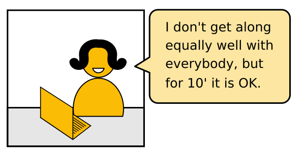

# How to encourage students to work together?

## The Problem

You want to convert disconnected students:

into a group:

so that:

However, in an online class, this rarely happens by itself.

Students feel *psychologically safe* on their own.
This creates a barrier that is hard to overcome.

What can you do to encourage students to work together and *still* feel safe?

----

## Solution

### 1. Check the technical setup

An online group is very sensitive to little bumps.
If something does not work out it takes the momentum from group activities almost entirely.
So you want to go sure that technological setup does not get in the way.

### 2. Establish rules

When I started to teach online, I realized that rules for tasks and activities need to be more clear than in a classroom. 
The last thing you want is that you have 3 students in a breakout, each with a different opinion on what they are expected to do.
To be clear, put the following information in the **eyes AND ears** of your students.

A good example of a group task that you could post to a chat would be:

    :::text
    Hyperparameter Optimization of a Classification Model
    -----------------------------------------------------
    During the next 25 minutes, your team should:

    1. Open the notebook `titanic.ipynb` that contains a Logistic Regression model
    2. Add the GridSearch example from the lecture notes
    3. Train the GridSearch to find the best hyperparameter value for `C`
    4. Post the training and test score to Slack

### 3. Example Tasks

Here are typical tasks that are not too difficult to prepare:

Notes on the timing:

* discuss an open question: 2-5 minutes, good for warming up
* debug a piece of code: 5-10 minutes
* read and summarize: 15 minutes (blog post) to 90 minutes (research paper)
* answer an interview question: 5-10 minutes
* implement a program with a step-by-step guide: 20-60 minutes 

During the longer tasks you can go around and see if anyone wants help or take turns reaching out to the groups via a chat.

### 4. Groups vs. pairs

There are 3 basic forms to organize group work.
Of those, small teams of 3-4 people is the least risky and easiest to organize:

Groups with different tasks are great if you want to cover a lot of ground quickly.
Each group could research a different function or library and show something at the end nobody else has seen yet.

### 5. Easy wins

When you prepare tasks for group activities, **make the task a bit too easy**.
First, tasks are usually more difficult for the student than one would think.
Second, you want to lead your groups to success. It is utterly frustrating if none of the groups makes it to the finishing line or if your group is the only one that fails.
Third, you maximize the benefit from working in a group. If the core task is easy, your advanced students will have time to try and discuss alternative implementations. This is exactly where you want them to be.

If you do not have much experience with group tasks or need to get to know a group of students, start with a shorter task (up to 10 minutes).
Shorter tasks are psychologically much safer:

### 6. Caveats

These tips make student cooperation *more likely*. 
It still strongly depends on the group chemistry at a given moment.
Some groups take up your encouragement very eagerly, others won't react at all.

If it does not work it is not your fault.
Imagine they have 2 kids or 7 cats around while being in your course.
Such situations do occur, and sometimes you won't notice.

But celebrate if it does work!