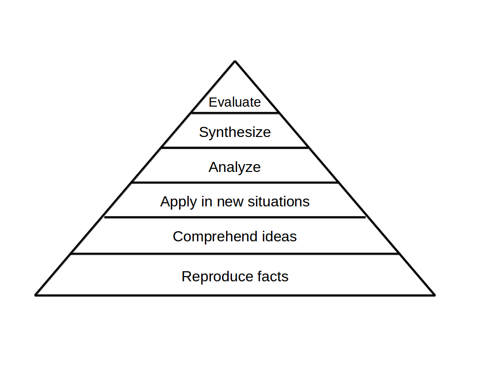

.. _blooms_taxonomy:

Planning well-balanced Courses
==============================

If you design a longer course, you probably not only want to cover a range of topics,
but also have a balanced mix of objectives.
In this chapter, you learn about **Blooms Taxonomy**, a powerful model to organize a larger set of learning goals.
looms Taxonomy categorizes learning goals into a hierarchy
according to the *activities* participants perform.
These activities range from basic to more complex activities over six levels:

Applied to a lesson on `for` loops, you could formulate the following goals:

====== ========== =========================================================================
level  activity   example goal
====== ========== =========================================================================
1      reproduce  identify correct syntax of a `for` loop
2      comprehend explain a `for` loop drawing multiple squares
3      apply      write a `for` loop drawing squares in different colors
4      analyze    review different implementations of loops
5      synthesize refactor repetitive code using a loop
6      evaluate   discuss advantages and disadvantages of `for` over `while`
====== ========== =========================================================================

Ideally, a course has a mixture of activities.
As the pyramid in the figure indicates, the majority of goals in a course should be on levels 1 + 2,
a smaller number on levels 3 + 4, and a few on levels 5 + 6.

Blooms taxonomy helps you to focus less on **content**
and more towards practical **skills** programmers need.
In the table below, you find verbs that you can use to create activities.

============= ================ ============== =============== ============== ============
1. reproduce  2. comprehend    3. apply       4. analyze      5. synthesize  6. evaluate
============= ================ ============== =============== ============== ============
define        describe         implement      debug            plan          advocate  
identify      explain          execute        compare          design        defend    
enumerate     draw             calculate      differentiate    plan          recommend 
name          illustrate       estimate       examine          refactor      judge     
recognize     classify         measure        investigate      organize      assess    
quiz          summarize        demonstrate    test             discuss       suggest   
============= ================ ============== =============== ============== ============

You will quickly notice that some topics are more apt for one or other type of activity.
Also, you could make an activity on each level more or less difficult.
So, by combining **topics**, **activities** and **difficulty**, you have practically an infinite number of goals for a lesson.

.. seealso::

   Bloom, Taxonomy of Educational Objectives Handbook (1956) and LeBrun and Johnstone (1994:162).
