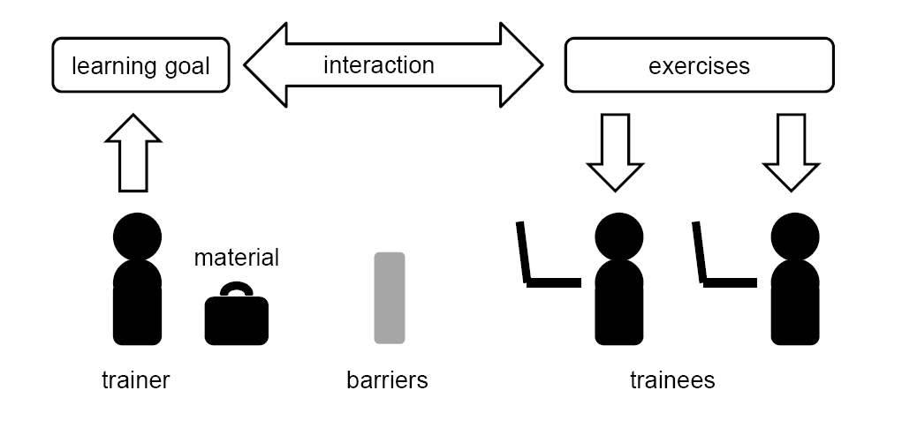
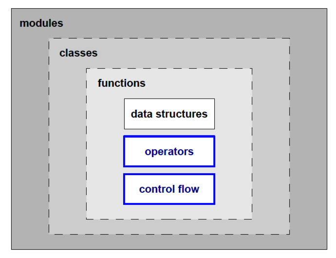
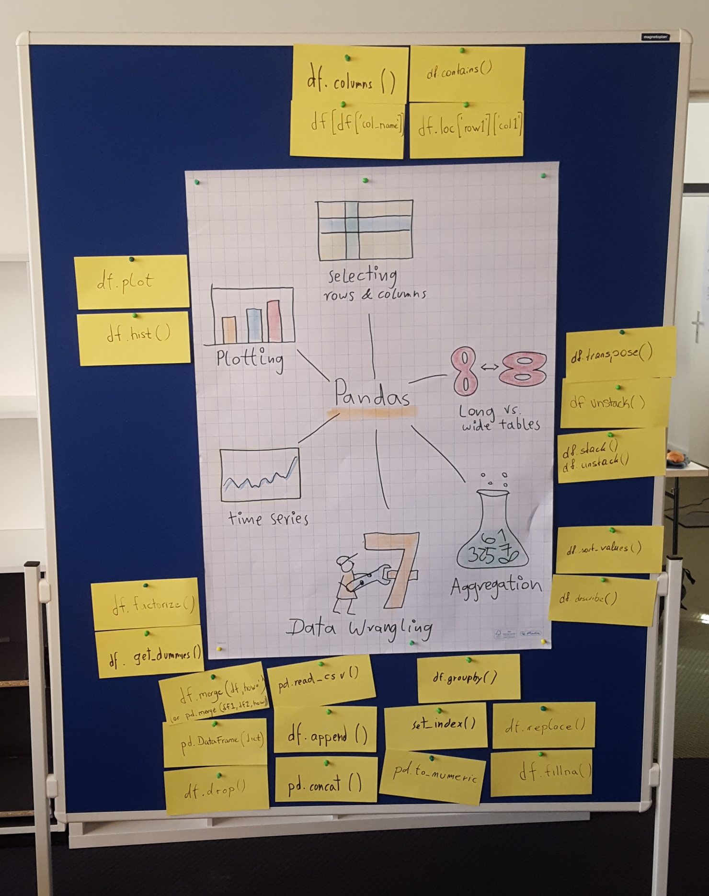

# Concept Maps

**A concept map is a structured visualization of a topic showing no more than seven concepts.**

We receive most of our information visually. Therefore, a key part of lesson preparation is to create a visual representation of the subject. These visualizations are called **Concept Maps**.

Concept Maps come in many forms. They can be depicted as mind maps, diagrams, flowcharts, or use a visual metaphor. Here are a few examples:

*concept map for a course on teaching programming*

*concept map on the Python language*

*concept map on pandas annotated with commands*

If you look carefully, you will find a few more concept maps throughout this book.

In this chapter, you can learn why concept maps are useful, how to create a Concept Map and how to use it in your lesson.

## Why Concept Maps are useful

To many learners a new programming language, library or tool looks vast and intimidating at first. A more experienced person has learned what is important in this topic and what is not. They have learned a *structure* that helps them to apply the technology more quickly.

Helping your learners to develop that structure is one of your main jobs as a teachers. We use Concept Maps to put that structure right in front of their noses. As they learn more about the topic, they slowly copy the your Concept Map into their brain (possibly with their own modifications).

But why does this work?

### Concept Maps facilitate conceptual understanding

Is it more important to memorize all data types in a language or to understand *what a data type is*? *"Data type"* is a great example of a programming **concept**, an idea that can be applied in multiple contexts to explain or predict outcomes.

For example, in an introductory lesson on Python, your participants see a Concept Map containing the following items:

* data types
* control flow
* operators
* functions
* input and output

Whatever you do, your participants will not learn all data types in lesson 1.
Let's say they only know integers after the first lesson. When they see strings in lesson 2, their knowledge about integers turns out to be quite useless. However, if you introduce strings as another *data type*, they can make the connection to something they already know: The two data types are connected. What is more, the word *"data type"* allows them to talk and reason about it. So that in lesson 3 you can show them a list and some participants start asking: *"is this a new data type?"*.

These participants have reached **conceptual understanding**. A Concept Map allows you to introduce key concepts very early.

### Concept Maps limit information

Look at any programming reference or cheat sheet. They are incredibly useful to look up things you already know. But to learn to know a new subject they are rather useless, mainly because there is too much information.

Neurological research has discovered that our brain only processes a very limited number of items simultaneously. That number is around 7, the famous **working memory limit* of seven plus/minus two** (see George Miller). If you are stressed or there are other distractions that number goes down further. In a nutshell, a learner needs to acquire all his knowledge through this limited bandwidth. A Concept Map respects this limitation, because it only contains a small number of items.

But what if you have more than 7 concepts to teach? Our brain manages larger numbers by a process called **chunking**. They get grouped together. For instance, integers, strings and lists would get chunked together, hopefully connected to the *"data type"* concept. If you add more data types, the brain will at some point decide to subdivide them further into numerical/other or mutable/immutable data types or whatever concept it finds more useful at that time.

Taken together, a Concept Map allows you to build a hierarchy with a limited width at each level. It keeps the content of your lesson digestable.

## How to create a Concept Map?

Concept Maps are the result of a process called **content reduction**. You basically project the existing structure from your brain (or a good textbook) into a lower dimensional space, the **concept map**. Here is a simple recipe to apply content reduction:

### Step 1: Collect everything important to the subject

Write down all topics, commands, keywords etc. that are necessary to achieve your **learning goal** and that you would like to cover in your lesson. Often, you can take these topics directly from a detailed **syllabus**.

### Step 2: Cluster the topics

Group the topics, until you have 4-7 clusters. Name each cluster by the **concept** it represents. Move the topics and concepts around until you are happy with the result. Don't cheat and go beyond 7 concepts. Don't worry if your clusters have very different sizes. Also, bear in mind that there is not one single true clustering.

Don't throw away the topics you have collected. They are a great starting point to create material or show a more detailed overview. For example, you could organize the topics of a introductory Python course in the following table:

| data types | control flow | operators | functions | input and output | tools |
|------------|--------------|-----------|-----------|------------------|-------|
| integer    | for loops    | arithmetic | `range()`  | `print()` | Python shell |
| float      | if           | comparison | `abs()`    | `open()`  | IDLE |
| string     | while        | logical    | `len()`    | `input()` | ...  |
| ...        |  |  |  |  |  |

The five columns are the main concepts you would place in your Concept Map. The others will be added one by one during your lessons.

### Step 3: Draw the Concept Map

Visualize your clusters as a **mind map**, **flow chart**, **visual metaphor** or any kind of picture, as long as the concepts and title are clearly written. Dare to use color and images!

**Finding out what to include in a Concept Map is difficult.** You may find that you may want to change your concept maps frequently. Probably this is because you are learning new aspects about it as well.

## How to use a Concept Map in class

A Concept Map is a powerful tool, because you can use it in many ways:

* show it while introducing a topic
* draw it while you explain a topic
* use it to explain the structure of your lesson/course
* guide them through a problem first
* use it to summarize or repeat your lesson
* draw the Concept Map on paper, put it up in class
* let them work on strongly facilitated exercises and let them draw the concept maps themselves
* zoom into one particular concept of a concept map learned in a previous lesson.
* organize content for yourself and other teachers
* demonstrate to students what is important
* attach new information next to known things
* answer conceptual confusion questions ("where does this belong?")
* zoom in on a particular concept
* improvise

To be useful, it is not enough to show a Concept Map on a slide briefly. Participants need to see it many times to accept it as a central hub around which they construct their knowledge. Ideally, a Concept Map is visible **all the time**.

For these reasons, you can introduce **only one concept map** per lesson.

A well-crafted concept map serves as the backbone of your teaching unit.
