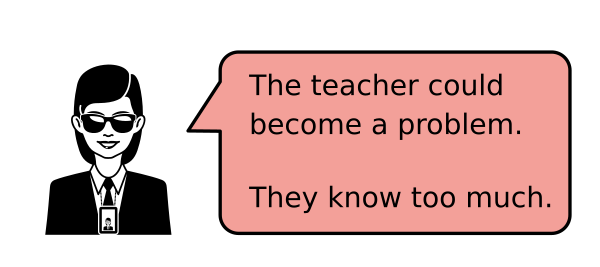
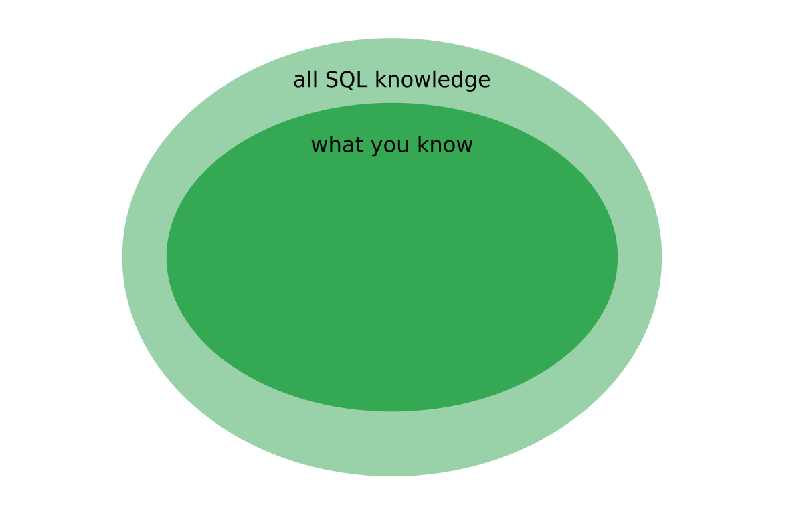
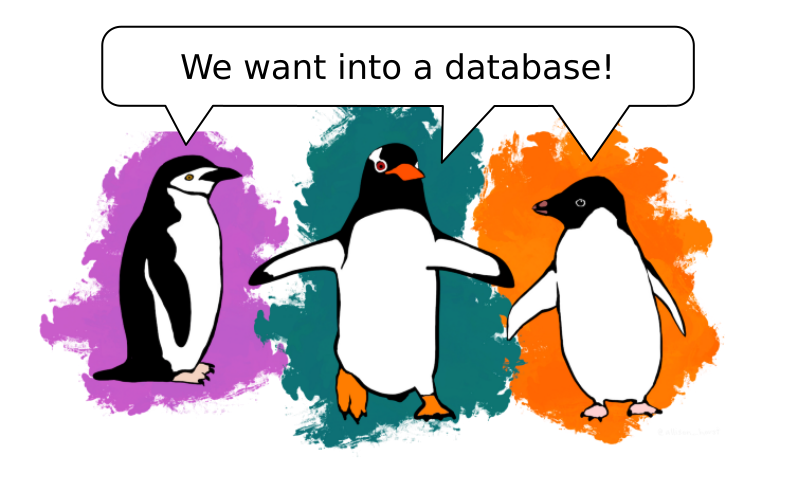
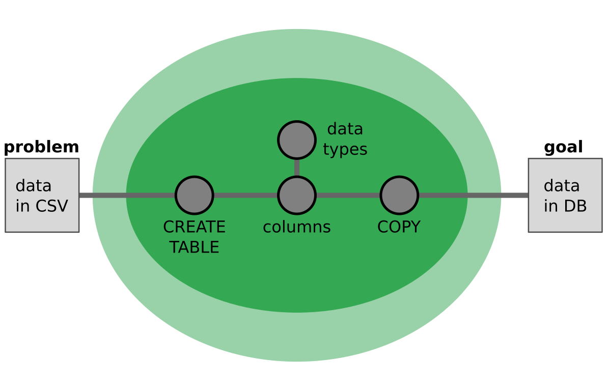
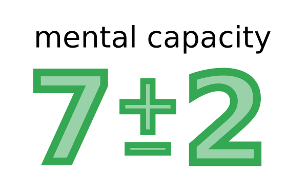
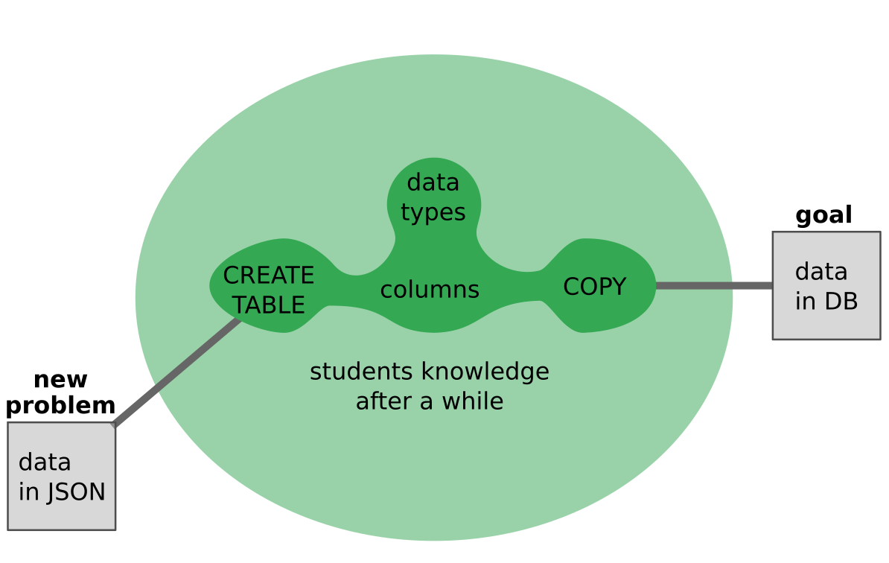
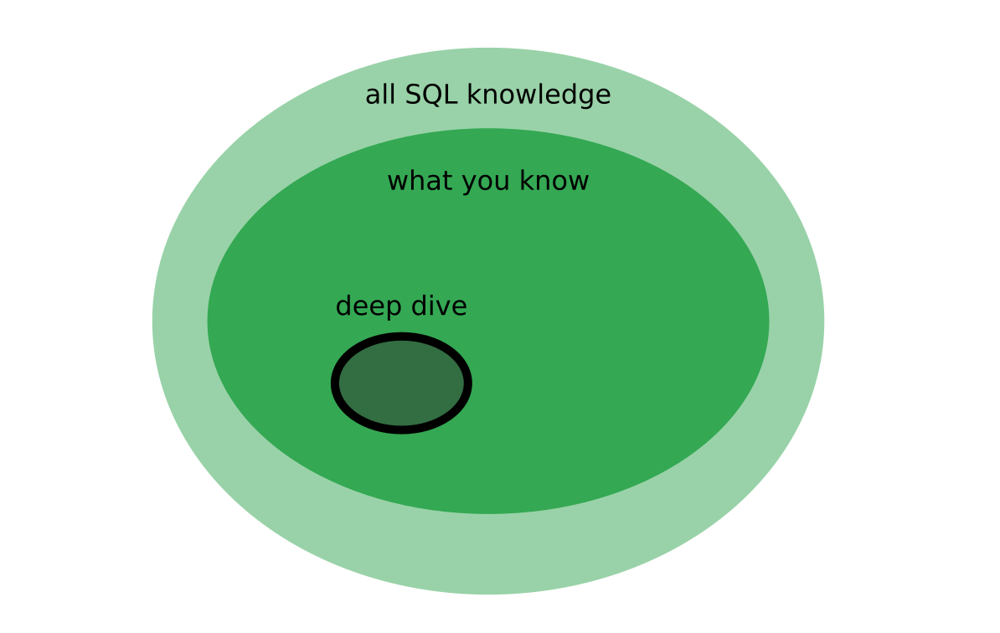

# Decide what to teach

## The Problem

Suppose you want to prepare a 3 hour masterclass about SQL:

As an expert, you know much more than you can fit in one lesson.
This sometimes gets in the way of good teaching:

Of course, whatever you know is only a small subset of all the knowledge that exists on any given subject:

Still, it is very tempting to try and cover a little bit of everything.
Trying to cover everything is probably among the worst things that you can do in an online setting. 
Cramming in a lot of content leaves little room for engaging the students.
At the same time the things you cover will still be somewhat superficial.

So how can you decide what to include in your lesson and what to leave away?

----

## The Solution

### 1. Find an interesting problem

The key to both *engage your students* and *select the right content* is to find an interesting problem.
For instance, to motivate the use of `CREATE TABLE` in SQL, an according problem would be:

    load a CSV file with penguins into a databse

Here, the penguin dataset makes the problem real enough to motivate students (in the unlikely case that you do not like penguins, use something you care about):

*Palmerpenguins Artwork by @allison_horst*

Choose the problem in such a way that you need your lessons topic to get from the problem to the solution:

Now all you need to do is to teach everything that is needed to connect the problem to the goal – and nothing else.

### 2. Identify Stepping Stones

The blob of knowledge between the problem and the goal is still too big to jump in a single leap.
Your job is to structure the knowledge space by placing key concepts there as stepping stones.
These may include some items that are not strictly on the linear path:

The number of stepping stones is crucial.
Literature says that our conscious brain has a maximum capacity of 7 plus/minus 2 items it can handle simultaneously:

However, in my experience this number is lower in online teaching.
At least one of the slots is occupied by the communication technology, another might be taken by all sorts of distractions.
If you want to be on the safe side, select **5 plus/minus 2** concepts and structure your lesson around them.

### 3. Leave away everything else

At this point, the expert mind usually starts screaming:

    "But you cannot leave away X!"

Imagine you have found an interesting problem, have data and could imagine that your lesson on `CREATE TABLE` will work.
However it does not require using a `PRIMARY KEY`.

Everybody who knows a little bit of SQL will agree that `PRIMARY KEY` constraints are super important.
Nevertheless, if the concept does not fit the problem or would violate the 5+-2 rule, leave it out.
This is always a bit scary for the teacher.
But it will make your lessons much more focused.

Why does this work? How will your students learn about the `PRIMARY KEY` then?
First of all, you are removing primary keys from a lesson, not from the students learning.
You are just postponing the concept a bit on the learning path.
Second, intelligent people (that includes all your students) are very good at connecting dots and filling in blanks.
Starting from the nodes you create during your lesson, their knowledge will start to grow organically in all directions:

After a while, they will come across the `PRIMARY KEY` by themselves.
A first sign that this is happening is when someone is asking questions about a concept you left out.

I have sometimes deliberately left out important concepts to make my students think and talk.
If your students think and talk, your job as a teacher is already half done.

### 4. Deep Dive Lessons

Another great thing about our brain is that it can do **chunking**.
Chunking bundles together concepts that belong together, so that they can be processed with little conscious overhead.

In practice this means that you can apply the 5 plus/minus 2 rule recursively: You could zoom into the **data types** node and cover 3-7 different data types (and leave away the rest).
You can zoom in during a lesson into a few nodes of your knowledge graph.
Mind-Mapping tools are great to visualize this kind of structure.

You could also dedicate an entire lesson on a deep dive on one of your concepts:

The key learning from this article is that you should only do a deep dive after your students have worked with the overarching structure – so that they can relate the details to practical problems they have already solved.