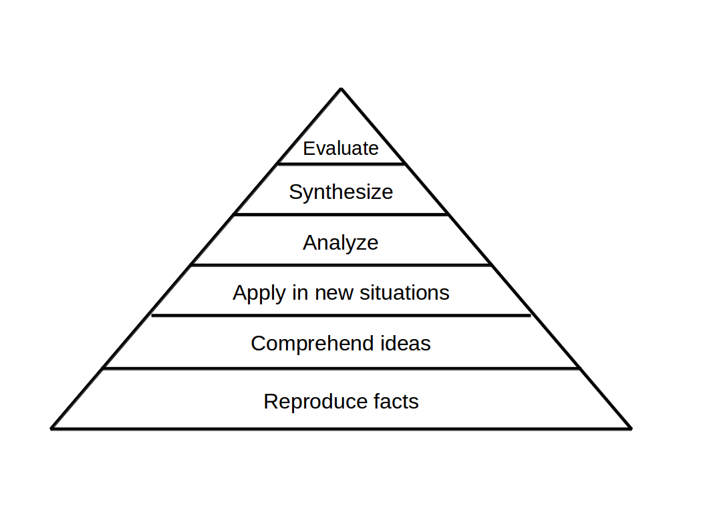

# Learning Goals

**Learning goals are the Unit Tests of your lesson**

## What are Learning Goals?

### What Lerning Goals are not

Often you start planning with a **syllabus**, which is simply a list of topics. For instance, your syllabus could contain the topic

    :::text
    for loops

This is not a learning goal. At best it is a topic for your lesson.

You could formulate this topic as an ideal final state:

    :::text
    The participants understand for loops

However, this is not very useful as a goal.
We cannot look into a students head, and even if we have an impression, it is highly subjective.
The goal is very easy to bend into all directions.
It leaves the student at the mercy of your interpretation.

It is not *specific*, it is not *testable* and is *hard to communicate.*
Essentially, it is a wordy version of the topic from the syllabus.

### How does a testable Learning Goal look like?

Let's make the learning goal **testable**:

    :::text
    participants use a for loop to draw multiple squares

This goal is specific enough that you can test it *informally*: If you come by a participants computer, you see whether there are multiple squares on the screen or not.
This way, you have a simple way to unit-test your lesson: if the participants reach the goal, the lesson has worked.

But it gets even better: a good learning goal is specific enough that participants can self-assess.
They could get the information:

    :::text
    The goal of todays lesson is to draw multiple squares with a for loop.

Knowing the goal gives them the chance to reach it *by themselves* and go home with the feeling of accomplishment.
Also, if students can self-check, you have more time to help people.

A single, well-crafted learning goal may power an entire lesson.

----

## Adjusting Difficulty

A great thing about testable learning goals is that the same goal works for participants with varying skill levels.

First, you can create tasks using

| difficulty | example |
|------------|---------|
| easy       | write a for loop that calls the `draw_square()` function 3 times. |
| medium     | write a for loop that draws 10 squares in random positions. |
| hard       | write two nested for loops creating a matrix of sqares |

Second, you can provide more or fewer hints:

| difficulty | example |
|------------|---------|
| easy       | Complete the gaps in the code example using the given words. |
| medium     | Sort the lines of the code example. |
| hard       | Research how to write the for loop and write it from scratch. |

Whatever you do, you may find that the same concepts or material will work for multiple audiences and heterogenous groups.

----

## Blooms Taxonomy

**Blooms Taxonomy** is a textbook technique on learning goals. Blooms Taxonomy categorizes learning goals into a hierarchy according to the *activities* participants perform. These activities range from basic to more complex activities over six levels:

Applied to the `for` loop lesson, we can formulate three goals:

### Reproduce (levels 1+2)

Participants repeat something they have seen before, e.g.:

    :::text
    participants explain a for loop drawing a row of square

The majority of your goals should be on that level.

### Apply (levels 3+4)

Participants apply a skill or model to a new situation:

    :::text
    participants write a for loop creating squares with a range of colors.

### Evaluate (levels 5+6)

Participants evaluate information in the context of a topic:

    :::text
    participants discuss advantages of for and while loops

A balanced lesson should contain a lot of learning goals **reproducing** knowledge, less for **applying**, and few for evaluating. When setting learning goals, Blooms Taxonomy helps you to choose a well-balanced mixture of activities.

The table below contains keyword you can use to generate ideas for goals on different levels:

| 1. knowledge | 2. comprehension | 3. application  | 4. analysis    | 5. synthesis | 6. evaluate  |
|--------------|------------------|-----------------|----------------|--------------|--------------|
| define    | describe      | implement    | debug          | compose   | advocate  |
| identify  | explain       | execute      | compare        | design    | defend    |
| enumerate | draw          | calculate    | differentiate  | plan      | recommend |
| name      | illustrate    | estimate     | examine        | refactor  | judge     |
| review    | classify      | measure      | investigate    | organize  | assess    |
| recognize | summarize     | demonstrate  | test           | discuss   | suggest   |

----

## Learning Goals to train Competencies

If you design a longer course, it is worth thinking of learning goals in a broader perspective.
One dimension are the *competencies* that you are training:

| competency | example |
|------------|---------|
| writing code | participants write a for loop drawing geometrical shapes |
| debugging | participants debug a program with a for loop |
| planning | participants draw a flow chart for a for loop |
| communication | participants discuss when for loops are useful |
| teamwork | participants review each others loops |

You could combine the three types of goals (Bloom levels, difficulty, competency). That way you end up with `6 * 3 * 5 = 90` possible goals arranged in a 3D matrix. Practically, it does not make any sense to write down the entire matrix or even trying to fully cover it in your lessons. But thinking of teaching goals as a 3D matrix helps to select diverse goals for your course.

----

## Practical Questions

### How many goals should one lesson (45-90 min) have?

One.

### How about an entire training day?

A full one-day training fits 3-5 goals.

If the day includes an intense planning / evaluation session, these can have their own goals.

However, if your day involves an intense period where participants work mostly by themselves you may want to give them many micro-goals that guide them through the process (here Blooms Taxonomy is most helpful).

### Should you communicate goals to the students?

Yes. One at a time. At the start of the lesson.

### Can the goal be part of a longer exercise that students do on their own?

Yes.

### Can the teacher give the solution to the students so that they reach the goal?

Yes, but it's not great.

### Should you have a goal for every lesson?

Setting Learning Goals as the very first thing when preparing a new topic is difficult. Many times, your goal will be *"survive the lesson"* rather than the detailed goals above. It is OK to start with a goal that is not immediately tested. If your goal is *"participants can implement for loops"*, and you do an exercise or recap session involving a loop, you will quickly observe how much they really understood.

When you feel more secure, e.g. after having taught a topic once or twice, you can formulate specific goals.

### What is this "Unit Test" idea?

Well-written goals have similarity with Unit Tests used to test programs.
Ideally, you notice when your lesson fails a test, and usually your participants need to be less active for you to get the feedback – you already know what to check.

----

## Summary

Writing specific, testable goals

* it is easy to communicate to participants what they are expected to do
* it can be checked easily; you will see whether your participants achieve that goal or not
* participants can self-check
* it gives you a specific guideline how to develop your lesson (draw stuff)
* it can still be adjusted in difficulty; you can provide beginners with detailed instructions, advanced participants may figure out by themselves

----

## References

* Bloom, Taxonomy of Educational Objectives Handbook (1956) and LeBrun and Johnstone (1994:162).
