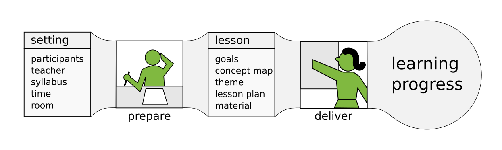

# How to teach programming?

In this chapter, we will look at teaching as a two-step process.
First, you prepare a lesson – you compile it. Second, you deliver it in the classroom – you execute it:

* Step 1: Prepare a lesson (compile)
* Step 2: Deliver the lesson (execute)

The first part of this book focuses on preparation, the rest on delivery.

We can formalize this compilation-execution process more: During **lesson preparation**, you consider the **setting** in which your lesson takes place and compile a **lesson** from it. This **lesson** is then executed during **lesson delivery**, and produces an output of its own.

To describe our teaching process more accurately, we need to find out what the **input of the preparation**, the compiled **lesson** and the **output of a lesson** consist of. In this chapter, you find a list of parts.

## The setting of your lesson

First, let us look at the input of our teaching process: the setting in which your course takes place. Much like source code, it determines a lot that happens in class. Most of the time you cannot influence it.

### Participants
Your **participants** (students, learners or however you want to call them) are the main ingredient of any teaching. Everything else (including yourself) is dispensable, but without participants, there is no learning. In chapter **Facilitating your group** you will learn how to handle these important people.  

### Teacher
You (or whoever will deliver the lesson) have something to say as well. What works for one teacher does not work for the other. If there are multiple teachers or you don't even know who will execute your lesson, the outcome will change again. This entire book is there to help you.

### Syllabus
Sometimes you get a list of topics you are expected to cover. However, usually nobody tells you how much of each topic to cover toA syllabus is raw material that requires work before lessons emerge from it. Often you may modify your syllabus or write it from scratch, which is a good first step before you start with the real preparation. You find more about how to use a syllabus in the chapters **Goals** and **Concept Maps**.

### Time
Time determines what you can do in a lesson and what you cannot. How long is your lesson? At what time of day does it take place? Are your lessons taking place in regular intervals or day after day? We will discuss time in chapter **Preparing Lessons**.

### Room
The location at which you teach and the room layout has a strong influence on the resulting lesson. Tables and laptops act as communication barriers that provide psychological safety but also make it more difficult to establish a dialogue.

What is the room layout? What equipment do participants have? What media do you have to visualize things in class? For a list of aspects to think about, see the chapter **Checklists**.

At least a few of these input parameters will change every time. It follows that you can rarely copy a previous lesson, but have to recompile it at least partially.

## What does a lesson consist of?

Many novice teachers assume that a lesson consists of everything that participants *see* during its delivery. This assumption is incomplete, like a program is more than what you see on the screen. The parts of a well-prepared lesson are:

### Learning goals
**Learning goals** formalize what you want to achieve. They give your entire lesson a clear direction. Ideally, they allow you to check whether your lesson has worked and your participants to assess what they have learned. In that sense, learning goals are the *Unit Tests* of your lesson. In chapter **Learning Goals** we look at goals more closely.

### Concept Map
A **Concept Map** is a structured visualization of a small number of key concepts. You can think of it of a highly reduced version of everything your participants need to know. In chapter **Concept Maps** you learn how to develop Concept Maps and how to use them.

### Theme
A theme wraps your entire lesson with one concrete story or problem question. A well-chosen theme that participants can relate to motivates everybody and makes your content generally easier to digest.
A them could contain of *data*, *a problem question* and some *eye candy*. The idea of themes will be explored in chapter **Projects**.

### Lesson plan
A big helper is to write a **lesson plan**, a table describing what will happen during your lesson. A lesson plan also states which **teaching methods** to use. The lesson plan helps you to balance, time and evaluate your lesson. In chapter **Lesson Planning** you will learn more.

### Material
The last thing to prepare is what participants actually see: exercises, code examples, data files, lecture material. What material you need depends on the methods you choose. You will find plenty of methods described in all other parts of the book.

## Output: Learning progress
The output of your lesson consists of several things as well:

* knowledge gained by your participants
* knowledge gained by you
* artifacts: programs, diagrams, tables, posters
* feedback

The sum of these becomes the input of your next lesson.

## Remarks

Over a longer course, our initial two-step process becomes a cycle: You prepare, you deliver and repeat.

I do not use all parts of this process for every lesson. Even a lesson compiled with 2 or 3 of the above components can work very reliably. Sometimes I set decide on the theme or goals in my head without writing them down explicitly. But if you are starting to teach or want to do a very thorough job, creating all aspects completely is a good idea.

An accurately prepared lesson is reusable in many ways. It is much easier to modify one component and recompile the lesson to another situation (more/less time, bigger/smaller/more experienced group).
