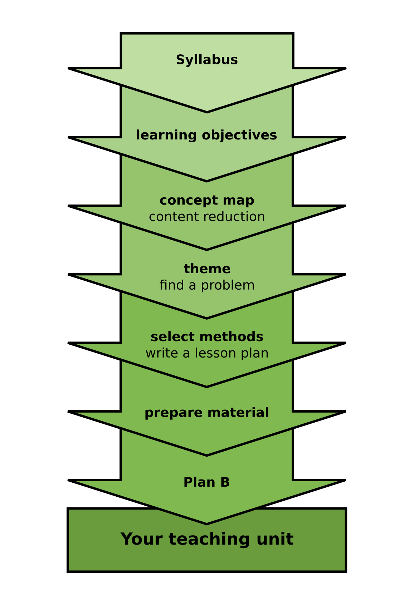

# Lesson Plans

A general recipe for preparing lectures, seminars, and practical training:

1. Set a learning goal.
2. Visualize your structure as a concept map
3. Write a lesson plan
4. Reserve time for warming up.
5. Include an exercise where students participate actively.
6. Reserve time for repeating.
7. Have a plan B.

## Writing a lesson plan

It is useful to prepare a **lesson plan**, a table listing the topics for a lesson, the methods you are going to use and the time you plan for this.

When you are new to teaching, your time estimates will be plain wrong. Be ready to recognize the moment at which to trash your lesson plan and improvise.

## Construct well-balanced Teaching Units

What is the optimal method for experimental research? Obviously, the answer depends on the subject and on the research hypothesis pursued by your research group. In teaching and training it is the same: Many factors determine how the optimal teaching unit should be structured, such as:

* the subject
* the learning objective
* the group size and their background
* the training room and available equipment
* the time frame
* and of course your personal style as a teacher.

Therefore there is no single best approach, but literally hundreds. The overall setting determines which teaching methods will work best in practice. But how can you systematically construct a teaching unit then?

## Training methods

How to build a training session using some of the methods above? For sure, you cannot just throw a few training methods together randomly. Is there an ideal arrangement for a particular subject. Unfortunately there is not.

You cannot simply copy the plan from one training to another. Here is why:

* No two training objectives are the same. Your field evolves, and so do training contents.
* No two trainees are the same. Some know exactly what they want, others want to be entertained.
* No two groups are the same. Groups can be homogeneous, heterogeneous, lively, silent etc.
* No two training rooms are the same. Moving a single piece of furniture can influence the training climate considerably.
* No two trainers are the same. All of you have their individual preferences.

This is why every lesson is a unique performance. Of course, a well-crafted lesson plan helps, and many things are reproducible. But be ready to improvise.

Each training is a new invention! This is what makes training so rewarding.

Repeating key concepts in increasing intervals is crucial for learning success (the scientific term for this is *"spaced repetition"*). Thus, repeating is an essential teaching activity that should not be skipped. However, repeating may be difficult to prepare, because you and your participants may be tired at the end of a day/lesson, and repeating easily falls victim to any changes to your plan. Even if everything goes well, your participants may be very eager to code to the very last minute, and interrupting them would be a pity. General strategies to deal with repeating are:

* Point students to material for self-study – works, because most online training resources do a decent job at repeating.
* Start the next lesson with it – the repetition serves as a warm-up activity
* Keep it short – one well-planned activity at the end of a lesson may prompt
