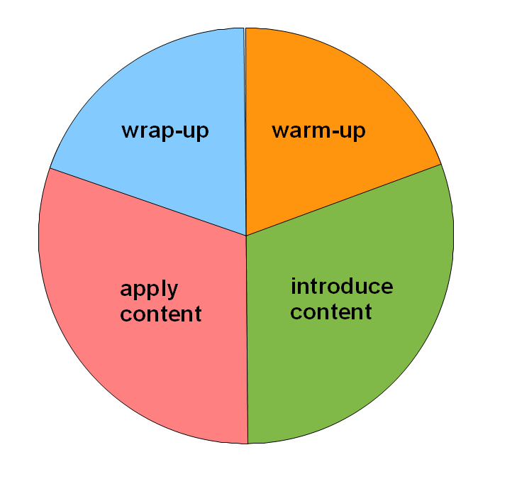

# The Structure of a Lesson

How does a **lesson** differ from a **presentation**? While your students passively consume content in a presentation, a lesson has interactive components.
But where should you put the interactive parts and how much of them?
In this chapter, I would like to suggest a model for building well-balanced lessons from 45 minutes to full days.
Such a well-balanced lesson consists of four phases: **warm-up, introduce content, apply content,** and **wrap-up**.

Let's look at the four phases in detail:

### 1. Warm-up

In the warm-up phase, you invite students into your class.
You motivate them to learn new things and encourage them to think actively.
Warming up is very important in a programming course, because it protects your participants from frustration.
The warm-up part should leave your students curious or already with a feeling of achievement.
Warming up should be short. For a lesson up to 90 minutes, move on after 10-20 minutes. In a one-day training the warm-up might last up to an hour.

There are many things you can do to motivate and activate students in the warm-up part:

* say hello. Imagine a lesson without, I was told it is very awkward
* introduce each other
* give an overview what the lesson is about
* elicit expectations from the group
* **prime** the class for a new topic. I believe this is the most important warm-up function
* ask quiz questions from a previous lesson
* do an easy coding exercise everybody can complete

In the following chapters, you find lots of warm-up methods.

### 2. Introduce content

Once the class is warmed up, you can deliver something new to them. 
New content is usually difficult. It is best delivered in bite-sized chunks.
Your most important job in this phase is not to convey as many facts as possible, but provide a structure to your subject.
Students will use this structure to organize new information on their own.

So, you would typically introduce a limited number of around 7 new concepts. 
Ideally, you have a good visual, a concept map where all the new concepts are shown.
Then, you still have room for detail.

It is by no means said that you have to introduce the new content by saying everything.
Your students might also discover new content during coding exercises or research.
As long as you guide them in the process so that they *"look in the right direction"*.

In the following chapters, you find several approaches for introducing content described in more detail.

### 3. Apply content

The real game changer in a successful lesson is that your students apply their new knowledge actively. They need to **do** something.
Your students need to experience that their knowledge is useful for something, otherwise their adult brains tend to classify the knowledge as 'irrelevant' and kick it out the next night.
In many subjects (lets say surgery or particle physics) it is difficult to come up with useful things a student can do.
Fortunately, when you teaching programming, there is an obvious way to apply content: **writing programs.**

There are many types of activities your students can do:

* write new programs
* analyze programs you give them (measure performance, compare two, draw a structure etc.)
* fix buggy code
* look up new commands and try them out
* work on a project

In any case, the task should require using the concepts you just introduced.
The application phase should be the *longest* part of your lesson.

### 4. Wrap-up

When your lesson approaches the end, you should reserve some time to close things off. The wrap-up section is an opportunity to make sure the content sticks and reflect on the lesson as a whole. There are several things that you can do in the wrap-up phase:

* **Answer open questions.** Depending on how things went in the application part, you might give hints on difficult parts, clarify concepts and give hints where to learn more.
* **Practical Transfer.** Your participants may need to connect the content of the lesson to real-world applications that are relevant for them. This part may require a lot of room when working with developers actively involved in projects.
* **Repeat.** Repeating content is essential to ensure successful learning. You might go through and example solution or conduct a repetition activity or quiz. If you run out of time, a brief summary of the take home message is the bare minimum.
* **Feedback.** You may want to leave room that gives you actionable information that helps you prepare the next lesson or improve in general. Feedback also helps your students to close off the lesson emotionally and free their brains for the next lesson
* **Say goodbye**, of course.

## Conclusions

The four basic phases of a teaching unit provide you with a scaffolding that give you a safe structure to construct quality teaching units
In the figure you can see that the warm-up and wrap-up parts are generally shorter than the other two (usually 10-20% each). 
The model in the figure is circular.
The end of one lesson feeds into the beginning of the next.
For instance, it is often a good idea to start the next lesson with a warm-up activity that repeats content introduced in the last one.

A single cycle should last at least 45'.
You can cycle over it several times during a day (in my experience up to four times).
But with very intense work phases, reserving half a day or a full day also works fine.

The four phase model gives you a lot of freedom how to deliver each of the phases.
At the same time, the model helps you to keep the overall learning process balanced.
