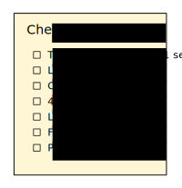

# Preparing Lessons

Many novice teachers assume that preparing a lesson is equivalent to preparing the *content* that participants *see* during its delivery.
This assumption is at best incomplete.
Likewise, a program is much more than what users see on the screen.

In this chapter, we take a look at the parts of a lesson you need to think about.
You find them in this checklist:

I have to admit that I do not use this checklist every time I prepare teaching.
But I use it whenever things get difficult.
It does a great job in preventing failure.

Let's go through the seven points one by one:

### Take Home Message

Summarize your lesson in one (short) sentence. This is a good way to find out what you are really teaching, and what it is useful for. You might use that sentence in class (even multiple times, to hammer it in).

If you find that you need two sentences to describe your lesson, you are probably really delivering two separate lessons. In this case, you should say that clearly (and take a break between them).

### Learning Goal

**Learning goals** formalize what you want to achieve. They give your entire lesson a clear direction. Ideally, they allow you to check whether your lesson has worked and your participants to self-assess their progress. In that sense learning goals are the *Unit Tests* of your lesson. In chapter **Learning Goals** we look at goals more closely.

### Concept Map

A **Concept Map** is a structured visualization of a small number of key concepts. You can think of it of a highly reduced version of everything your participants need to know. In chapter **Concept Maps** you learn how to develop Concept Maps and how to use them.

### 4-7 Key Points

A frequent mistake is to teach too many things at a time. Usually, **less is more**. Limit your content to 4-7 new things you would like to get across. Write them down. Kick out everything that distracts from these 4-7 points.

### Lesson Plan

A big helper is to write a **lesson plan**, a table describing what will happen during your lesson. A lesson plan also states which **teaching methods** to use. The lesson plan helps you to balance, time and evaluate your lesson. In chapter **Lesson Planning** you will learn more.

As a rule of thumb, a single lesson should not be longer than 45' minutes if you are talking most of the time. If there is a larger activity, 90' are the limit. After that, your participants (and you) will need a break.

### Theme

A theme wraps your entire lesson with one concrete story or problem question – ideally one that is practically relevant. A well-chosen theme motivates your participants and makes your content easier to digest.
A theme could consist of *data*, *a problem question* and some *eye candy*. The idea of themes will be explored in chapter **Projects**.

### Plan your Opening

What will be the first thing you do in class? What are you going to say? Do you start with an activity, a visualisation or a speech?

Planning the opening of your lesson helps a lot to be less nervous. In the chapter *The First Minute* you find methods to start your lesson.

### Material

The last thing to prepare is what participants actually see: exercises, code examples, data files, lecture material. What material you need depends on the methods you choose. You will find plenty of methods described in all other parts of the book.

----

## Concluding Remarks

I do not use all parts from this list for every lesson.
Even a lesson prepared with 2 or 3 of the above components can work very reliably.
Sometimes I decide on the theme or goals in my head without writing them down explicitly.
But if you are starting to teach or want to do a very thorough job, creating all aspects completely is a good idea.

An accurately prepared lesson is reusable in many ways.
It is much easier to modify one component and recompile the lesson to another situation (more/less time, bigger/smaller/more experienced group).
