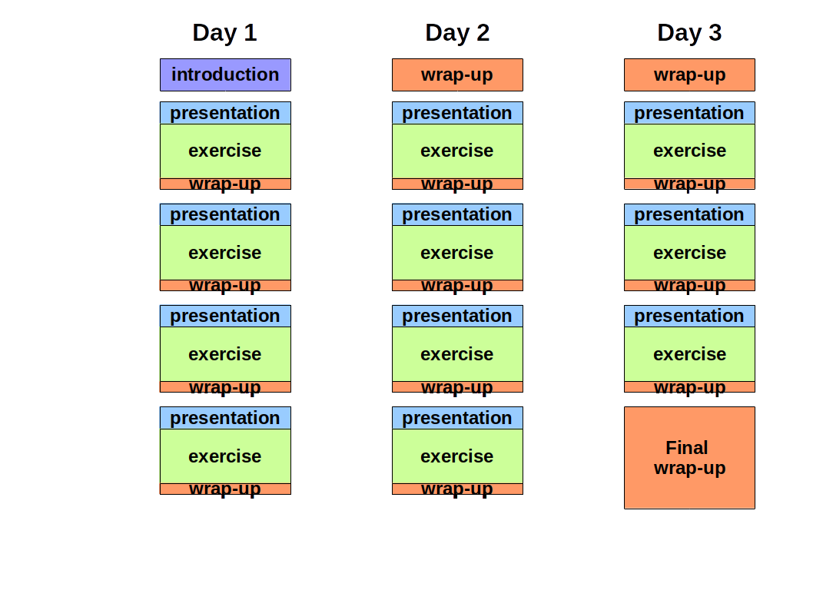

# A Recipe for Bioinformatics Training Course Design

**Pedro Fernandes**

This "recipe" is a method for generating a training course skeleton. The goal is to provide a stepwise roadmap for trainers and organisers that have materials like slides and exercises, but need to go one step further, in order to create a training instance that is structured, balanced in timing, coherent and “measurable”.

## Definitions
A  **training course** is aimed at participants  and is delivered by instructors. A third role (the coordination) is taken by the organiser. Such a  training course is a way to provide a large amount of skills, in a defined conceptual framework, in a short period of time.  The course plan will include a timetable divided in sessions. A successful training course delivers skills that participants can use with a high degree of independence.

## Model
The model course that emerges from the recipe matches the typical needs of a three day face-to-face training course. A suitable training room is assumed to be in place, where participants can work in small groups (2 to 4 people each) Naturally, some major adaptations may be needed if one departs from this assumption, but that may very well be the theme for another newsletter article. Minor adaptations are always needed in the field, so the plan must be built with minimum provision for that to happen.

## Recipe
Define an an **overall objective**, linked to your conception of what set of skills the training course will provide. Be prepared to revise it at the end of this exercise if needed. As you do not know the audience, this definition cannot be tailored in an a-prioristic way. Start from what you imagine could be the audience and establish what the most likely knowledge gap is. Then, establish what training levels are required, often a blend of of them.

## Opening session
The first 30-60 minutes of any course should be spent familiarizing people with each other, breaking the ice, defining ways of working in a team and creating a nice environment for learning together, getting accustomed to the environment, establishing the ground rules as if you were entering a ship or aircraft. Take the chance to explicitly say hat is allowed and what is disallowed, at the necessary level of detail. The beginning is the most suitable to create a teamwork atmosphere, in which every participant, instructor and organiser establish that a common goal is at stake and that reaching it is a mission for all, in a single team.

## Sessions
The training course will consist of several **sessions**, composed of a presentation an practical exercise and an optional focused wrap-up. 

Make a list of the exercises that you need for the course. Sort this list in a logical way, and divide it in blocks that can contain one or two exercises. Each block is now the seed for a session in the course. 

For each block:

* Write a learning objective that reflects the reason why you chose the exercise (solving a problem using a technique or something simlar). Use SMART rules to refine the learning objectives. 
* Prepare a short presentation, using materials from your pool and borrowed ones, aiming at establishing a conceptual framework where the problem fits, nothing else!. Avoid details, go directly to the point. A possible structure for a presentation is: subject introduction / explore the subject / show an example / show limitations. 
* Consider adding an optional short wrap-up to consolidate the new knowledge.
* Repeat

## Review

Aggregate short blocks if needed. Now you have sessions, with one or more blocks each. Attribute sessions to slots in the timetable (Figure 1). Partition through the three days, so that the second an third days begin with a wrap-up of the previous day (typically less than 30' ). 

There must be a final wrap-up  (maybe 1h) at the end of the course. Make a slot in the timetable for it and be prepared to take notes, as some important verbal feedback is very likely to happen at that moment. A course feedback questionnaire should have been filled and collected before the final wrap-up.

Pedro Fernandes is coordinating the Gulbenkian Training Programme in Bioinformatics. See [gtpb.igc.gulbenkian.pt](gtpb.igc.gulbenkian.pt)
