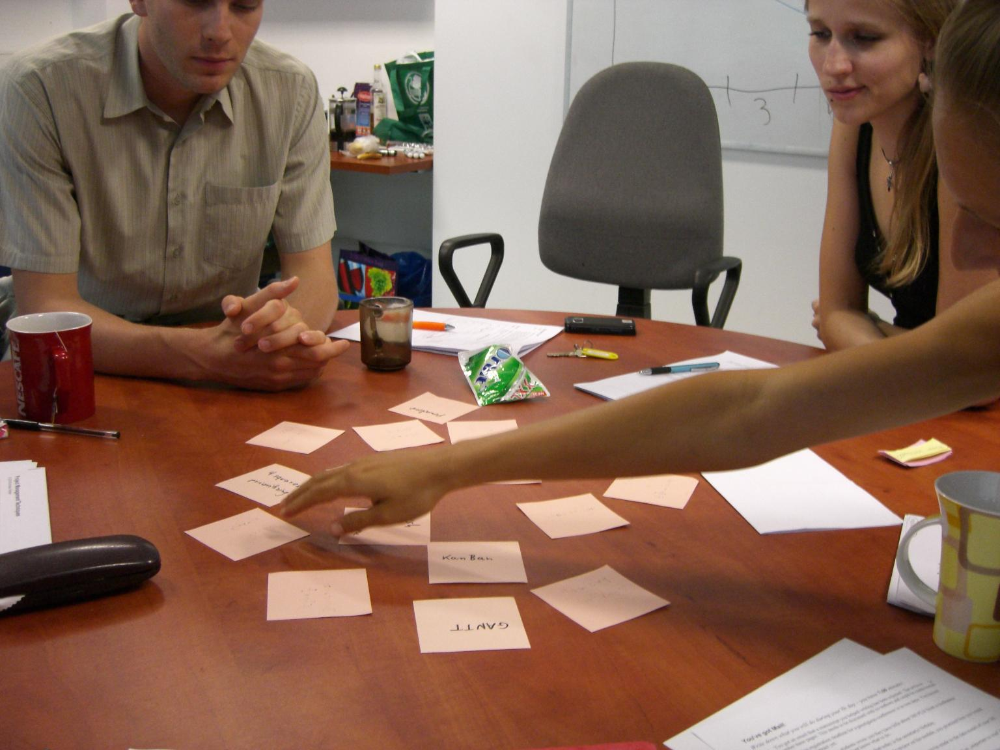

# Memory

**Run through some topics with an entire group.**

### Time in class
10'

### Preparation time
5'

### Group size
2-15

### What you need
small paper cards

### How it is done

Write 10-15 concepts on cards. Place the cards upside-down on a table/whiteboard. Trainees take turns in uncovering a card and explain whatever is written there. This way, you can either *repeat* content, or collect existing knowledge. In any case, do not comment on the answers.

### Comments

I have used Memory for repeating content at the beginning and end of a lesson. At the beginning, it makes a great warm-up exercise. The memory cards are easy to prepare on-the-fly, so that you can repeat what was done during a workshop at the end of the day.

The main advantage of Memory is that everybody gets to participate. Sometimes, participants feel encouraged to help each other, in which case you can lean back and watch comfortably.
