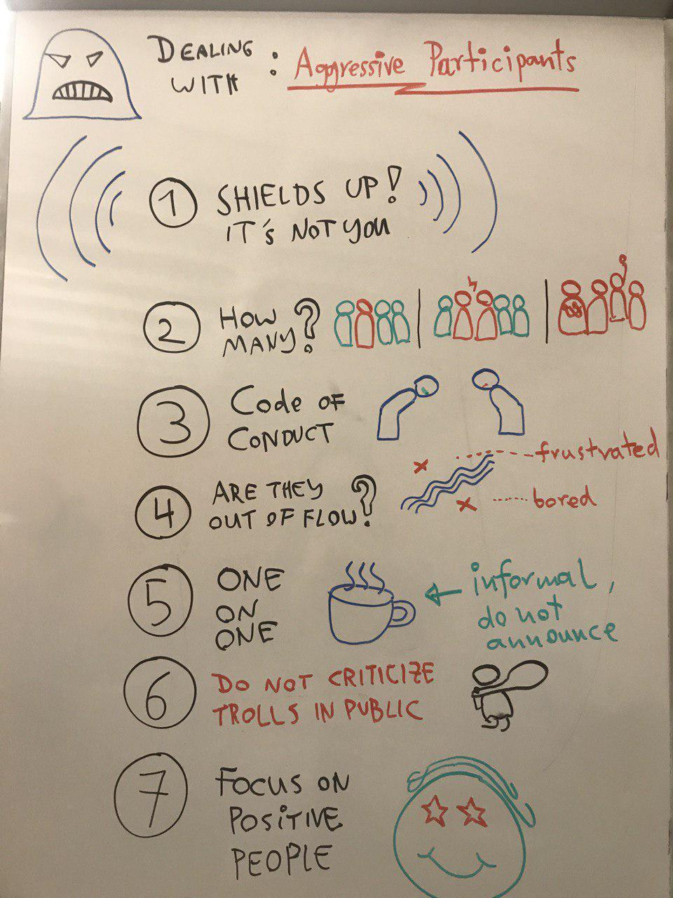

# How to handle aggressive participants?

## How to deal with conflicts inside the group

* round where everybody says something
* establish ground rules, e.g.:
* do not interrupt others
* listen
* **NO justifications**
* everybody is heard
* everybody tells things from their own perspective ("in my opinion..")
* limit speaking time
* summarize pros and cons, propose solutions

## How to deal with aggressive/annoying participants

* "Shields up", it is nothing personal. It has nothing to do with you
* do you have a Code of Conduct?
* do the students know the CoC?
* is it a single person or a few or are they representing a majority?
* are the students bored or overwhelmed?
* redirect statements to the group (*"do you share that point of view?"*)
* talk to them one-on-one informally (but do not announce it)
* **DO NOT** criticize them in public
* if it is bad: schedule an extra session to resolve conflicts
* focus on the positive people

## How to deal with verbal attacks directed at you

* *"Shields up"*, it is nothing personal, let the attack pass
* redirect criticism to the group (*"do you share that concern?")
* focus on positive people, look at them!
* stick to your structure
* understand the critic
* talk to them one-on-one (but do not announce it)
