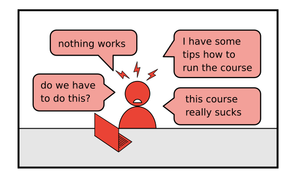
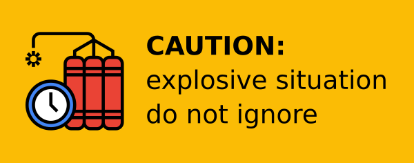
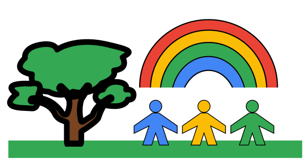
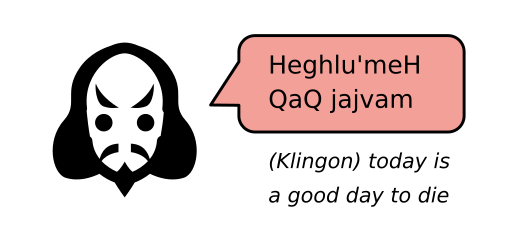
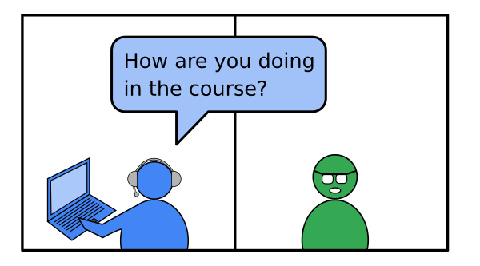
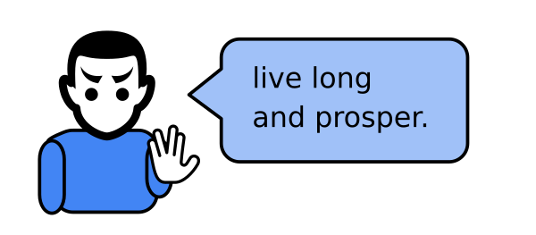

# How to react if students show disruptive behavior?

OR

**The Starfleet Guide for handling aggressive lifeforms**

## The Problem

One or more students openly behave in a way that makes your work as a teacher difficult.
Disruptive behavior can take many forms, including but not limited to:

This can really ruin your day and take all the fun out of teaching.
It can also ruin the course for the other students.
When you observe disruptive behavior, you need to act.

What should you do?

----

## Solution

### 1. Shields Up!

Put yourself into a *"safe mode"* where you consciously deal with the exceptional situation:

Tell yourself something like:

    :::text
    This is an exceptional situation.
    I am in the shields up mode.
    This is nothing personal.

The primary purpose of the *"safe mode"* is your own mental protection.
Only if you are calm with yourself you can start thinking about defusing the situation and helping others.

### 2. Remember the Prime Directive

When you observe disruptive behavior, it is very easy and tempting to blame someone else for the situation.
But blaming anyone is not constructive and most of the time does not give you any useful results either.
It is good to remember the **Retrospective Prime Directive**:

    :::text
    Regardless of what we discover, we understand and truly believe
    that everyone did the best job they could, given what they knew
    at the time, their skills and abilities, the resources available,
    and the situation at hand.
    
        — Norm Kerth

That means, unless you learn otherwise, you assume that the student did not disrupt anything on purpose.
Outside zoom, the same students are often perfectly peaceful and harmonic beings.
I once observed a super nervous and somewhat difficult group in online course.
Later I met them at a picnic and they were like best friends:

Often disruptive behavior results from language and cultural differences.
Maybe they have a strange way of saying *"Hello"*:

So if this is the case you have a good chance to defuse the situation by making everybody aware of the situation.

### 3. Have a Code of Conduct

Ideally, students sign a Code of Conduct when they start the course
The purpose of the CoC is that you can remind them of their own commitment.
And if things go really, really bad, you can use it to justify decisions.
The main purpose of a CoC is to demonstrate that you care about constructive harrassment-free zone and that people can be held accountable.

Check out the [Berlin Code of Conduct](https://berlincodeofconduct.org/) for an example.

### 4. Find out what is going on

The first step to improve the situation is to have friendly conversation with the student who is showing the disruptive behavior.
You may want to ask them how they are doing in the course.
Then describe what you observed.
Noticing that you care about their success in the course, half of the students will cooperate immediately.

 
However, this is not the easiest conversation to have.
You may want to escalate to the next stage right away.

### 5. Have a path of escalation

In difficult cases, or repeated disruption from the same person(s), you will need to escalate.
You need to know who to escalate to.
You need someone who can act as a counselor or facilitator.
Turn to a person who is emotionally not involved and can take over the conversation.

Involving someone else also helps if the entire group is on the edge or frustrated.
Letting off some steam in small portions can be done in a small feedback session.
But do not start a big discussion under any circumstances. It is likely to make matters worse.

If you face a situations where frustration and grudges build up over a couple of weeks, things are more difficult.
As someone teaching a masterclass of a few days, this should not be on your plate.

Fortunately, most disruptive behavior can be smoothed out with a friendly conversation and maybe a few apologies.

----

## Also see:

* [Paloma Oliveira – The code of conduct has been broken. Now what? on YouTube](https://www.youtube.com/watch?v=RBZrYMEJFXA)
