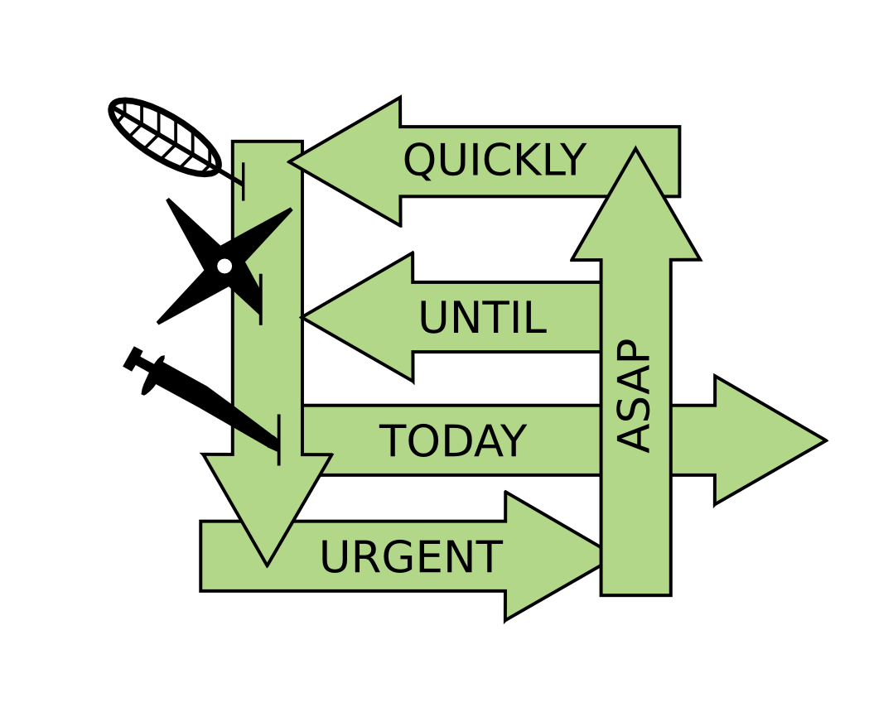

# How to teach with little time to prepare?

Having little time is a common situation that can be very scary for beginners.
Because you might read this while under time pressure, I will stick to simple, step-by-step recipes.

----

## If you have 5 minutes or less

Do not waste time. Stick to the following procedure:

1. Pick a task from the table below
2. Write the task on the board
3. Give them 20 minutes to work on the task
5. Pair up your students randomly
5. While they work, think what to do next
6. Discuss the results
7. Take a break

| task | description |
|------|-------------|
| read code | Go to the repository X. Read the code. Write down 10 questions. |
| code review | Give a piece of your code to your partner. Read code for 5 minutes. Ask each other questions. |
| coding challenge | Teacher picks a [Coding Challenge](https://www.academis.eu/python_basics). Students solve it. May take longer than 20 minutes. |

----

## If you have half an hour

Assuming you know the subject, do a barebones preparation. Take a piece of paper and follow the following procedure:

1. Write down the topic of the lesson
2. Write down a goal: *"After the lesson, students will be able to .."*
3. Write down a maximum of 7 concepts / sub-topics
4. Draw an image / diagram / mind map that helps you to explain the 7 concepts
5. Pick a warmup exercise for the first 5 minutes
6. Write down a small task where the students work towards the goal

During the lesson, do the warmup and then draw and explain the diagram, covering the 7 concepts one by one. With the tasks and questions afterwards, you should be able to fill 45 minutes.

----

## If you know the subject well

Run a live coding session, writing a program solving problem X from scratch. Examples of problems I have used with little preparation in the past are:

* Explore dataset X
* Extract information from website X
* Draw an image with the Pillow library
* Write a small text adventure
* Implement a graph traversal algorithm
* Train a machine learning model on dataset X
* Deploy a program on a server
* Clean up a piece of code

It is a good idea to pause often and make sure your participants can follow.
Ask questions how they would implement Y, or why line Z is implemented in a certain way.
You might encourage the participants to code along with you (if there is no difficult installation required).
Whenever you run into bugs ask the group to help you with debugging or looking up things.

Besides making a good lesson, all these questions also buy you more time.

----

## If you don't know the subject well

If you are not an expert, but have basic knowledge, follow the following procedure:

1. Write down the topic of the lesson
2. Write down a maximum of 4 sub-topics
3. When the lesson starts, prime the students on the topic (see below)
4. Ask students to research and present one sub-topic
5. Assign students to groups of 3-5 people (1 group per topic, 2 if necessary)
6. Let them research the topic for 30-60 minutes
7. Make sure they have a way to share their results (a channel to share code, paper for posters etc.)
8. Give every group time to present
9. Conduct a wrap-up session by collecting open questions on the board. Try to answer as many as possible.

| Method for priming | description |
|---------------------|-------------|
| video | short (<10') clip motivating the subject |
| story | tell a story from your own experience where the subject was relevant |
| chat  | write down an open question and ask students to talk 2' about it |
| upside-down | Ask the opposite e.g.: *"how to write a really slow program?"*. Collect answers. |

----

## If you know nothing

If you have no idea, use the following **six-step facilitation cycle**:

1. **Motivate the topic**: Let everybody (including yourself) chat **why** the topic might be important. Collect answers. Ask for previous experience.
2. **Collect questions**: Form groups of 3-4 (including yourself) and let them write down ideas **what** questions/aspects might be worth exploring. Collect everything on cards. Cluster the cards to topics (Affinity Grouping)
3. **Prioritize the topics**: Conduct some sort of voting. If you have <4 topics, skip this step.
4. **Split into groups**: Every group researches one topic for a predefined time. Join one group yourself.
5. **Present results**: You decide *how* the results are presented (code, posters etc.)
6. **Reflection**: Have an open discussion, ask for feedback what further questions might be interesting.

The complete cycle takes 90-180'.

If you have more time, you could browse catalogs of facilitation/design thinking methods to have fancy methods for each step. There are many professional facilitators who earn a living doing that. But it is OK to work through the topic

----

## If you want to build a tactical reserve for future emergencies

Build an emergency kit to make life easier for replacement teachers that have to take over lessons on short notice. Your emergency kit could include the following:

| item | description |
|------|-------------|
| quizzes | quiz questions that you can hand out to students, either for individual work or a recap quiz |
| tutorials | links to online tutorials that can be run and supported by a non-expert teacher |
| question pool | a pile of questions (open questions, interview questions, real-world problems etc.) allows you to build a wide range of useful lessons |
| coding challenges | links to handpicked coding problems |

----

## Concluding Remarks

In a perfect world, you would always know your class in advance, spend time preparing, have good material etc. But in the real world, teachers become ill, schedules get rearranged, and clients demand topics to be delivered the next day.

With any of the above recipes, the outcome may not be your most brilliant lesson ever. On the other hand, you will be surprised that it often works quite well.

Note that the students don't know you were panicking behind the scenes 5 minutes before the lesson. They assume you are perfectly prepared.

And in a sense you are: Preparing by reading the emergency recipes above gives you another tool for your teaching toolbox.
